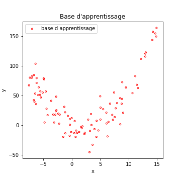
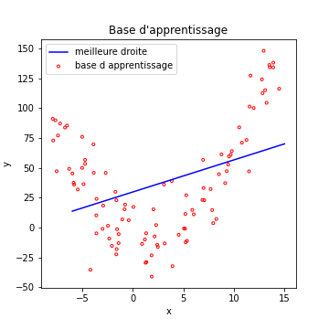
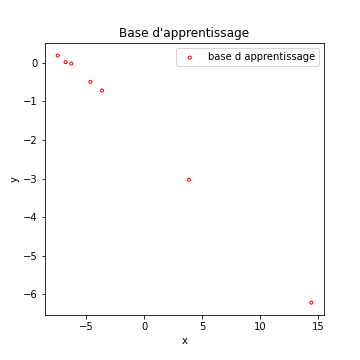
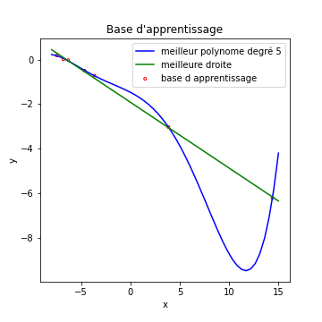
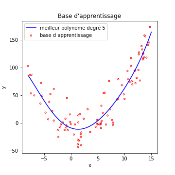

### Qualité du modèle

Pour vous expliquer ces questions de **qualité du modèle**, commençons par
voir les choses d’un peu loin :
un algo d’apprentissage automatique va produire une fonction de prédiction.
Cette fonction doit normalement capturer toutes les propriétés de chaque
caractéristique et les corrélations entre caractéristiques.

Ce que l’algorithme extrait est **spécifique au Training Set**.
Une condition **nécessaire** pour que notre algorithme fonctionne bien, dans
le cas général, est que cette base d’apprentissage soit représentative du
problème général.

Mais cette condition n’est pas **suffisante**.
Il faut encore que notre modèle soit suffisamment complexe pour extraire les
informations utiles à l'apprentissage.

#### Sous Apprentissage

Imaginons les données suivantes :

Si l'on cherche à prévoir la valeur en ordonnée, pour une abscisse donnée, on
pourrait essayer un modèle faisant l'approximation que ces exemples sont
répartis sur une droite (c'est une **régression linéaire**).
Évidemment, cela ne marche pas très bien…

La régression linéaire cherche la **meilleure droite** correspondant aux 
données.
Dans ce cas, même la meilleure des droites ne peut avoir que des performances
très mauvaises.

On dit que notre modèle souffre de **sous apprentissage**.
Il est **incapable de s’adapter correctement aux données** de la base
d'apprentissage.
L'équivalent dans un problème de classification, serait un modèle avec une
accuracy faible en apprentissage.

Dit autrement, notre modèle n’est pas suffisamment complexe pour s’adapter
aux données.
C’est le sens du **sous apprentissage**.
Il faudrait disposer d’un modèle plus complexe.
Si l’on est confronté à un problème de sous apprentissage dans le cas des
réseaux de neurones, il faudrait par exemple (et au choix) :

- ajouter des neurones dans les couches cachées,
- ajouter des couches cachées…

Voyons maintenant le cas inverse.

#### Sur Apprentissage

Reprenons de nouveaux exemples, ce sera plus parlant. Imaginons les données suivantes :

Échaudé par l’histoire du sous apprentissage, je décide de créer un modèle de régression qui cherche le meilleur polynôme de degré 5 qui fit mes donnée... Le résultat est la courbe bleue de la figure qui suit. J'ai également tracé la droite décrivant au mieux mes exemples (en vert).

Que voit-on dans ces courbes ?

- Notre bête modèle de régression linéaire, en vert, fait le boulot correctement, ce coup-ci.
- L’algorithme qui utilise un polynôme de degré 5 trouve une solution, disons…bizarre.

Voyons ceci plus en détails.

En fait, la **courbe bleue commet une erreur beaucoup plus faible sur la base d’apprentissage que la droite verte**.

L’algorithme a quasiment appris par cœur chaque exemple de la base
d’apprentissage, **au détriment de sa capacité à généraliser**.

On voit par exemple que sa prédiction pour $$x=12$$ est pour le moins
fantaisiste $$y_{pred} = -9$$.
Ses **performances en généralisation** sont bien moins bonnes que celle d'une
simple droite.
Ici, notre modèle est **trop complexe** (en particulier pour un nombre
d’exemples aussi faible).

On dit que l'algorithme est en situation de **sur-apprentissage** si ce qu'il
a appris sur la base d'apprentissage ne lui permet pas d'avoir de bonnes
performances en généralisation.

On peut le détecte en observant que soit :

- les performances en apprentissage sont très supérieures aux performances en généralisation, 
- lors de l'apprentissage, à partir d'un certain point, les **performances en apprentissage s'améliorent**, alors que les **performances en généralisation ne progressent plus, voire décroissent**.

Ci-dessous, un exemple de l'évolution des fonctions de coût en apprentissage et en généralisation au cours de l'apprentissage, qui témoigne d'un sur-apprentissage. À partir de l'epoch 150, le coût en apprentissage diminue, alors qu'en généralisation les performances empirent.

[exemple d'overfitting sur la loss](images/overfitting_dnn.png)

Il est donc primordial de disposer de modèles dont la complexité n’est ni trop faible (sous apprentissage) ni trop élevée (sur apprentissage)

#### Complexité correcte

Faut-il nécessairement avoir, dans le cas général, une idée très précise de la complexité optimale du modèle ? De fait, non. Voyons notre polynôme de degré 5 sur la première base d’exemples.

On voit que notre polynôme de degré 5 arrive à fitter nos données
correctement, alors qu’elles suivent un polynôme de degré 2.
Ce qui nous sauve du sur-apprentissage, c’est le nombre d’exemples assez
élevé pour que le modèle ne puisse pas “apprendre par cœur” ces exemples.

Dans tous les algorithmes d'apprentissage supervisé que nous verrons par la
suite (réseaux de neurones inclus), il faudra se poser la question de savoir
si notre modèle propose bien une complexité suffisante, sans apprendre par
cœur les exemples.