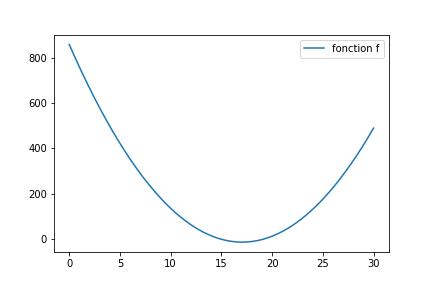
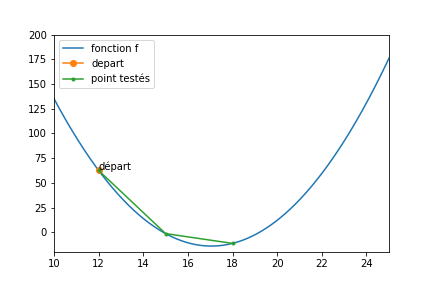
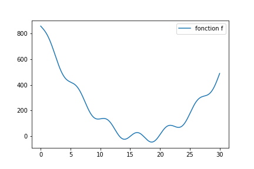
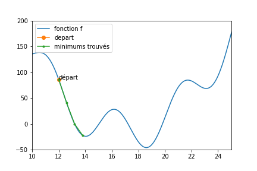

### Descente du gradient et algorithmes d'optimisation

Dans les explications des pages de bases, concernant
l'**apprentissage supervisé**, je m'étais contenté de dire :
lors de l'apprentissage, un **algorithme d'optimisation** (inspiré des 
techniques de **descente du gradient**) va permettre de modifier légèrement
**les poids du réseau** à chaque itération, afin de converger progressivement
vers un minimum de la **fonction de perte** (un minimum local).

Si vous comprenez la phrase qui précède, de mon point de vue, c'est amplement suffisant pour utiliser des algorithmes d'apprentissage automatique, réseaux de neurones inclus. Il n'est en revanche jamais malvenu de comprendre un peu plus précisément ce qui se passe. Dans cette section, je vais parler un peu plus des détails de la modification des poids du réseau.

Nous verrons donc :

- Tout d'abord, le principe d'une descente de gradient.
Cela suppose que vous compreniez ce qu'est la **dérivée partielle** d'une
fonction par rapport à un paramètre.
- Comment cette descente de gradient est appliquée sur un ensemble d'exemples
d'apprentissage.
- Quelles sont les variantes de cette descente de gradient ?

Pour commencer simplement, rappelons comment fonctionne une descente du gradient classique. 

#### Maths simples définissant une descente de gradient

Commençons par expliciter l'objectif. 

Partant d'une situation donnée (un ensemble de **paramètres** de notre
**modèle**), nous voulons modifier ces paramètres de façon à faire décroître
la valeur de la **fonction de coût** (loss function).

Notons $$C$$ la valeur de notre loss function, que je noterais sous le nom de
**coût** par la suite. Ce coût dépend bien évidemment des exemples, et des paramètres actuels.

Pour simplifier les notations, dans cette partie (maths simples), je vais juste considérer que notre modèle est composé de \(n\) paramètres notés \$$w_i$$.

Pour modifier les paramètres de façon à faire décroître la valeur de la fonction de coût, les techniques d'optimisation en mathématiques indiquent que nous pourrions nous déplacer depuis la situation actuelle, d'un petit pas, proportionnel à chacune des dérivées partielles du coût sur chaque paramètre modifiable :

- $$w_0 \leftarrow w_0 - \nu \frac{\partial C}{\partial w_0}$$
- $$w_1 \leftarrow w_1 - \nu \frac{\partial C}{\partial w_1}$$
- ...
- $$w_n \leftarrow w_n - \nu \frac{\partial C}{\partial w_n}$$

$$\nu$$ sera le **pas de la descente**, pris entre 0 et 1, le plus souvent
assez petit.

En notation rapide, si l'on note $$\theta$$ le vecteur de tous nos paramètres
modifiables (les $$w_i$$), on peut écrire notre algorithme de descente du
gradient simple :

$$\theta \leftarrow \theta - \nu \nabla C(\theta)$$

avec $$\nabla C(\theta)$$ le gradient du coût : le vecteur
$$[ \frac{\partial C}{\partial \theta_1} , ... ,\frac{\partial C}{\partial \theta_n} ]$$

Le gradient du coût $$\nabla C(\theta)$$ indique, pour une situation donnée,
dans quelle direction modifier les paramètres pour obtenir la décroissance la
plus grande du coût.

Nous savons donc comment modifier mathématiquement les poids, sous réserve
d'être capable de **calculer ces dérivées partielles**, ce que nous verrons un
peu plus loin.

#### Quand modifier ces paramètres ?

Sur le principe, ce qui précède n'est pas trop complexe, reste que le calcul du coût est très vague pour le moment.

On peut imaginer plusieurs stratégies pour le choix des modifications des
poids.

##### Stratégie 1

Ce coût est calculé à chaque exemple présenté. Notre algorithme fonctionnerait ainsi :

1. on présente un exemple,
2. on calcule le coût associé à cet exemple,
3. on calcule le gradient du coût,
4. on modifie les paramètres,
5. on recommence en 1 jusqu'à avoir passé tout la base d'apprentissage.

Ceci constituerait une **epoch** de notre algorithme, et on enchaîne les
epochs jusqu'à obtenir des performances correctes en apprentissage.

Dans la pratique, ceci serait très long et assez instable.
De plus, cela ne correspond pas exactement à l'énoncé du problème :
nous voulons en fait minimiser le **coût moyen** sur l'ensemble de la base
d'apprentissage.
Dans cette stratégie 1, nous essayons d'obtenir cela en minimisant successivement le coût de chaque exemple.

##### Stratégie 2

Ici, nous souhaitons calculer le coût moyen sur TOUTE la base d'apprentissage avant de modifier les paramètres. Notre algorithme fonctionnerait ainsi :

1. on présente un exemple,
2. on calcule le coût associé à cet exemple,
3. on calcule le gradient du coût et on le stocke,
4. on recommence en 1 jusqu'à avoir passé tout la base d'apprentissage,
on calcule le gradient du coût moyen, c'est simplement la moyenne des gradients pour chaque exemple,
5. on modifie les paramètres du modèle.

Ceci constitue une **epoch**, que l'on réiterera de nombreuses fois.

Notez que ceci correspond à l'énoncé :
notre modèle et son paramétrage actuel sont évalués sur l'ensemble de la base
d'apprentissage.
On calcule alors le gradient du coût (un coût moyen) pour modifier ces
paramètres de façon à minimiser ce coût moyen.

Ceci correspond techniquement à l'**algorithme originel** de
**descente du gradient**.

Ceci serait également très long.
Pour parer à cela, on ne traite quasiment jamais toute la base lors d'une
itération.

##### Stratégie 3 : Algorithme de descente stochastique (les mini batch)

De fait, dans la pratique, nous ne calculerons pas le gradient moyen sur la
totalité de la base (qui pourtant est ce que l'on voudrait).
On se contentera d'une approximation de ce gradient moyen.

1. On prend un sous ensemble de la base d'apprentissage :
c'est un **mini batch**.
2. On calcule le gradient moyen du coût sur ce mini batch.
C'est vraisemblablement (si le batch n'est pas trop petit) une assez bonne
approximation du gradient moyen sur l'ensemble de la base).
3. On modifie les paramètres en suivant ce gradient.
4. On recommence jusqu’à avoir passé chaque exemple de la base dans un mini batch (chaque exemple ne passe qu'une fois).

Ceci forme une **epoch** : on aura bien vu tous les exemples de la base
d'apprentissage et modifié les paramètres $$n$$ fois
(avec $$n = taille_{base}/taille_{batch}$$ )

Dans la pratique, la taille des batch est réglé de façon complètement
empirique, en fonction de :

- la taille de la base,
- la puissance de calcul de la machine (qui peut éventuellement paralléliser
les calculs sur les différents exemples du batch),
- les performances obtenues et leur stabilité.

Cette approximation de descente du gradient qui utilise une portion tirée au
sort de la base à chaque étape est appelée
« **descente du gradient stochastique** ».

##### Différents algorithmes d'optimisation

La description des différents algorithmes d'optimisation dépasse de très très
loin le cadre de ce cours, mais nous pouvons néanmoins retenir quelques
principes.

Comme indiqué auparavant, le gradient indique, dans une situation donnée, la
direction qui fait décroitre le plus le coût.
Par exemple, tous les algorithmes d'optimisation des réseaux de neurones
utilisent ce calcul de gradient.
Néanmoins, tous n'en font pas la même chose.

- Certains algorithmes vont utiliser une direction légèrement différente.
Elle pourra dépendre de la direction obtenue lors de l'itération précédente,
ou suivre une courbe particulière dépendant de ce gradient.
- La direction de descente une fois choisie, il s'agit de choisir **de combien on se déplace** le long de cette direction.
Dans le cas d'une descente de gradient standard, on appelle cela le « **pas de descente** ».
Ce pas peut être **fixe** (cela ne fonctionne pas très bien) ou **adaptatif**.
Dans ce cas, en fonction de l'amplitude du gradient, ou de ce qui s'est passé aux itérations précédentes, on peut modifier le pas de descente.

Un algorithme d'optimisation, c'est donc un algorithme qui, en fonction du gradient mesuré, va choisir :

- la direction retenue,
- le pas de déplacement.

Il existe de très très nombreux algorithmes d'optimisation.
Dans ce cours, la plupart du temps, nous utiliserons un algorithme nommé
« **Adam** » qui date de 2015 et obtient des performances tout à fait
satisfaisantes dans la plupart des cas.
Rien ne vous empêche d'en tester d'autres. En voici une liste pour ne pas
rester cantonnés à mon choix :

- RMSprop,
- SGD (stochastic Gradient Descent),
- AdaGrad.

Voilà.
À ce stade, vous comprenez que :

- l'apprentissage se fait par un algorithme
d'optimisation.
- Que ces algorithmes travaillent le plus souvent sur des mini batch d'exemples.
- Que ces algorithmes utilisent tous le calcul du gradient, et définissent tous un pas de descente.
- Qu'il y a pléthore d'algorithmes et que certains ont l'air d'être assez généralistes pour fonctionner dans à peu près tous les cas pratiques.

Voyons maintenant une propriété très important de ces algorithmes de descente
de gradient : le fait qu'ils ne trouvent qu'un **optimum local**.

#### Recherche d'un optimum local

Pour vous illustrer ce point, je vais me placer en 1D. Nous avons donc un algorithme (de classification ou de régression), qui ne dépend que d'un paramètre. Je cherche donc le paramètre qui minimise le coût. La figure suivante donne un exemple de l'évolution du coût en fonction de notre paramètre. C'est un cas très simple, où le coût est convexe.

Prenons, par ailleurs, un algorithme d'optimisation très simple  :

1. On prend un point de départ au hasard, et on mesure ses performances.
2. On tire au hasard une direction (gauche ou droite), et on se déplace d'un certain pas dans cette direction.
3. Si cela améliore le coût, on conserve cette nouvelle position.
4. On recommence en 2, un nombre de fois noté $$nMax$$.

Dans la  figure suivante, on partait d'un paramètre tiré au sort de 12, $$nMax$$ était fixé à 5, et on se déplaçait d'un pas de 3.

Arrivés en 18, on ne peut plus améliorer la situation. Soit on repart en 15 (c'est moins bon), soit on va en 21 (c'est moins bon aussi). Donc on trouve une solution **proche du minimum**, mais pas très proche.

##### Influence du pas

Vous proposerez peut-être de modifier le **pas de la descente**. Oui, mais :

- Au départ, je n’ai aucune idée de la précision qu’il me faut choisir.
En soi, 3 n’est pas mieux ou moins bien que 0.01.
La forme spécifique de ma fonction à minimiser influe sur le
**choix optimal du pas** ;
- Si on part de plus loin que 12, on en 5 itérations, on ne va pas explorer
suffisamment de points pour s’approcher du minimum.
Dans les cas courants, je n’ai aucune idée de la distance qui sépare mon
point de départ du minimum (je ne sais pas où est ce minimum).

Vous proposerez peut-être, après réduction du pas, d’**augmenter le nombre d’itérations** :
Oui, mais le **temps de calcul** va potentiellement augmenter de façon énorme.

Vous pouvez déjà retenir que le **choix du pas résulte d’un compromis entre qualité de la solution et temps de calcul**.

##### Optimums locaux et optimums globaux

Les fonctions, dont je voudrais trouver un minimum, ne sont pas forcément aussi sympathiques que celles que j’avais prises en exemple ci-dessus.

Regardez par exemple celle-ci :

Une descente du gradient, partant de 12, donnerait ce qui suit (l'image est zoomée autour de 15).

On dit que la fonction présente des **minima locaux** (il y en a trois dans
[10,25], et à l’œil, 4 au total).

Si ma fonction présente des minima locaux, une descente stochastique
**ne garantit pas** de trouver le **minimum global** de la fonction
(le plus petit des minimum locaux).

Si vous tombez sur le minimum global (et vous ne le saurez en fait jamais),
c’est que vous avez eu beaucoup de chance.

Est-ce un problème ? Oui et non, nous allons le voir.

##### Application des descentes stochastiques aux algorithmes d’apprentissages supervisés

*Vous avez vu ? Ça commence à faire des chouettes titres de section qui font peur aux enfants…*

Reprenons les problèmes d'apprentissage automatiques qui nous ont amené ici.
Nous cherchons le jeu de paramètres permettant d'optimiser la fonction de
coût à l'aide d'une descente stochastique (de gradient ou autre).

Ayant lu ce qui précède, vous devez normalement vous demander :
Sommes-nous plutôt dans le cas d’une **fonction simple** (convexe)
ou d’une **fonction présentant des minima locaux** ?

La réponse est facile :
dans les problèmes réels, **il y a des minima locaux**. 

Donc une descente stochastique va nous donner un jeu de paramètres qui n’est pas le meilleur (sauf si on a beaucoup de chance).

Mais ce jeu de paramètres correspond à un algorithme. Du coup :

- Si les performances de cet algorithme sont suffisantes pour votre problème, c’est bon. Ce n’est pas le meilleur, mais il fera l’affaire.
- Sinon, il vous reste deux choix :
    - changer d’algorithme d’optimisation pour qu’il soit moins sensible aux minima locaux,
    - changer de mesure de performance pour qu'elle soit plus lisse, avec moins de minima locaux.

##### Solution pragmatique pour ces problèmes d'optima locaux

Une solution extrêmement pragmatique pour atténuer ces problèmes consiste à
refaire l'apprentissage en **multipliant les points de départs**.
Ainsi, on explore de plus grandes portions de l'espace des paramètres, 
multipliant les chances de trouver, sinon le minimum global, au moins un
**minimum local présentant des performances suffisantes**.

