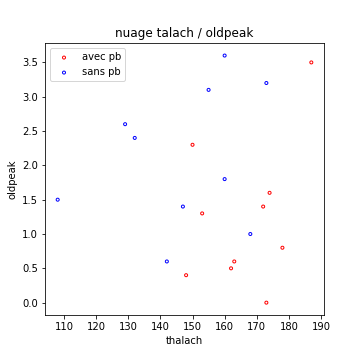
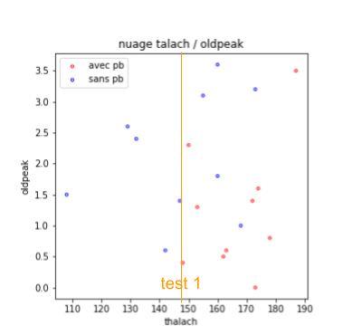
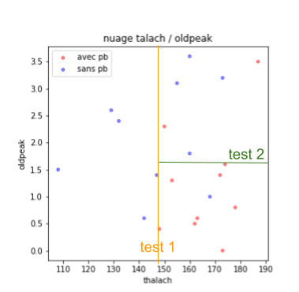
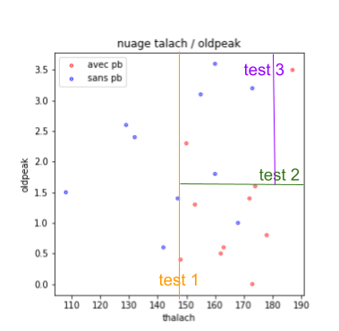
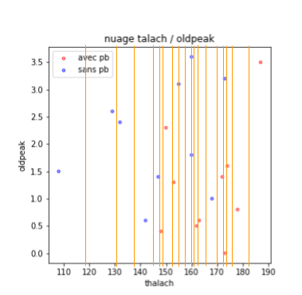

### Arbres de décision

#### Principe dans le cas d'un arbre défini manuellement

Un arbre de décision est un modèle relativement simple lorsqu'il s'agit de prendre une décision dans un contexte supervisé, compte tenu de caractéristiques :

Étant donné plusieurs caractéristiques, et un ensemble d'exemple labelisés :
On observe une seule caractéristique, qui permet de découper l'ensemble d'exemple en deux groupes.

- Si chaque groupe est suffisamment homogène en terme de décisions, on arrête.
- Sinon, on va recommencer en 1 en considérant que l'on souhaite maintenant
séparer mieux l'un des deux groupes crées auparavant.

Le plus simple pour bien comprendre cette notion, est de prendre un exemple :

La figure qui suit présente un cas de classification à deux classes : les
patients atteints de problèmes cardiaques ou non, en fonction de deux
caractéristiques.
J'ai extrait 20 exemples de la base Heart Disease Cleveland, et choisi 2
caractéristiques seulement : *thalac* et *oldpeak*.

Un arbre de décision va **choisir une caractéristique pour séparer cet ensemble au mieux, selon les classes**.
On pourrait par exemple choisir de tester si talach est supérieur ou pas à
147, ce qui me donnerait la figure suivante :

On voit que la partie gauche est correcte (tous les exemples sont de la classe bleue, on ne peut pas rêver mieux). Les exemples de la partie droite sont, en revanche, relativement mélangés. On va ajouter un test supplémentaire, pour les séparer. On cherche, **parmi les caractéristiques, celle qui permet de séparer au mieux ces exemples (et le seuil associé)**. Par exemple, on prendrait oldpeak > 1.6, ce qui nous amènerait à la figure suivante :

À partir de là, **soit on considère que ce n'est pas si mal**,
**soit on continue**.
Si l'on continue, on cherche, parmi les 3 groupes actuel, quel test, sur
quelle caractéristique, permettrait d'**améliorer l'homogénéité des groupes**.
On pourrait s'intéresser au groupe en haut à droite, et décider que l'on va
découper selon talach > 180, ce qui donnerait la figure suivante :

On peut s'arrêter là, ou continuer.

Dans un premier temps, je vais m'arrêter là, pour vous présenter
l'**arbre de décision** ainsi construit.
Dans la figure qui suit, on présente **les différents tests** et leurs
enchaînements.
Ces tests sont les ronds dans mon arbre.
Les nœuds finaux de mon arbre (**les feuilles** de l'arbre)
**correspondent à la décision** devant être prise dans ce cas-là.
Ils sont représentés par des carrés, dont la couleur est celle la classe
choisie.

#### Apprentissage automatique d'un arbre

L'objectif de cette section est d'automatiser la détermination des tests
composant l'arbre, à partir de la base d'apprentissage.

Le principe est assez clair, on l'a entrevu dans la présentation des arbres
définis manuellement.

C'est un problème récursif.
Compte tenu d'un **ensemble de points labelisés**, il faut déterminer le
**meilleur test** pour séparer cet ensemble en deux sous ensembles, dont les
classes seront **aussi homogènes que possibles**.

Depuis le début de ce cours, je ne cesse de vous indiquer que « chercher la meilleure solution » peut souvent se ramener à un **problème d'optimisation**. C'est ce que nous ferons une fois de plus.

Il faut :

- une **mesure de qualité** des sous ensembles créés par un test donné,
- une **procédure d'optimisation** qui explore l'ensemble des tests possibles
pour trouver un test optimal ou au moins efficace.

Commençons par la procédure d'optimisation.

##### Procédure d'optimisation :

En l'occurrence, la procédure d'optimisation est ici relativement simple.
Nous allons simplement **évaluer tous les tests possibles**
(en optimisation, on parle de **recherche exhaustive**).

Pour vous expliquer pourquoi c'est possible, et comment nous le ferons, je
vous remet ci-dessous la figure correspondant à notre base d'apprentissage
précédente.

Chaque test se fait sur une seule caractéristique, par comparaison à un seuil,
et séparera l'ensemble des exemples en deux groupes.

Considérons une caractéristique, par exemple $$x$$, sur les abscisses de notre
figure.
Combien de tests puis-je envisager ?

Si l'on classe les $$n$$ exemples par ordre croissant de $$x$$,
on obtient un ensemble $$[x_1..x_n]$$.
Deux seuils tombant entre $$x_i$$ et $$x_{i+1}$$ sépareront l'ensemble en des
groupes identiques et seront donc équivalents en termes de qualité.
Pour disposer d'un peu de robustesse aux fluctuations des exemples,
nous pouvons choisir, parmi tous ces seuils équivalents,
le milieu de $$[x_i, x_i+1]$$.

Ainsi, si l'on a $$n$$ exemples, sur une caractéristique, nous n'avons que
$$n-1$$ tests possibles à évaluer.

Je vous ai représenté dans la figure suivantes ces tests possibles, par des
droites verticales.
Ce sont les droites dont l’abscisse est le milieu de deux exemples qui se
succèdent.

Ce raisonnement peut se tenir sur chaque caractéristique de notre problème.

Ainsi, si l'on a $$n$$ exemples, dans un espace de dimension $$d$$, pour construire un nœud de l'arbre, nous aurons  $$(n-1) \times d$$ tests possibles
à évaluer.

Voyons maintenant comment on évalue la qualité des sous ensembles crées par un test donné.

##### Mesure de la qualité des sous ensembles

C'est l'un des points qui diffère entre les différents algorithmes.
Vous vous en doutez, il existe une multitude de variantes des arbres de
décisions.
Dans ce cours, je cherche surtout à vous donner une certaine culture sur ces
techniques, sans forcément chercher à entrer dans les détails mathématiques
les plus subtils de certaines versions.

Il faut que cette mesure de qualité :

- soit monotone (croissante ou décroissante) avec la pureté des sous ensembles
(en termes de labels),
- ne favorise pas trop les situations ou l'un des sous ensembles est de taille
réduite (si l'un des sous ensemble est réduit à un point, il est totalement
homogène en terme de labels...).

Il y a eu de très nombreuses recherches sur ces problèmes, et de non moins nombreuses solutions.

On pourra notamment s'intéresser à l'**indice de Gini** (utilisé par
l'algorithme **CART**) ou à l'**entropie** (utilisée par l'algorithme
**C4.5**).
Ces deux algorithmes sont les plus connus parmi les arbres de décision.
Les notions d'indice de Gini et d'entropie sont décrites ci-dessous.

Soit un sous ensemble de point, dans lequel les $$m$$ classes possibles apparaissent chacune avec une probabilité $$p_i$$.

L'**indice de Gini** de ce sous ensemble est :
$$ \sum_{i=1}^m p_i. (1-p_i)$$
Plus il est grand (proche de 1), plus la classe est homogène.

Le test **retenu comme optimal** est celui qui maximise la
**moyenne des indices de Gini** des deux sous-ensembles qu'il crée.

Dans le cas de l'**entropie**, qui nous vient de la Théorie de l'Information et mesure globalement le désordre associé à une variable aléatoire, le calcul est légèrement différent.

L'entropie d'un sous ensemble est : $$\sum_{i=1}^m - p_i. log_2(p_i)$$
Plus elle est faible (proche de 0), plus la classe est homogène.

Nous savons donc maintenant, pour un ensemble de point donnés, choisir le test
qui le découpe de façon optimale selon l'une des caractéristiques.
De **façon récursive**, nous pouvons donc
**calculer automatiquement un arbre de décision pleinement développé**.

##### Détermination de la taille de l'arbre

On l'a vu, il est parfois inutile, voire contreproductif d'utiliser un arbre pleinement développé. Nous pouvons envisager deux solutions pour choisir l'arbre final :

- soit se donner un critère d'arrêt pour stopper la définition récursive de notre arbre,
- soit calculer tout l'arbre, puis procéder à son **élagage**, en supprimant des tests peu utiles.

C'est souvent la seconde solution qui sera utilisée, en mesurant si le gain en termes d'indice de Gini (par exemple) apporté par chaque test est vraiment conséquent.

#### Conclusion sur les arbres de décision

Les arbres de décision occupent une place importante dans l'histoire de l'apprentissage automatique, mais pas seulement dans ce domaine. Les raisons de leur succès sont :

- la simplicité de leur principe et de leur mise en œuvre,
- la variété des régions de décisions qu'ils peuvent produire,
- la facilité avec laquelle on peut suivre le processus de décision.

Les entreprises en raffolent. Pour vous donner une idée, la version manuelle des arbres de décision est aujourd'hui encore enseignée comme un processus d'aide à la décision pour les futurs cadres.

*Je soupçonne fort les grands groupes de s'en servir pour mettre au point les cartes de questions utilisées par les centres d'appels délocalisés auxquels ils sous-traitent leur service après-vente. Vous savez : « Avez vous redémarré votre appareil ? Si oui, observez vous un clignotement... ». Notez que, dans ce cas, on finit relativement souvent dans la feuille « Je dois en référer à un technicien compétent... » .*

En apprentissage automatique, c'est une technique assez ancienne (C4.5 date de 1993). En dépit de son âge, C4.5 (ou CART qui lui est assez semblable) restait, en 2008, dans le top 10 des algorithmes d'exploration de données. Un peu délaissés ces dernières années du fait de l’avènement des réseaux de neurones, **les arbres de décision sont néanmoins un des outils** qu'il faut avoir sous la main, si l'**on veut évaluer rapidement les performances que l'on peut obtenir sur un jeu de données**.

Ceci d'autant plus que Python les implémente directement sous la forme des objets *DecisionTreeClassifier* de *sklearn*, qui rend leur utilisation très simple.

