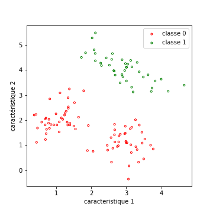
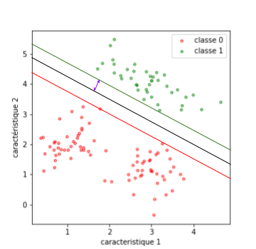
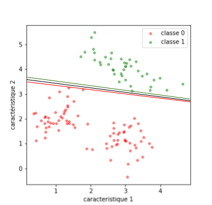
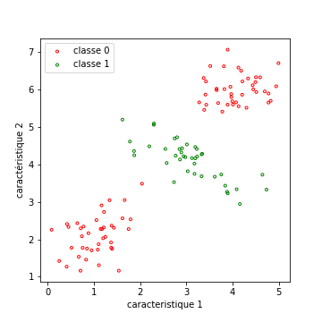
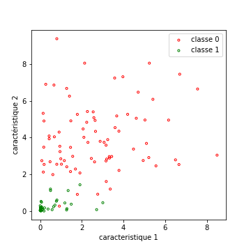
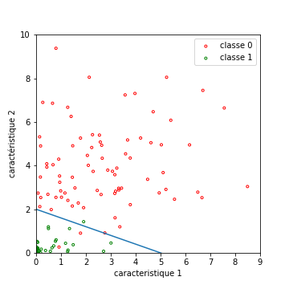
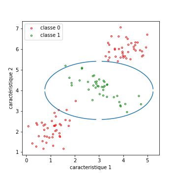

### Les Support Vector Machines (SVM)

#### Principe dans le cas simple

Ce premier cas simple, qui nous permettra de comprendre le principe des SVM,
est celui d'une séparation à deux classes, pour des données linéairement
séparables.
La figure ci-dessous présente une base d'apprentissage d'un tel exemple.

Sur cette base, on va chercher « la meilleure droite » pour séparer les
données, car les SVM sont des **classifieurs linéaires** par nature.
Comme nous travaillerons dans le cas général dans des espaces de dimension
élevée, la droite dont on parle devient un plan en dimension 3, puis un
hyperplan dans les dimensions supérieurs.

L'équation d'un hyperplan en dimension $$n$$ est :
$$w_1.x_1 + w_2.x_2 +... w_n.x_n + b = 0$$ .
Le vecteur $$w$$ fixe la **direction du plan** et $$b$$, le **biais**, est
l'équivalent de l'ordonnée à l'origine.

Vous pouvez noter que l'expression de cette équation peut s'écrire en fonction
du produit scalaire entre $$w$$ et $$x$$.
Si l'on note $$<w,x>$$ ce produit scalaire, l'équation du plan devient
$$ <w,x> + b = 0 $$.

##### Notion de marge

Reste à trouver un critère pour quantifier la qualité de l'un de ces hyperplans
(pour nous, une droite).
La probabilité d'erreur ne suffit pas pour discriminer des solutions
intéressantes.
Si l'on observe la figure suivante, elle présente deux droites, ne commettant aucune erreur en classification :

La droite bleue est meilleure que la droite violette au sens où elle laisse
**plus de marge** aux fluctuations éventuelles des exemples.

C'est cette **marge** que va essayer de **maximiser l'algorithme des SVM**.

Quand on choisit une direction pour l'hyperplan (le vecteur $$w$$), permettant
de séparer les variables, on peut tracer les deux versions de ces hyperplans
parallèles qui touchent un ou plusieurs des exemples de chacune des deux
classes.
Entre ces deux plans se trouve la **séparatrice**.

Voici un dessin pour clarifier ceci : à gauche, une marge assez importante
(en **violet**), à droite, une marge très fine.

|:---:|:---:|
|  |  |

Le problème ainsi posé est (relativement) simple :

La **marge** est la **distance minimale entre les points de la base et la droite**.
Et on cherche la droite telle que cette marge soit **maximale**.

Sans trop entrer dans les détails mathématiques, si l'on note $$d_w$$,
un hyperplan de vecteur $$w$$, et $$x_k$$ un exemple de la base, cela pourrait s'écrire :

L'hyperplan optimal est défini par le vecteur $$w_{best}$$ tel que
$$w_{best} = argmax_w(marge) = argmax_w (min_k (dist(d_w, x_k) ) $$,
sous contrainte que tous les $$x_k$$ soient du bon coté de la droite.

Notez que si l'on a un critère à maximiser, nous savons qu'on peut chercher, à l'aide d'un algorithme d'optimisation, les paramètres optimisant le critère.

##### Les Support Vectors

Profitons de cette fin d'exposition du cas simple, pour préciser ce que sont les **Support Vectors** (ou vecteurs de supports).

Les **Support Vectors** sont, pour un plan donné, les points qui touchent la
marge.
Retenons qu'ils **définissent le plan**, et sont **très peu nombreux** par rapport au nombre d'exemples de la base.

Je les ai représentés dans la figure suivante par les ronds violets

)

L'écriture précise de ces équations et le déroulé des techniques permettant de
faciliter leur optimisation est franchement magnifique d'ingéniosité, mais il
me semble que cela dépasse un peu le cadre de ce cours.
Pour la suite, je vais essayer de tenir le niveau de mathématiques à son
minimum (ce qui n'est pas forcément chose facile) pour vous présenter les cas
plus difficiles.

#### Cas plus complexes

##### Relâchement des contraintes de classification stricte.

Commençons par voir ce que l'on peut faire lorsque quelques exemples nous empêchent de séparer les données par une droite (ce qui arrivera toujours dans la pratique).

La figure suivante présente une telle base. J'ai repris la base précédente, et ajouté manuellement 1 point (le rond rouge en haut à droite) qui va rendre cette base impossible à séparer par une droite. En rose, j'ai représenté la distance minimale le séparant d'une position acceptable pour cette droite.

Ici, nous allons utiliser des techniques de **régularisation de modèles**.
Cela consiste à ajouter à la fonction de coût un terme qui va pénaliser les
modèles non souhaités.

Voyons comment ceci se met en œuvre dans le cas des SVM.

Le principe est de définir, pour chaque point de la base, une variable ressort
$$\xi_k$$.
Cette variable, si le point n'est pas du bon coté de la droite, prend comme
valeur l'opposé du déplacement minimal à effectuer pour le remettre du bon
coté (représenté en rose sur la figure précédente).
Les points du bon coté ont un $$\xi_k$$ nul.

Avec cela, nous allons modifier notre fonction de coût :

$$Coût(w) = marge(w) + C \sum_k  \xi_k  ) $$

Le terme $$C \sum_k  \xi_k $$ pénalise ainsi les plans pour lesquels des
points sont mal classés.
Ainsi, pour deux plans qui possèderaient la même marge, le meilleur plan sera
celui qui commet le moins d'erreurs de classification, ou celui pour
lesquelles ces erreurs sont moins éloignées d'une bonne réponse.

Le coefficient $$C$$ règle l'importance relative du terme de pénalisation par
rapport au terme de marge.
Dans cette formulation, plus il est grand, plus on pénalise les erreurs.

**quelques remarques** :
- *Dans la version du module sklearn python implémentant les SVM, la formulation est légèrement différente. Il vaut 1 par défaut, mais plus il est petit, plus il pénalise les erreurs.*

- *J'ai pris certaines libertés avec l'expression exacte des variables ressort, pour éviter un lot conséquent de notations et de calculs. Le résultat me semble assez convaincant, et très respectueux du principe.*

Nous pouvons maintenant passer au cas où par essence, les données ne sont pas linéairement séparables.

#### Le kernel trick

Donnons-nous tout d'abord une base d'apprentissage dans laquelle les données
ne sont clairement pas linéairement séparables.
Dans l'exemple qui suit, une des classes est répartie sur deux modalités,
non connexes.
La seule chose importante est qu'aucune droite ne permet d'obtenir une
classification de bonne qualité.

###### Changement d'espace des caractéristiques

Imaginons tout d'abord qu'au lieu d'utiliser $$x_k$$ pour définir notre
exemple, on transforme le vecteur en un autre, à l'aide d'une fonction
prédéfinie $$\phi$$. On définit ainsi $$y_k = \phi(x_k) $$.

Dans le cas précédent, une transformation intéressante pour chaque point de
coordonnées $$[a,b]** de la base pourrait être ** [(a-3)^2, (b-4)^2)]$$
qui conduirait à ce nouvel espace des caractéristiques :

Comme on le voit, dans ce nouvel espace, les données sont presque linéairement séparables. En tout cas, une séparation linéaire donne des performances assez bonnes (de l'ordre de 4 erreurs sur les 120 points).

De plus, en faisant la transformation inverse, je peux observer mes données,
et leur séparatrice optimale, qui n'est pas une droite dans l'espace
d'origine.
La figure suivante présente ceci.

| Espace transformé : données et séparatrice | Espace d'origine : données et séparatrice |
|:---:|:---:|
 |  | 

##### Changement automatique d'espace des caractéristiques

Vous pourriez, à juste titre, me dire que j'ai tout de même choisi la
transformation $$phi$$ avec soin
(j'ai pris le carré de l'écart au centre du nuage vert).
Certes, mais songez que j'avais le choix entre d'innombrables possibilités.
En particulier, j'aurais pu augmenter la dimensionalité du problème, par
exemple, en prenant $$ \phi([a,b]) = [a, b, a^2, b^2] $$

Or, un résultat intéressant en analyse des espaces vectoriels montre que plus
la **dimensionalité est grande**, plus la **probabilité que deux ensembles**
de points soient **linéairement séparables augmente**.

Ainsi, en projetant mes données dans un espace de grandes dimensions, j'**augmente les chances que mes données deviennent linéairement séparables**.

De fait, nous n'aurons pas vraiment besoin de définir la transformation
$$\phi$$ à appliquer.

##### Le kernel trick

Pour ce qui suit, je vais vous demander d'accepter un fait :

Les principales grandeurs à calculer pour définir le plan optimal dépendent du
produit scalaire entre les couples de points de la base.
On note ce produit scalaire $$<x_i, x_j>$$.

Dans notre espace transformé, ces produits scalaires s'écrivent :

$$< y_i, y_j > = <\phi(x_i) , \phi( x_j )> $$

On va se donner une **fonction noyau** (un kernel, en anglais)  telle que :

$$K(x_i, x_j) = < \phi(x_i) , \phi( x_j ) > $$

Vous me direz qu'il est peut-être délicat de trouver cette fonction $$K$$ qui
correspond à un $$\phi$$ donné (et vous auriez raison).

Vous aurez sans doute besoin de lire ce qui suit quelques fois...

C'est là le **kernel trick** : on choisit $$K$$, qui définit **implicitement**
la transformation $$\phi$$.
On ne connaîtra jamais la transformation $$\phi$$.
On se contentera, au lieu de calculer $$<x_i, x_j>$$, de calculer
$$K(x_i, x_j)$$, qui correspond à $$<y_i, y_j>$$ dans l'espace transformé.

Ensuite, pour effectuer la classification, au lieu d'utiliser le produit
scalaire $$<x, x_k>$$, entre le vecteur et les différents support vectors
$$x_k$$, on utilisera également $$<K(x, x_k)>$$, ce qui définira une
séparatrice non linéaire.

##### Choix de la fonction noyau

En fait, et c'est là la magie des maths, un vieux théorème de 1905 (le théorème de Mercer, qui a connu une seconde jeunesse à cette occasion), stipule que dès lors que $$K$$ est définie, positive, il existe un espace dans lequel $$ K(x_i, x_j) = < \phi(x_i) , \phi( x_j ) > $$.

Par ailleurs, nous avons signalé que plus la dimension de l'espace transformé
est grande, plus il est probable que les données soient linéairement
séparables.
Nous pourrions donc choisir un noyau pour lequel la dimension de cet espace
soit aussi grande que possible.

De savants calculs (trop pour moi) montrent que le noyau gaussien permet en
fait d'effectuer ces produits scalaires dans un espace de dimension infinie,
ce qui en fait un candidat intéressant de fonction noyau.

L'expression de ce noyau gaussien est la suivante : 
$$K(x,y) = exp^{ -\lVert  x-y \rVert^2)}$$

À ce stade, vous avez sans doute mal à la tête, il est temps de conclure sur ce que nous avons appris.

##### Conclusion sur les SVM

Comme vous avez pu le voir, les SVM empilent des considérations mathématiques
de haute volée.
De 1980 aux années 2000, cela a été un outil extrêmement étudié et utilisé,
pour ses performances, d'une part, mais aussi parce que toute une branche des
chercheurs en apprentissage automatique souhaitait des techniques
mathématiques avec un gros appui théorique.

Dans cette conclusion, plus de maths, juste les choses importantes pour
pouvoir utiliser ces algorithmes.
Certaines ont déjà été vues, d'autres seront introduites ici.

- Ils sont adaptés aux problèmes à deux classes, mais extensibles à des
problèmes à $$m$$ classes, sans difficultés, avec des stratégies
**one vs all** ou **one vs one** que nous verrons plus loin.
- Ces SVM définissent, au sein de la base d'apprentissage, des vecteurs de
supports (très peu nombreux), qui définissent la séparatrice des classes.
Ce faible nombre de paramètres **limite énormément le risque de sur-apprentissage**.
- Le temps de calcul est très faible (relativement faible en apprentissage,
et quasi constant en inférence).
- En l'absence de noyau (ou avec un **noyau linéaire**), la séparatrice est une droite.
- Avec un noyau non linéaire (**noyau gaussien** ou autre), la séparatrice peut être beaucoup plus complexe.

Les SVM ont actuellement perdu de leur splendeur, dépassés par la mode actuelle des réseaux de neurones. N'hésitez néanmoins surtout pas à les sortir car c'est une excellente technique.

Notez que python les implémente dans la librairie **sklearn** sous une forme qui prend en charge les problèmes à $$m$$ classes, ainsi que toutes sortes de noyaux.

Vous pouvez ainsi en quelques lignes tester :

- si un noyau linéaire donne de bons résultats,
- s'il convient d'utiliser un noyau gaussien.

Avec cela, vous pouvez estimer très rapidement les performances que vous pouvez atteindre.