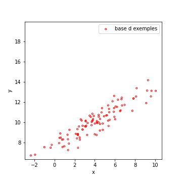
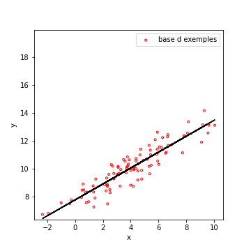
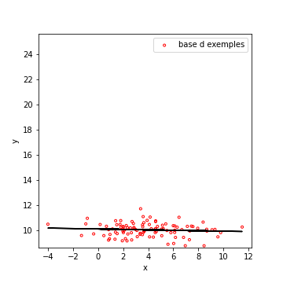

## Algorithmes de régression

### Introduction

Exactement comme dans le cas de la classification, concernant les problèmes
de régression, nous avons jusqu'ici déjà eu l'occasion de croiser l'algorithme
du **plus proche voisin** (ou ppv), et sa variante des
**k plus proches voisins** (ou kppv ou encore **knn** pour les anglophones).
Je ne reviendrais pas dessus, leur principe n'ayant pas dû vous poser trop de
problème.

Je vous ai également présenté de façon relativement rapide (je complèterais
plus loin) les **réseaux de neurones denses** qui ont ces derniers temps les
performances les meilleures (pour peu qu'on dispose de suffisamment
d'exemples, et qu'on sache trouver une architecture adaptée au problème).

Ici encore, je vais vous présenter quelques algorithmes, plus anciens, qui
ont eu leur heure de gloire pour traiter les problèmes de régression.
L'objectif est multiple :

- D'une part, il s'agit de vous constituer une certaine culture du machine
learning.
- Certaines notions peuvent être utilisées dans d'autres contexte (la
corrélation, très liée à la régression linéaire).
- D'autre part, il peut être utile de disposer de ces outils, soit pour se
faire une idée des performances qu'on peut atteindre sur un problème précis,
soit parce que la base d'exemples s'y prête.
Par exemple, si elle est petite, il sera peut être compliqué pour un réseau
de neurones d'apprendre dessus.

Nous commencerons donc par étudier la **régression linéaire** et la notion de
**corrélation**, puis la **régression linéaire multiple** qui étend la
régression linéaire au cas de caractéristiques de dimensions supérieures à 1. Nous verrons aussi quelques variantes des algorithmes de classifications adaptés à la corrélation, tels que **CART** qui utilise le principe d'arbres de décision, ou encore **SVR**, une version des SVM pour la corrélation.

Commençons par la régression linéaire.

### Régression linéaire

Lorsque nous disposons d'**une seule caractéristique**, censée nous permettre
de **prédire une variable cible réelle**, la technique la plus simple
consiste à supposer que ces variables se répartissent autour d'une droite.
Cette droite constitue la **régression linéaire des données**.

Ci-dessous, un exemple de données, qui suivent effectivement une droite.
Notez bien que **tous les points ne sont pas sur la droite**, mais se
répartissent autour.
La valeur de $$x$$ permet en grande partie de prédire $$y$$, mais il peut
subsister des fluctuations.

| Données | Régression Linéaire des données |
|:--:|:--:|
| 	|  |

Pour la calculer, on va postuler que pour chaque exemple $$ (x_i, y_i) $$,
les données obéissent à peu près à $$y_i = a \times x_i +b$$.

Pour être plus rigoureux, on pourra écrire ceci, en tenant compte de l'erreur
commise sur l'exemple $$i$$ par notre prédiction.
En notant $$\epsilon_i$$ cette **erreur** (ou **résidu**), on peut écrire,
pour une droite donnée, de pente $$a$$ et d'ordonnée à l'origine $$b$$ :

$$ y_i = a \times x_i + b+ \epsilon_i $$

d'ou l'on tire : $$\epsilon_i = y_i - a \times x_i - b+  $$

Ceci fait, on va chercher les paramètres du modèle $$(a,b)$$ permettant de
minimiser l'erreur commise sur l'ensemble de la base.
Vous pouvez penser cette erreur comme une fonction de coût à minimiser.
La **MAE** ou à la **MSE**, que nous avons déjà croisées, font très bien
l'affaire.
Un algorithme d'optimisation pourrait trouver les paramètres optimaux.

En l'occurrence, si l'on s'intéresse à la MSE,
**les calculs peuvent être faits manuellement**.
Pour cela, on calculerait la MSE en fonction de $$a$$ et $$b$$, à l'aide de
l'équation précédente, puis on la dériverait.
On **cherche un minimum**, donc un point où **cette dérivée s'annule**.

Dans ce cas précis, il n'y a qu'une solution. On obtiendrait alors :

Pour la **pente**, $$ a = \frac{cov(x,y)} {var(x} $$ , ou en notation abrégée :
$$ a = \frac{\sigma_{x,y}} {\sigma^2_x} $$

Pour l'**ordonnée à l'origine**, $$ b = m_y - a \times m_x  $$

Dans ce qui précède, on note $$m_x, m_y$$ les moyennes respectives de $$x$$
et de $$y$$.
$$\sigma^2_x$$ est la variance de $$x$$ et $$cov(x,y) = \sigma_{x,y}$$ est la
**covariance** entre $$x$$ et $$y$$.

Ainsi, il est **parfois possible de prédire** la valeur de $$y$$ à partir de
la caractéristique $$x$$ avec un modèle très simple.
La **qualité de la prédiction** est donnée par une mesure de performance,
telle que la **MSE** ou la **MAE**.

Au-delà de cette capacité de prédiction, la régression linéaire permet
également de mettre en évidence certains **liens statistiques** pouvant
exister entre 2 variables.
C'est ce que nous allons voir maintenant.

### Corrélation linéaire

Ce qui suit n'est pas un cours complet sur la notion de corrélation. Cette section a simplement pour objectif de vous présenter ces notions et l'intérêt qu'elles peuvent avoir en apprentissage automatique. 

#### Principe

Calculer la régression linéaire de \(y\) par rapport à \(x\), revient à observer l'évolution de la moyenne de \(y\) par rapport à \(x\).

On peut donc envisager plusieurs cas :

| Croissance | Décroissance	| Constance |
|  |  |  |

Dans le premier cas, quand $$x$$ **augmente**,
l’**espérance de $$y$$ augmente**.
On dit que $$x$$ et $$y$$ sont **corrélées positivement**.

Ceci n'empêche pas des fluctuations sur $$y$$, propres à chaque exemple, mais
cela donne une tendance générale.

Vous pouvez penser par exemple au poids et à la taille des individus. Vous pouvez trouver des grands tout maigres, mais en moyenne, plus on est grand, plus on est lourd.

Dans le second cas, quand $$x$$ **augmente**,
l’**espérance de $$y$$ diminue**.
On dit que **$$x$$ et $$y$$ sont corrélées négativement**.

Vous pouvez penser par exemple au nombre de cigarettes fumées et à l'espérance
de vie des individus.
Vous pouvez trouver de vieux fumeurs, mais en moyenne fumer nuit (grandement)
à votre espérance de vie (je suis fumeur...).

Enfin, le dernier cas indique que la valeur de $$x$$ ne permet aucunement de
prédire celle de $$y$$ (avec une droite).
On dit que **$$x$$ et $$y$$ ne sont pas corrélées linéairement**.

#### Mesures de la corrélation linéaire

Pour quantifier cette corrélation linéaire, on calcule le coefficient de corrélation par la formule suivante.

Formule du **coefficient de corrélation** : 
$$\rho = \frac{\sigma_{x,y}}{\sigma_x.\sigma_y} $$

Avec \( \sigma_{x,y} \) la covariance de \(x\) et de \(y\), et \sigma_x\), \sigma_y\) les écarts-types respectifs de \(x\) et de \(y\).

    Ce coefficient est compris entre -1 et 1.
    Le signe nous indique si la corrélation est positive ou négative.
    Plus sa valeur absolue est forte, plus la dépendance entre \(x\) et \(y\) est forte (plus les résidus de la régression sont faibles).
    Un coefficient très faible indique soit des résidus très grands, soit une absence de corrélation entre \(x\) et \(y\).

Ci-dessous, vous trouverez quelques exemples de données et leurs coefficients de corrélation pour illustrer tout ceci.
\(\rho = \) 0.924	\(\rho = \) 0.537	\(\rho = \) -0.625	

\(\rho = \) -0.011

corrélation positive forte	corrélation positive moins forte	corrélation négative	pas de corrélation

Voilà pour le principe et les calculs. Voyons enfin quelques remarques à garder en tête en permanence quand on utilise cette notion.

Remarques importantes sur la corrélation linéaire

La corrélation linéaire et son coefficient sont extrêmement répandus dans l'ensemble des sciences, dès lors qu'il s'agit de savoir si quelque chose permet de prédire autre chose. C'est le cas en physique, biologie, médecine, finance, ... Il faut néanmoins faire attention aux points suivants.

Qualité de l'estimation de dépendance statistique

Quelle que soit la valeur du coefficient, il faut s'assurer que cette valeur a un sens statistique (que vous avez assez d'échantillons pour pouvoir conclure) avant de conclure à une quelconque dépendance entre \(\x\) et \(\y\). Pour cela, on recourt en général à un test de Fisher (non détaillé ici).

La corrélation n'indique pas de causalité

Une notion primordiale à retenir : la corrélation mesure le fait que les variables présentent une dépendance statistique, pas que l'une soit la cause de l'autre.

Dans les exemples que je vous ai donnés en tête de section, vous avez deux exemples parlants : 

    Le nombre de cigarettes fumées est corrélé négativement avec l'espérance de vie. Dans ce cas, ce sont des médecins et des biologistes qui ont prouvé que fumer nuit à la santé.
    Taille et poids sont corrélés positivement. Pourtant, vous pourrez manger tant que vous voudrez, si vous êtes adulte, vous ne grandirez pas.

Pour être plus clair, voici un exemple de corrélation sans causalité.

On observe une corrélation très forte entre le nombre de coups de soleils quotidiens et le nombre de personnes portant des lunettes de soleil ce jour-là. Il n'y a clairement aucune causalité de l'un à l'autre. Il y a en revanche une variable cachée (l'ensoleillement) qui influe sur les deux variables observées. (Pensez-y quand on vous parlera de statistiques ethniques, par exemple.)

Retenez aussi ceci : l'apprentissage automatique ne démontre jamais une causalité. Il prend en compte ou démontre des corrélations entres les informations qu'il traite (et le fait souvent incroyablement bien).

La corrélation n'est pas nécessairement linéaire

La corrélation linéaire mesure la force d'une relation affine entre les données. Ci-dessous, un exemple dans lequel les données sont clairement corrélées, mais pas selon une droite. La corrélation linéaire de ces deux variables est finalement assez faible.

correlation non linéaire

Intérêt pour l'apprentissage automatique

En dépit des réserves évoquées ci-dessus, la régression peut s'avérer très intéressante pour nous lorsqu'il s'agit de sélectionner des caractéristiques.

Imaginez un problème de prédiction de rentabilité de sites d'implantation pour une entreprise. Vous disposez disons de 500 exemples de sites, chacun défini par 50 caractéristiques (localisation, population avoisinante,...) dans l'objectif de prédire le chiffre d'affaire possible sur ce site.

Si on utilise un réseau de neurones, par exemple, pour faire cette prédiction, nos malheureux 1000 exemples sur 30 caractéristiques risquent fort de conduire à un fort sur-apprentissage. Il pourrait être judicieux de ne retenir, parmi ces 50 caractéristiques, que les 5 ou 10 qui « aident le mieux » à prédire la rentabilité.

Une façon rapide de faire cela rapidement, serait de calculer le coefficient de corrélation existant entre chaque caractéristique et la rentabilité. On peut alors classer les caractéristiques par ordre décroissant (de valeur absolue du coefficient de corrélation), pour ne retenir que les meilleures.

Cette approche n'est pas sans risques, mais cela peut être fait très rapidement, et testé aussitôt pour mesurer les performances de la prédiction.

Attention aux corrélations non linéaires et à ne pas introduire de multiples caractéristiques qui mesurent en fait la même chose. 

