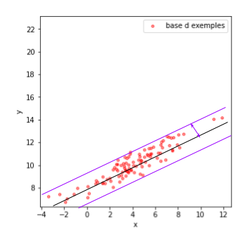
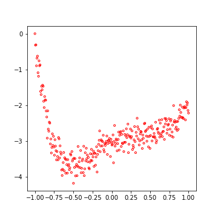
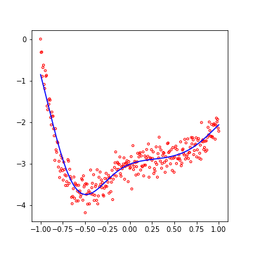
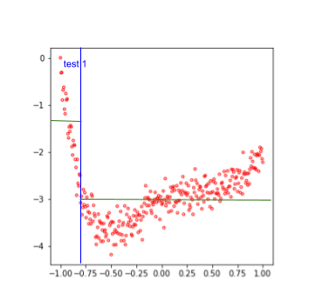
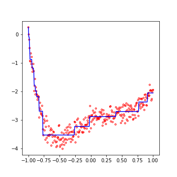
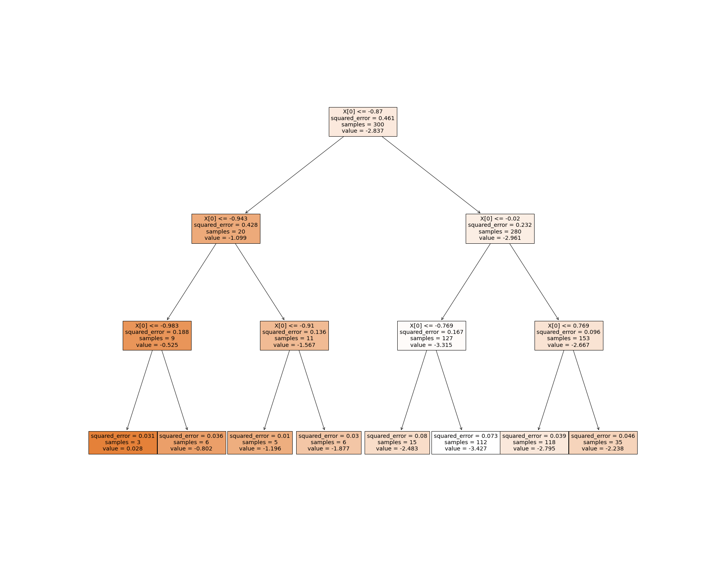

### Régression linéaire multiple, SVR et DTR

Si l'on pouvait passer un peu de temps à parler des différents modèles applicables à des caractéristiques à une seule dimension (régression polynomiale, régression linéaire par partie, ...), il est en fait plus judicieux d'envisager le cas où nos caractéristiques évoluent dans un espace de plus grande dimension. C'est en effet le cas le plus fréquent dans la pratique. En voici quelques unes, que je vais décrire brièvement, car elles s'appuient beaucoup sur ce que nous avons déjà vu dans ce cours.

#### Régression linéaire multiple

Une régression linéaire multiple est simplement l'extension des régressions linéaires au cas où les caractéristiques appartiennent à un espace vectoriel de dimension supérieure à 1.

Par exemple, vous souhaitez prédire le nombre de ventes annuelles de lunettes de soleil en fonction de l'âge des habitants, de leur nombre et de l'ensoleillement du lieu.

On dispose pour cela d'exemples, dans lesquels on notera $$x_i$$ le vecteur
des caractéristiques et $$y_i$$ la cible (les ventes observées pour l'exemple
$$i$$).
Pour préciser les notations, on écrira
$$x_i = [x_{i,1}, x_{i,2},..., x_{i,d}]$$.

La **régression linéaire multiple** fait l'hypothèse que
**la cible est une combinaison linéaire de ces différentes caractéristiques**.
Ainsi, comme dans le cas d'une régression linéaire simple, on peut écrire :

**Équation de régression multiple** :
$$y_i = a_0 + \sum_{j=1..d} a_j x_{i, j} + \epsilon_i$$

Sur l'ensemble toute une base de $$n$$ exemples, et en notation matricielle,
cela donnerait :

$$ \begin{pmatrix}y_1\\y_2\\...\\y_n\end{pmatrix} = \begin{pmatrix}1& x_{1,1} & ... & x_{1,d}\\ 1& x_{2,1} & ... & x_{2,d}\\ 1& ... & ... & ...\\ 1& x_{n,1} & ... & x_{n,d}\end{pmatrix} \begin{pmatrix}a_0\\a_1\\...\\a_d\end{pmatrix} + \begin{pmatrix}\epsilon_1\\\epsilon_2\\...\\\epsilon_n\end{pmatrix} $$

Ici encore, il s'agira de choisir \(a_0, a_1,... a_d\) afin de minimiser
« l'importance » des résidus $$\epsilon_i$$, en utilisant par exemple, un critère tel que la MAE ou la MSE.

Dans le cas de la MSE, on peut démontrer qu'un très bon estimateur est donné par :

$$A = (X^t.X)^{-1} X^t.Y$$, où les différents composants correspondent aux matrices et vecteurs portant la même lettre dans l'équation précédente.

Bien que très utilisée dans de nombreux domaines, cette régression reste un modèle très sommaire, peu utilisé en apprentissage automatique (hors cas spécifiques), si ce n'est pour une évaluation rapide des performances atteignables.

Ici aussi, python offre un objet *sklearn.linear_model.LinearRegression* permettant de la mettre en œuvre rapidement.

Concentrons-nous maintenant sur une version plus élaborée, la régression utilisant l'idée des SVM.

#### Support Vector Regression (SVR)

La technique de **Support Vector Regression** (ou **SVR**) consiste à adapter
les SVM à des problèmes de régression.

Ici aussi, je ne vais pas rentrer dans des détails, qui me semblent
facultatifs, pour me concentrer sur le principe, que j'illustrerai sur une
caractéristique à 1 dimension et une cible 1D.

Notez que cet algorithme s'adapte par nature à différents cas pratiques :
des **caractéristiques en dimension supérieures à 1** mais aussi des **prédictions multiples** (s'il s'agit de prédire deux valeurs ou plus pour
chaque exemple).
Dans ces deux cas, le principe reste exactement le même.

##### Principe, cas simple

On cherche, de fait, la droite (l'hyperplan dans le cas général) qui minimise la **marge**. Celle-ci est illustrée dans la figure suivante par la double flèche violette.

Si l'on réfléchit en termes de régression linéaire, la droite présentée dans
la figure est celle qui **minimise le résidu maximal observé sur tous les exemples**.

##### Cas plus complexes

Ici, nous allons exploiter deux techniques déjà vues dans le cas des SVM.

La minimisation de cette marge, dans des cas très bruité, risque de mettre en
avant des droites dans laquelle aucun point n'échappe à la marge, mais qui ne
« suit pas » bien les données.
Il peut être utile de recourir à la technique des **variables ressort** déjà
vues dans les SVM.
Dans ce cas, on autorise certains points à sortir de la marge.
Ces points infligeront simplement une pénalité à la droite dans l'évaluation
de son coût.
Il faudra alors choisir l'importance relative du terme de pénalité via le
choix d'un coefficient réel $$C$$.

Par ailleurs, nous pouvons recycler le **kernel trick**, également vu dans le
cas des SVM, qui va nous permettre de faire une régression non linéaire dans
notre espace de caractéristiques, en faisant les calculs dans un espace des
caractéristiques transformé.
Ceci sera ici encore effectué en utilisant un noyau non linéaire.

Je me contenterais d'illustrer ceci dans la figure suivante, qui présente les
données ainsi que la prédiction produite par les SVR, dans un cas clairement
non linéaire à 1 dimension.

Et ci-dessous, les résultats obtenus par SVR (obtenus avec un *noyau rbf*) :

Comme vous pouvez le voir, le résultat est extrêmement précis et saisit des
détails (présents dans la construction des données) qui n'étaient pas
forcément visibles dans la visualisation initiale.

Pour conserver un niveau raisonnable à ce cours, tout en balayant un large
spectre de techniques, il ne me semble pas plus utile de développer le détail
de ces techniques (pourtant passionnant).
Notez simplement que ceci s'implémente en python à l'aide de l'objet
*sklearn.svm.svr*

On dispose, avec la **SVR**, d'un outil très efficace pour toutes sortes de
régressions.
La SVR est de plus **très peu sensible au sur-apprentissage**.

Voyons maintenant, dans un souci d'inventaire, une autre solution fondée sur les arbres de décision.

#### Les arbres de décision en régression (Decision Tree Regressors)

Les algorithmes de type **Decision Tree Regressors** (ou **DTR**), sont des
algorithmes, s'appuyant sur le principe des arbres de décisions, adaptés à la
régression.

Dans cette section, je m'intéresserai uniquement à leur principe pour la
régression, toujours sur des caractéristiques 1D et une cible 1D.

Notez que cet algorithme s'adapte par nature à différents cas pratiques :
des **caractéristiques en dimension supérieures à 1** mais aussi des
**prédictions multiples** (s'il s'agit de prédire deux valeurs ou plus pour
chaque exemple).
Dans ces deux cas, le principe reste exactement le même.

##### Principe

Un petit rappel sur les arbres de décision en classification et le fonctionnement général de ces algorithmes.

- On choisissait **une caractéristique**, et **un seuil** qui minimise la
pureté des sous-groupes que ce test crée.
- On recommence en 1 jusqu'à obtenir des sous groupes suffisamment purs.
(On peut aussi développer l'arbre complet, puis l'élaguer.)

Ce principe sera maintenant utilisé en régression. Simplement, nous ne chercherons pas des sous groupes purs en termes de classe, mais des sous groupes dont la valeur à prédire est aussi constante que possible. Voyons ceci sur un exemple.

Reprenons notre base d'apprentissage non linéaire :

Dans une prédiction par arbre de décision, on considère que dans un groupe d'exemple, la **prédiction est constante**, et **égale à la moyenne** des exemples du sous groupe.

On cherche donc, sur notre caractéristique, quel seuil permet d'obtenir par exemple la MSE la plus faible dans les deux sous groupes ainsi crées. La figure suivante illustre par exemple un premier test (en bleu), qui sépare les exemples en deux groupes, ainsi que la valeur prédite (en vert) dans chacun des sous groupes.

Puis, on continue récursivement jusqu'à avoir une MSE suffisamment faible, tout en conservant un arbre suffisamment simple. Pour cela, une solution rapide consiste à fixer la profondeur maximale de l'arbre.

Dans la figure qui suit, vous observerez les prédictions de notre DTR, pour une profondeur de l'arbre maximal de 4 :

Ce n'est pas mal du tout, si l'on considère que le modèle impose à la fonction prédite d'être **constante par morceaux** !

L'intérêt majeur de ces techniques, comme pour les arbres de décision en classification, consiste en la simplicité d'interprétation de la prédiction. Voici ainsi une visualisation de notre arbre de régression. Pour des raisons de lisibilité, l'arbre présenté est de profondeur 3.

Notez simplement que ceci s'implémente en python à l'aide de l'objet sklearn.*tree.DecisionTreeRegressor*

C'est un **outil un peu désuet**, mais qui fait partie du bagage culturel à emporter partout avec soi.

Ceci conclut notre parcours des méthodes de régression précédent l'avènement des réseaux de neurones que nous allons voir maintenant. Ne négligez pas l'intérêt de ce que nous venons de voir.

**Les SVR peuvent s'avérer très efficaces, notamment dans le cas de bases de faible taille et/ou de caractéristiques très nombreuses.**