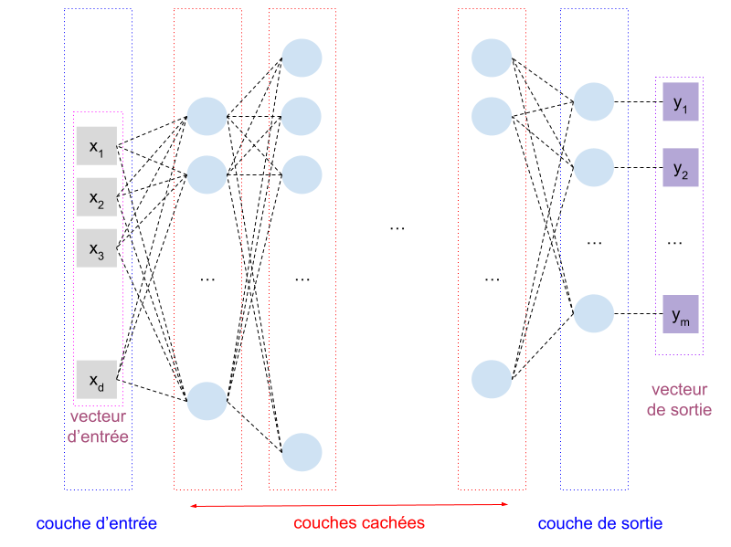
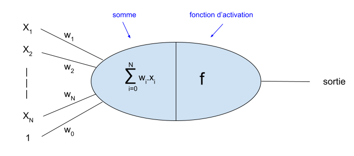

### Réseaux de neurones denses en régression

Dans la partie **pages de base**, je vous ai présenté les réseaux de neurones
en classification.
Il ne me semble pas inutile de revenir sur ces réseaux, appliqués à la
régression.
Ici, nous n'aurons besoin d'aucun nouveau concept.
Il s'agit simplement de bien s'assurer que tout ce que nous avons vu ensemble
commence à s'organiser clairement dans vos esprits.

#### Rappels sur les réseaux de neurones

Dans un problème de régression, nous avons, pour chaque exemple :

- des caractéristiques qui constituent un vecteur de dimension $$d$$
- une valeur à prédire (qui peut être de dimension supérieure à 1).
Nous noterons $$m$$ le nombre de valeurs à prédire pour chaque exemple.

Si l'on souhaite prédire le prix d'une maison, ainsi que l'âge du propriétaire, en connaissant : sa latitude, longitude, nombre de pièces, nombre d'habitants du quartier et distance à la mer, nous avons un problème de régression ou $$d=5$$ et $$m=2$$. Une sortie typique serait [320000, 54]

De fait, les réseaux de neurones sont par nature bien adaptés pour des
problèmes de régression.
Par construction, il sont capables, pour un vecteur numérique d'entrée donné,
de calculer un vecteur de sortie.
Ainsi, l'architecture de notre réseau de neurones comporte nécessairement :

- une **couche d'entrée** de $$d$$ neurones (pour y placer les
caractéristiques de chaque exemple),
- une **couche de sortie** de $$m$$ neurones (qui calculera les différentes
valeurs prédites pour chaque exemple),
- un certain nombre de **couches cachées**, choisi empiriquement, comportant
chacune un nombre de neurones choisi lui aussi empiriquement.

De l'entrée à la sortie, chaque sortie d'une couche est reliée à une entrée de chaque neurone de la couche suivante (architecture **dense**).

Voici une illustration de notre architecture pour de la régression :

Dans cette illustration, chaque neurone est représenté par un rond bleu. Chaque neurone est connecté à une de ses entrées par un trait pointillé noir. À chacune de ces entrées correspond un poids, comme rappelé dans la figure que nous avons déjà vue et qui rappelle le fonctionnement d'un neurone :

Au sein du réseau :

- Les poids de chaque neurone sont initialisés aléatoirement avant l'apprentissage.
- Ces poids devront être modifiés lors de l'apprentissage, de façon à
**minimiser une fonction de coût** sur l'ensemble de la base d'apprentissage,
à l'aide d'un algorithme d'optimisation.
- La **fonction d'activation** de chaque neurone (en fait, de chaque couche)
permet que la sortie d'un neurone ne soit pas simplement une combinaison
linéaire de ses entrées.

Si tout ceci ne constitue que des rappels, c'est parfait. Sinon, retournez voir la présentation initiale ; ce que nous avons vu depuis va nous permettre de préciser certains points sur lesquels j'ai été volontairement assez évasif en première approche. Voyons donc comment cela s'applique aux problèmes de régression.

#### Application aux régressions

De fait, il nous faut :

- Choisir une **fonction de coût** : Nous prendrons par exemple la MAE ou la
MSE, qui correspondent tout à fait aux objectifs d'une régression et que nous
avons explicités précisément dans la partie *Mesures de performances*
de la section [Performances/](Cours/12_performances.md).
- Choisir un **algorithme d'optimisation** : Nous avons vu dans la partie
*Descente du gradient* de la même section comment fonctionnent les algorithmes
d'optimisation.
Nous en prendrons donc un classique, comme '**adam**'.
- Choisir des fonctions d'activations, pour chaque couche. Ici, je vais détailler ci-dessous les différents cas de couches.

Pour les **couches cachées**, il faut des non linéarités qui vont permettre d'extraire des informations plus complexes.
On prendra par exemple une activation **ReLU** ou sigmoïde dans toutes les
couches cachées.
Si vous laissez une activation linéaire (équivalent à pas de fonction
d'activation) dans toutes les couches, votre réseau ne saura pas faire autre
chose qu'une régression linéaire.

Pour la couche de sortie, il faut prendre quelques précautions :

Dans la **couche de sortie, ne placez pas une fonction d'activation ReLU**,
cela peut empêcher totalement le réseau d'apprendre.

Pour les curieux : les poids étant initialisés aléatoirement, vous avez une
chance sur deux que la sortie d'un des neurones en sortie soit dans la zone
ou la fonction ReLu est nulle.
Dans cette zone, le gradient de la fonction est également nul (la fonction
est constante).
L'algorithme d'optimisation ne peut donc pas trouver de direction dans 
laquelle modifier les poids correspondants.

Également, si vous souhaitez mettre une fonction d'activation, faites
attention à l'ensemble des valeurs que celle peut prendre.
Dans l'exemple que j'ai présenté en tête de chapitre, concernant le prix des
maisons, des valeurs typiques de sorties sont  [320 000, 54].
Si vous placez une fonction d'activation sigmoïde, dont les valeurs en sortie
sont dans l'intervalle $$[0,1]$$, votre réseau n'a aucune chance d'apprendre.

Dans ce cas précis, il faudrait également faire attention à un point.
Si le coût est une MAE, une erreur typique de prédiction va être de
20 000 euros (prix de la maison) et de 10 ans (âge du propriétaire).
La disproportion des échelles de ces deux grandeurs fera que votre réseau va
se concentrer pour prédire au mieux le prix, sans vraiment s'intéresser à
l'âge.
C'est un problème que nous connaissons, et pour lequel nous avons déjà évoqué une solution : la **normalisation des données**

En régression, il convient, comme souvent en apprentissage, de
**normaliser les entrées**.
Il est souvent également approprié de **normaliser les sorties attendues**
(indiquées dans la base d'exemple).

Ainsi, si l'on normalise chacune des sorties attendues pour qu'elles soient
toutes dans l'intervalle [0,1], on pourra sans risque mettre une fonction
d'activation sigmoïde en sortie de notre réseau de régression.

Tant que j'y suis à vous parler de fonctions d'activations, si vous recyclez
du code de classification pour un problème de régression, faites attention à
ne pas laisser une **fonction d'activation softmax** en sortie d'une
régression multiple.
Nous n'avons pas encore vu ces fonctions d'activations (nous le verrons dans 
les pages de niveau 2), mais elle n'ont absolument aucun sens en régression 
(elles normalisent les sorties pour que la somme des sorties correspondant à 
un exemple vaille 1).

En ce qui concerne le **dimensionnement des couches cachées**, il n'y a pas
de règle précise, mais voici comment procéder.

Pour choisir le nombre de couches cachées, et le nombre de neurones sur ces
couches, procédez par tests successifs, en
**commençant par un réseau simple**.
Puis **augmentez la complexité du modèle**.
Le réseau final sera souvent en situation de **léger sur-apprentissage**, ce
qui devrait vous conduire aux meilleures performances en généralisation. *Cette « règle » vaut aussi pour la classification*.

La figure suivant illustre ce **léger sur-apprentissage**. En fin d'apprentissage, **la courbe en validation est stable**, mais la courbe d'apprentissage **continue à décroître doucement**. Éventuellement, vous pourriez aussi avoir une **courbe d'apprentissage constante pour une validation doucement croissante**.

Et voilà pour les réseaux de neurones en régression, qui réunissent à peu près toutes les notions importantes de ce cours !