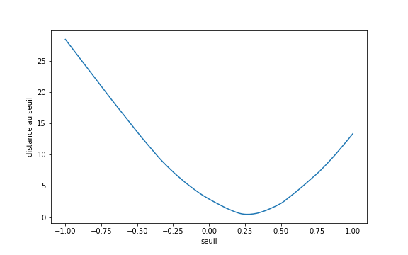
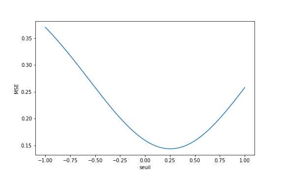

## Performances

### Fonction de perte lisse et Entropie croisée

#### Introduction et présentation de l'exemple de démonstration

Dans cette section, je vais vous montrer l'importance de disposer d'une
fonction de perte présentant des caractéristiques intéressantes pour les
algorithmes de descente de gradient.
Cela nous permettra de vous présenter l'**entropie croisée**, qui est la
fonction de perte standard utilisée pour les réseaux de neurones en
classification.

Pour illustrer les résultats différentes fonctions de perte, je vais me
servir d'un exemple simple avec des caractéristiques en une dimension et un
algorithme à un seul paramètre. 

Imaginons un problème de classification à deux classes et une caractéristique
unique, tel que représenté par la base suivante :

Notre algorithme de classification sera simple :

1. on choisit un seuil.
2. Tout ce qui est à gauche du seuil est supposé de la classe 0 (rouge), tout
ce qui est à droite est supposé de la classe 1 (bleue).

**Notre objectif est de déterminer le seuil optimal.**

Ce seuil optimal est celui qui **minimise la probabilité d'erreur**.

On pourrait donc naturellement penser que la loss function la plus adaptée
est la probabilité d'erreur.
**Ceci est faux**, du fait que nous utilisions des
**algorithmes de descente du gradient** pour trouver ce minimum.

Voyons pourquoi !

Notre exemple très simple permet de n'avoir qu'un paramètre à l'algorithme.
On peut donc explorer différents seuils, et tracer la probabilité d'erreur
pour chaque seuil.
Il nous fallait un exemple simple pour pouvoir
**visualiser la forme de la loss function** en fonction du(des) paramètre(s).

La figure suivante illustre l'évolution de la probabilité d'erreur en fonction du seuil.

Comme on pouvait s'y attendre, l'erreur est maximale pour les seuils
extrêmes, et le minimum global est bien situé autour du seuil optimal
(~0.26).
On peut de plus remarquer que la **loss function présente quelques minima locaux**.
Ceci est déjà problématique, mais il y a pire.

Le problème est qu'un algorithme de descente du gradient est initialisé
aléatoirement et, pour un jeu de paramètre donné (ici, un seuil),
**observe la valeur du gradient** (la dérivée) pour choisir comment modifier
les paramètres.
Or, comme on peut l'observer sur la courbe, la probabilité d'erreur est une
fonction en escalier (les voisins d'un seuil donnent le même nombre
d'erreurs).
**Le gradient de cette fonction est nul presque partout**.

Ceci signifie que la descente du gradient ne sait pas dans quelle direction
déplacer le seuil pour améliorer les performances.

On dit que la fonction de perte présente de nombreux **paysages plats**,
lorsque son gradient est nul sur de nombreuses zones.
C'est une des situations qui met les algorithmes de descente de gradient en
difficulté.

Voyons comment améliorer la situation.
De fait, pour minimiser la probabilité d'erreur, nous allons minimiser une
autre fonction, dont les minimums doivent correspondre à ceux de la
probabilité d'erreur, mais qui ne présente pas ou peu de paysages plats.

#### Une première loss empirique

Pour vous montrer ce que l'on peut faire, j'utiliserai par la suite la **distance au seuil** pour chaque exemple.

On peut se dire que l'on souhaite un seuil qui **minimise la moyenne des distances au seuil, pour les points mal classés** (ou leur somme),
ce qui pourrait constituer notre loss function.
La figure suivante montre l'évolution de la somme des distances au seuil en
fonction du seuil :

Comme on peut le voir, notre nouvelle loss présente
d'**excellentes caractéristiques** :

- Elle n'a plus de paysages plats.
- Elle est de plus ici complètement convexe, ce qui garantit une convergence facile (c'est lié à la facilité du problème posé).

Si ceci nous a permis de visualiser ce que nous souhaitons, la solution n'est pas directement applicable à la sortie de la plupart des classifieurs qui fournissent un score pour chaque classe. (Éventuellement, cette solution n'est pas très efficace).

Voyons donc d'autres possibilités que nous offre l'interprétation probabiliste des sorties du classifieur.

#### Interprétation probabiliste des sorties

Pour me rapprocher des réseaux de neurones, tout en restant simple, je vais être obligé de bricoler un peu.

Notre classifieur va présenter 2 sorties :

- La première correspond à la classe 0.
C'est la distance au seuil, signée positivement si le point est à gauche du
seuil ;
- La seconde correspond à la classe 1.
C'est la distance au seuil, signée positivement si le point est à droite du
seuil.

Les deux sorties sont de signe opposé et de valeur absolue identique. Ainsi, pour un seuil donné, un exemple aura pour résultat [-0.1, 0.1], par exemple. Le max est donné par la seconde sortie ; le classifieur considère qu'il s'agit d'un point de classe 1.

##### Utilisation de softmax

Comme nous l'avons vu précédemment, on peut utiliser la fonction **softmax**
sur les sorties pour estimer la probabilité de chaque classe.

Ainsi, si nos sorties sont $$[-0.1, 0.1]$$, après passage de la fonction
softmax, on obtient le vecteur $$y_{pred} = [0.45, 0.55]$$.

Deux cas peuvent se présenter :

- La classe de cet exemple est la classe 1.
Auquel cas, notre algorithme a raison ;
- La classe de cet exemple est la classe 0.
Auquel cas, notre algorithme a tort.

Imaginons que notre exemple soit de la classe 0. Notre algorithme a tort.

Si l'on déplace un tout petit peu le seuil pour obtenir un vecteur
$$[0.46, 0.54]$$, **notre algorithme aura toujours tort, mais un peu moins**.
(Il pense un peu moins que c'est la classe 1, et un peu plus que c'est la classe 0.)

De fait, nous souhaiterions un algorithme qui pense de façon certaine que
c'est la classe 0.
La sortie souhaitée est donc $$[1,0]$$ si l'exemple est de la classe 0.
La sortie souhaitée aurait été $$[0,1]$$ si l'algorithme était de la classe 1.

**Nous avons en fait transformé le label en One Hot Vector**, déjà vu
précédemment.

Tout l'objectif va maintenant être de définir une
**distance entre deux distributions** :

- celle de la sortie de l'algorithme ( $$y_{pred} = [0.45, 0.55]$$ ) et
- celle de la sortie souhaitée ( $$y_{true} = [1, 0] \) ou \( [0,1] $$ ).

##### La MSE

Les sorties de l'algorithme et les sorties souhaitées étant deux vecteurs,
il est possible de mesurer le vecteur erreur existant entre les deux
$$y_{pred} -y_{true}$$, puis de mesurer la norme de ce vecteur.
C'est l'erreur quadratique qui, moyennée sur l'ensemble de la base,
nous donne la MSE.

La figure suivante montre l'évolution de la MSE, en fonction du seuil :

Ici encore, non seulement la MSE ne présente plus de paysages plats
(ce qui était notre principale motivation), mais la fonction est de plus
restée convexe (ce qui est toujours dû à la simplicité du problème).
C'est peu visible, mais la MSE est également **plus lisse** que la précédente
loss empirique présentée (sa dérivée varie moins).

Ayant bien compris que l'objectif est de mesurer une distance entre les distributions souhaitées des sorties et les distributions des sorties (normalisées par softmax), je peux maintenant vous présenter très brièvement l'entropie croisée.

##### Entropie croisée

De fait, il existe une mesure directe de la distance séparant une
distribution observée d'une distribution voulue :
la **divergence de Kullback Leibler**
(ce n'est pas exactement une distance car elle n'est pas symétrique).

De fait, et l'on s'en tiendra là, la **théorie de l'information**
(de Shannon) établit une mesure, très liée à cette divergence de
Kullback Leibler, de l'**écart entre une distribution de référence et une distribution observée** : l'entropie croisée.

Soit une distribution de référence $$P = [p_1,..., p_m]$$  et une
distribution observée $$Q = [q_1,...,q_m]$$, l'entropie croisée entre
P et Q s'écrit : $$H(P,Q) = \sum_i -p_i ln(q_i) $$

L'**entropie croisée** est un nombre **positif**,
**minimal lorsque les deux distributions sont identiques**.
Ce nombre peut atteindre zéro la distribution observée est identique à la distribution de référence ET si la distribution de référence ne contient qu'un élément de probabilité 1 (et les autres nuls).
*C'est justement le cas en classification.*

Pour chaque exemple, on calcule donc l'entropie croisée entre la distribution
de sortie souhaitée et la distribution observée.
La **moyenne sur tous les exemples** de ces **entropies croisées** constitue
notre **loss function**.

La figure ci-dessous illustre l'évolution de notre entropie croisée en
fonction du seuil :

Ici encore, on observe une fonction très lisse, sans paysages plats.
Elle est en fait plus lisse que la MSE, ce qui n'est franchement pas facile à
observer sur notre courbe.
On le voit un peu en comparant les courbes aux alentours du seuil -0.75.
Ces propriétés expliquent que ce soit elle que l'on utilise le plus souvent
comme loss function dans les réseaux de neurones.

##### Conclusion

La première conclusion est importante :
en apprentissage automatique, il est fréquent que
l'**on n'utilise pas directement comme loss function la mesure pour laquelle on souhaite *in fine* obtenir un minimum**.

Si l'on souhaite trouver un algorithme qui donne la meilleure probabilité
d'erreur possible, nous n'utiliserons pas cette probabilité d'erreur comme
loss function.

On lui préfèrera une fonction dont le minimum global soit au même endroit, mais qui ne présente pas de paysages plats, et qui soit le plus lisse possible.

Je ne vous ai présenté ici que quelques loss functions classiques. Il en existe en fait de nombreuses, mais vous connaissez l'essentiel de ce qui nous importe.

