<script type="text/javascript" async src="//cdn.bootcss.com/mathjax/2.7.0/MathJax.js?config=TeX-AMS-MML_HTMLorMML"></script>
<script type="text/javascript" async src="https://cdnjs.cloudflare.com/ajax/libs/mathjax/2.7.1/MathJax.js?config=TeX-MML-AM_CHTML"></script>


## Introduction

### Le grand débat : symbolique vs numérique

Depuis sa naissance vers la fin des années 1950, la recherche en intelligence artificielle est divisée en deux grands courants : l'**IA symbolique** et l'**IA numérique** (terme employé actuellement).

L'**IA symbolique** est basée sur **la logique**, considérant que l'intelligence humaine s'organise autour de ce concept. 

Une de ses premières applications concernait, par exemple, la démonstration automatique de théorèmes mathématiques. On peut imaginer cela comme un ensemble d'axiomes, qu'on pourra combiner pour obtenir des propriétés, que l'on combinera entre elles pour découvrir de nouvelles choses.

Un autre exemple d'application est les *systèmes experts*. Très en vogue dans les années 80-90 dans l'industrie, il s'agit de composer un raisonnement permettant de répondre à des questions concernant des données à partir d'un ensemble de faits et de règles. Les faits et les règles initiaux devaient être écrits en observant le raisonnement d'un expert face à un problème donné.

Il y a eu des applications de ces systèmes en médecine, sidérurgie, banque, ...

À l'inverse, l'**IA numérique** considère que le raisonnement humain est avant tout la conséquence de **calculs numériques** et va se focaliser sur ces calculs (*probabilités, optimisations*).

La connaissance et les décisions qui suivront vont plutôt être extraites d'exemples de situations. Les réseaux de neurones artificiels font partie de cette catégorie.

Pour bien distinguer les deux approches, diriez-vous qu'un chat, c'est...

- un petit animal poilu à quatre pattes, qui fait miaou (version symbolique) ?

- ça (version numérique) ?
 mais aussi ça 

Toute la difficulté vient de là. Bonne chance pour expliciter le lien entre les deux images pour la version symbolique ! Mais ne pas tenir compte de la logique sous-jacente va empêcher de reconnaître des chats, si l'on n'en n'a pas vu assez d'exemples (pour la version numérique).

#### Avantages et inconvénients

Dans le cas de l'**IA symbolique**, l'avantage est que les décisions prises sont le fruit d'une démarche logique, qui est relativement facile à suivre, même si la mise au point automatique de cette démarche a pu prendre énormément de temps.

L'inconvénient est qu'il est parfois très difficile pour les experts d'expliciter les règles qu'ils suivent. Une bonne part de nos décisions est prise sans qu'on puisse vraiment expliquer tous les sous-cas que l'on peut rencontrer, et l'intuition de l'expert, qui fait souvent sa qualité, rend le codage des règles délicat.

Dans le cas de l'**IA numérique**, *les algorithmes se basent exclusivement sur les exemples qu'on lui fournit pour composer sa décision*. Avec énormément d'exemples (au-delà de ce qu'un humain pourrait traiter), l'algorithme va extraire ses propres règles. C'est un gros avantage, puisqu'on n'a plus besoin d'expliciter les raisonnements.

En revanche, la façon dont l'algorithme prendra sa décision sera très peu comparable à la façon dont un humain aurait géré la situation. Il est donc parfois difficile de savoir pourquoi un algorithme commet une erreur et difficile de la corriger, par exemple.

Pour être tout à fait honnête, il me semble (je n'ai aucune certitude à ce sujet) qu'aucune des deux branches à elle seule ne peut proposer un modèle d'Intelligence Artificielle semblable à celle d'un être humain.

Pour vous donner un exemple, imaginons un enfant de 3 ans qui devrait trier des images d'animaux pour trier les mammifères des autres.

- Ce genre de tâche va être très compliqué à résoudre par une IA purement symbolique car il sera délicat d'expliciter comment reconnaître les caractéristiques d'un mammifère dans une image.
- Ce genre de tâche va être relativement facile à résoudre par une IA numérique (typiquement, un réseau de neurones). MAIS l'IA numérique aura besoin de voir beaucoup plus d'exemples que notre enfant de 3 ans. Montrez à un enfant 2 fois un chat, et il les reconnaît toujours, quelle que soit leur position et même s'ils sont dessinés de façon sommaire.

Ainsi, notre cerveau est vraisemblablement capable d'apprendre de plusieurs façon différentes et de mixer logique et probabilités de façon spontanée.

Pour vous donner un autre exemple, je suis incapable de vous donner la règle d'accord des participes passés des verbes pronominaux, mais je me trompe finalement rarement lorsque j'en rencontre. Ma connaissance du sujet est purement statistique (numérique). Ma mère, en revanche, peut réciter cette règle en toute occasion (symbolique). A priori, ma maman comme moi-même sommes pourtant des êtres humains, mais pour la même situation, nous avons mis en place des stratégies différentes.

De plus, la recherche en Intelligence Artificielle n'a pas forcément vocation à reproduire l'intelligence humaine, mais seulement à permettre à des machines de résoudre les problèmes qu'on leur pose. Quel que soit le modèle choisi, les deux approches ont réussi à obtenir des résultats qu'aucun humain ne pourrait égaler sur certains problèmes. Les deux approches peinent aussi à faire des choses que tout humain arrive à faire sans difficulté.

Étonnant, non ?

#### Le point actuel

Depuis les débuts de l'IA, on a vu une alternance entre ces deux branches en termes de performances. Ceci est le signe d'une recherche saine. Il n'y avait aucune certitude de la part des chercheurs (au moins officiellement car en fait, ils sont tous plus ou moins convaincus d'une chose ou d'une autre). Il existait seulement des pistes potentielles qu'il convenait d'explorer. Libre à chacun d'explorer ce qui lui paraissait le plus prometteur à un instant donné.

À ce jour, et depuis à peu près 15 ans, l'IA symbolique est un peu en sommeil. Les performances obtenues en IA numérique (notamment à l'aide des réseaux de neurones artificiels) ont entraîné un engouement très fort des industriels pour ces techniques. Ce qui est logique puisque, auparavant, les systèmes experts avaient été poussés très fortement jusqu'à montrer leurs limites.

Il y a fort à parier que la situation s'inverse dans quelques années. C'est déjà partiellement le cas, puisqu'on cherche actuellement à mélanger les deux approches pour obtenir des systèmes permettant d'obtenir le meilleur des deux mondes :

- un apprentissage à partir d'exemples,
- des exemples aussi peu nombreux que possibles,
- des prises de décisions plus transparentes pour un observateur humain.

Quoiqu'il en soit, ce cours sera consacré à l'apprentissage automatique vu de façon numérique. Ce préambule avait surtout pour objectif de vous signaler que ce n'est pas la seule approche possible et, en aucun cas, la seule approche légitime.

## L'instant Philo : Hal 9000, Skynet, Red Queen, Jarvis et leurs amis.

Un cours d'IA sans son questionnement sur le futur des IA, et la possible disparition de l'humanité à cause de ces programmes, ne serait pas un vrai cours d'IA !

En gros, et concernant les IA basées sur de l'apprentissage automatique, on peut se poser des questions sur l'efficacité des IA, et sur les métiers qu'elle menace

### Efficacité des IA :

Les IA actuelles sont extrêmement efficaces, sous quelques conditions.

- quand le problème reste dans un cadre bien défini,
- quand on dispose de très nombreux exemples. 
- quand les erreurs de décision commises lors de l'apprentissage ne sont pas dramatiques

On peut ainsi créer des IA pour reconnaître des visages (les exemples abondent car les réseaux sociaux sont remplis d'exemples de photos de vous, annotées comme vous représentant). On peut aussi créer une IA qui jouera aux échecs (maintenant, le modèle standard est que l'IA joue contre elle-même pour créer des exemples à partir desquels apprendre). On pourrait, sur le même principe, faire une IA qui batte tout le monde à FIFA.

Il est un peu plus difficile de faire une IA qui conduise une voiture, car on peut difficilement gérer les erreurs que l'IA va commettre au cours de son apprentissage. *Une solution consiste à entrainer l'IA à conduire une voiture dans un simulateur de conduite, dans lequel un accident ne génère aucune perte matérielle ou humaine. Encore faut il avoir un simulateur assez réaliste pour que l'IA s'y retrouve lors du passage dans la réalité.*

Il est également plus difficile de créer une IA qui s'occupe d'un enfant en bas âge parce que, en plus d'éventuels drames possibles en cas d'erreurs, cela nécessite aussi d'effectuer en parallèle de nombreuses tâches relativement complexes mais surtout interconnectées :

- reconnaître l'émotion de l'enfant à chaque instant,
- moduler les activités en fonction de ces émotions.

### Métiers potentiellement menacés par les IA

L'arrivée massive des IA dans l'industrie constitue une nouvelle révolution industrielle, laquelle s'accompagne de la mise en péril de certains métiers existants. Quels sont les métiers concernés en premier lieu ? Tous les métiers où la connaissance ne vient que d'exemples et où les résultats peuvent être rapidement évalués. En voici quelques exemples :

- courtier en bourse,
- médecin généraliste (ça se discute, mais si l'on définit un taux d'échec accepté, oui...),
- pilote d'engin dans des situations relativement simples (trains, tramway, ...).

Inversement, les métiers où les situations sont les plus différentes d'un cas à l'autre ET qui nécessitent une certaine dextérité de manipulation sont relativement protégés. Par exemple, à ce jour, il est inconcevable d'avoir un robot plombier, car aucune installation de plomberie n'est pas la même et qu'on peut difficilement imaginer un robot capable de passer sous toutes les toilettes du monde pour y changer un joint. Il est ainsi plus difficile d'avoir un robot plombier qu'un robot chirurgien (la salle est fixe dans le cas du chirurgien).

Depuis 2014, une nouveauté (les Generative Adversarial Networks ou GAN) a même permis aux IA d'atteindre des capacités de création (en musique, arts plastiques, design, mode ...). Ces IA sont capables de générer des choses nouvelles, ressemblant aux exemples qui lui sont fournis pour un résultat très bluffant. On peut donc imaginer que pour de la production de masse, ces IA remplacent rapidement toute une frange de la population d'artistes/artisans de ces domaines (ne laissant que des postes de création artistique originale).

## L'IA non fantasmée

Dans ce cours, il s'agit de commencer à aborder des techniques dites d' « Intelligence Artificielle », dans le domaine de l'Apprentissage Automatique (ou Machine Learning en anglais).

### Les trois problèmes de base

Commençons par voir quels problèmes les plus fréquents nous voulons résoudre en apprentissage automatique. Ils sont au nombre de trois et sont détaillés dans les sections qui viennent.

#### La classification

Si, à partir d'informations bien définies et communes à tous les exemples, on souhaite reconnaître qu'un objet ou une situation fait partie d'une catégorie, on parlera d'un problème de **classification**.

Évidemment, à ce stade, il est délicat pour vous de comprendre ce dont je parle. Prenons donc un exemple :

Imaginons que notre programme travaille sur des personnes. Pour chaque personne, nous disposons d'informations : sa taille / son poids / le nombre de cigarettes qu'il fume par jour. Un problème de **classification** pourrait consister à décider si une personne est un homme ou une femme (2 catégories).

*Notez bien qu'en 2022, je suis bien conscient des problèmes que pose la non binarité. Notre capacité à créer des programmes capables de réaliser efficacement cette tâche ne signifie pas du tout qu'il faudrait les utiliser dans la vie quotidienne. Cet exemple a en fait plusieurs avantages : tout le monde a à peu près une idée des différences existant en moyenne entre hommes et femmes en termes de poids, taille, hygiène de vie. Tout le monde a aussi en tête des contre-exemples générateurs d'erreurs. C'est un excellent exemple pédagogiquement.*

Cette conceptualisation recouvre un grand nombre de problèmes, dont voici quelques exemples, des plus directes aux plus éloignées :

- À partir de données médicales, prédire la pathologie d'un patient parmi N possibles.
- À partir d'une photo de visage, savoir quelle est la personne représentée sur la photo. Ici, nous aurions autant de catégories que de personnes possibles.
- À partir d'une série de notes de musique, prédire la note suivante. Notez que ceci permet de composer de la musique de proche en proche.

C'est l'une des forces de cette modélisation : elle répond à une énorme variété de problèmes de la vie courante.

#### La régression

Si, à partir d'informations bien définies et communes à tous les exemples, on souhaite prédire la valeur associée à un objet ou une situation, on parlera d'un problème de **régression**.

Ici encore, un exemple sera plus parlant :

Imaginons que notre programme travaille sur des personnes. Pour chaque personne, nous disposons d'informations : sa taille / son poids / le nombre de cigarettes qu'il fume par jour. Un problème de régression pourrait consister à prédire son espérance de vie.

Voici quelques exemples de problèmes de régression pour vous donner une idée de la variété de tâches que ce problème recouvre :

- en fonction de la valeur d'une action boursière tout au long d'une période passée, prédire sa valeur le lendemain.
- à partir de vidéo et d'informations sur un véhicule, prédire la vitesse à choisir et l'angle de rotation du volant permettant de passer une courbe.

Si vous trouvez des ressemblances avec la classification, c'est normal. En gros, la classification consiste à choisir une catégorie que l'on pourrait représenter par un entier. La régression doit, elle, choisir une prédiction, souvent dans $$\mathbb{R}$$ ou $$\mathbb{R}^2$$ (l'action boursière)

  (le véhicule).

#### Le clustering (partitionnement de données)

Le dernier problème est un peu différent.

À partir d'un ensemble d'objets ou de situations, on souhaite les regrouper en sous ensembles homogènes. On parle alors d'un « problème de clustering ».

Ici encore, un exemple vous aidera sans doute à mieux comprendre :

Imaginons que notre programme travaille sur des personnes. Pour chaque personne, nous disposons d'informations : sa taille / son poids / le nombre de cigarettes qu'il fume par jour. Un problème de clustering pourrait consister à chercher, parmi l'ensemble des personnes dont on dispose, à extraire deux groupes de personnes se ressemblant le plus. L'un des résultats possibles serait deux groupes d'individus, dont une analyse a posteriori montrerait qu'ils sont liés à l'hygiène de vie des personnes.

Je vais insister un peu sur une confusion commune quand on attaque le domaine de l'apprentissage automatique : la distinction entre classification et clustering.

En classification, les catégories sont prédéfinies. Le problème consiste à ranger chaque exemple qui se présente dans la bonne catégorie. En clustering, il s'agit de découvrir des catégories pertinentes. Le problème consiste à regrouper des exemples, afin d'obtenir les groupes les plus homogènes possibles.

Les application des problèmes de clustering sont également innombrables :

- En marketing, en fonction de fichiers clients, trouver les types de consommateurs associés à un produit.
- À partir de données météorologiques, trouver les types de temps existants dans une région.
- À partir de données physiologiques, définir des groupes d'animaux (refaire une classification du vivant).

### Petite remarque d'importance

Éventuellement, en lisant ce qui précède, vous avez commencé à réfléchir pour concevoir vous-même un programme qui puisse, par exemple, reconnaître si une personne est un homme ou une femme (les autres problèmes sont plus complexes). Peut-être quelque chose comme (en python) :

```python
def classify(taille, poids):
  if taille > 1.73 :
    return "homme"
  else :
    return "femme"
```

Dans le code qui précède, l'intelligence de votre programme vient directement de vous. Vous implémentez dans votre programme votre propre logique. L'Apprentissage Automatique ne fonctionne pas du tout comme cela. En apprentissage automatique, on dispose d'exemples, à partir desquels notre programme va apprendre, parfois longuement, comment prendre sa décision.

Ce cours est donc une façon totalement nouvelle pour vous de concevoir des programmes.

### QCM d'auto-évaluation

Pour vous aider à vous y retrouver entre ces trois problèmes classiques, et avoir une idée de la diversité de situations qu'ils recouvrent, voici quelques exemples, dans lesquels je vous demande de reconnaître à quel problème la situation peut-elle être ramenée. Assurez-vous donc de lire attentivement la question et la consigne. 

#### Question 1
Imaginons qu'on veuille faire un programme permettant de reconnaître, à partir d'une image, si l'objet présent dans l'image est un chien ou un chat ou un poney.

De quel type de problème de machine learning s'agit-il ?
- Clustering
- Classification
- Régression

#### Question 2
Imaginons qu'on veuille faire un programme permettant de déplacer un personnage de jeu vidéo à l'aide d'un joystick numérique.

De quel type de problème de machine learning s'agit-il ?
- Clustering
- Classification
- Régression

#### Question 3
Imaginons qu'on veuille faire un programme permettant de déplacer un personnage de jeu vidéo à l'aide d'un joystick analogique.

De quel type de problème de machine learning s'agit-il ?
- Clustering
- Classification
- Régression

#### Question 4
Vous êtes en charge d'analyser les données clients d'une chaîne de grande distribution, l'objectif étant de définir des groupes types de consommateurs, afin d'adapter la stratégie commerciale du groupe à ces clients.

De quel type de problème de machine learning s'agit-il ?
- Clustering
- Classification
- Régression

#### Question 5
Vous devez programmer un correcteur orthographique dans un traitement de texte.

De quel type de problème de machine learning s'agit-il ?
- Clustering
- Classification
- Régression

### Premiers algorithmes

Ici, sans trop détailler, je vais essayer de vous expliquer les principes de l'apprentissage automatique et quelques algorithmes simples basés sur ces principes.

Nous cherchons à concevoir une solution pour qu'un programme apprenne, sur la base d'exemples, à prendre une décision concernant un objet ou une situation. Pour avancer dans ce problème, il nous faut impérativement une image mentale de notre problème. Qu'est-ce qui peut nous fournir une image mentale sur laquelle nous pourrons ensuite faire des calculs ? Les mathématiques.

Nous allons donc reprendre nos trois problèmes classiques sur des exemples très simples pour poser un peu de vocabulaire et essayer de faire émerger des début de solutions.

#### Application au Clustering

Re-simplifions notre exemple vu dans une section précédente, et intéressons-nous par exemple au problème du partitionnement de données (ou clustering) qui consiste à regrouper nos exemples en groupes (des clusters).

Nous disposons d'un ensemble d'exemples. Chaque exemple sera caractérisé par deux informations : taille et poids.

Les informations concernant un exemple sont appelées les **caractéristiques** du problème (**features**, en anglais). Dans notre exemple, ce sont la taille et le poids.

Dans le tableau qui suit :

- chaque ligne est une personne,
- sur une ligne, on trouve le vecteur de caractéristiques [taille, poids] de la personne.

Nos données ont la forme suivante :

|Taille	| Poids |
|:---------------:|:---------------:|
| 1.8707 | 68.7103 |
| 1.5430 |	63.2235 |
| 1.8442 |	88.0109 |
| 1.6772 |	70.5969 |
| ... |	... |
| 1.6072 |	66.1378 |

Imaginons que l'on veuille répartir les personnes représentées par ces données en deux groupes (deux clusters). Avec ce tableau, je pourrais faire toutes sortes de calculs, mais je peux surtout visualiser mes données. On peut penser chaque exemple comme un point (ou un vecteur) dans un espace de dimension 2 (taille, poids). Ceci nous conduit à pouvoir tracer le nuage de points de nos exemples :

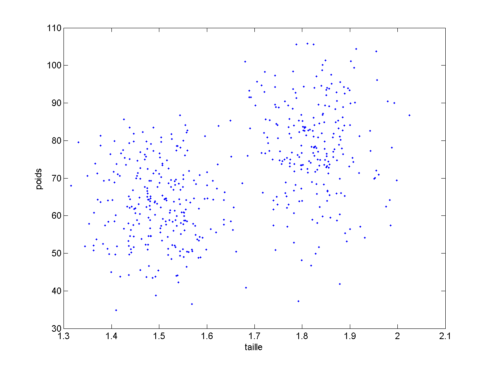


- Voyez vous deux groupes de personnes ? (Normalement, oui.)
- On ne sait toujours pas comment faire notre programme, mais au moins nous saurions répondre à la question.

Ceci montre bien l'intérêt de la visualisation des données.

Comme premier algorithme de clustering, on pourrait procéder comme suit :

1. Initialement, chaque point constitue un groupe.
2. Puis on cherche les deux points les plus proches et on fusionne leurs groupes. 3. On ré-itère jusqu'à ne conserver que le nombre de groupes voulu (ici, deux).

#### Application à la classification

Reprenons notre exemple simplifié précédent. Nous voudrions à partir d'exemples de taille et poids connus, apprendre à déduire le sexe d'un individu inconnu. Pour cela, il faut impérativement que pour chaque exemple connu, nous sachions quel est son sexe. Nos données, pour chaque exemple, indiquent donc le poids et de la taille (qui sont les caractéristiques), mais aussi le sexe de l'individu. C'est ce sexe que nous essayerons de deviner. On l'appelle le label associé à chaque exemple (ou sa classe).

Nos données prennent maintenant la forme suivante :

|Taille	| Poids	| Label |
|:---------------:|:---------------:|:---------------:|
| 1.8707 |	68.7103 |	homme |
| 1.5430 |	63.2235 |	femme |
| 1.8442 |	88.0109 |	homme |
| 1.6772 |	70.5969 |	femme |
| ... |	... |	... |
| 1.6072 |	66.1378 |	femme |

Il nous faudra enfin un ou plusieurs exemples inconnus à propos desquels il faudra prendre une décision :
**Quel est donc le sexe d'un individu dont les caractéristiques sont 1.60 , 72 ?**

Encore une fois, avec ce tableau, je pourrais faire toutes sortes de calculs, mais je peux surtout visualiser mes données :

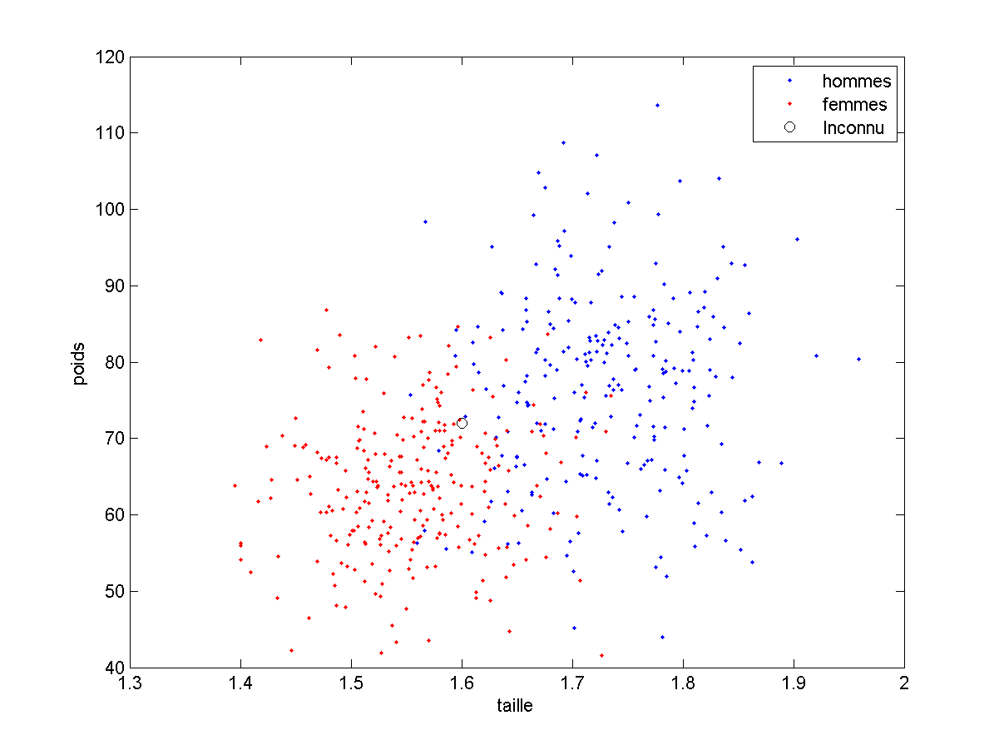


- Pouvez-vous prendre une décision concernant le point inconnu ? (Vous devriez pouvoir prédire qu'il s'agit d'une femme.)
- Pourriez -vous écrire un programme qui prenne cette décision ? (Vous pouvez penser à observer le ou les points qui lui sont proches.)

L'algorithme auquel vous avez sans doute pensé (c'est mon coté mentaliste...) est l'**algorithme du plus proche voisin**, qui procède comme suit :

On cherche, dans l'ensemble des points connus, quel est le point le plus proche du point à classifier. L'algorithme prend simplement la décision correspondant au label du point le plus proche.

#### Application à la régression

Encore une fois, je vais re-simplifier l'exemple précédent pour des questions de visualisation. Nous disposons d'exemples connus dont nous connaissons le nombre de cigarettes qu'ils fument par jour. Nous voudrions, pour un individu inconnu, prédire son espérance de vie. Pour cela, il faut impérativement que pour chaque exemple connu, nous sachions quelle est son espérance de vie. (Notez qu'ici, j'ai complètement inventé les chiffres utilisés pour mes exemples.)

Nous aurons donc des exemples connus :

| Nb Clopes |	Espérance de vie |
|:---------------:|:---------------:|
| 22 |	74 |
| 0 |	45 |
| 0 |	84 |
| 22 |	51 |
| 0 |	90 |
| 10 |	72 |
| 4 |	67 |
| ... |	... |
| 0 |	69 |

**Et nous voulons savoir quelle serait l'espérance de vie d'un inconnu qui fume, par exemple, 14 cigarettes par jour.**

Encore une fois, avec ce tableau, je pourrais faire toutes sortes de calculs, mais je peux surtout visualiser mes données. Notre programme doit en fait choisir une valeur en ordonnée sur la ligne noire, d’abscisse 14, représentée dans la figure suivante.

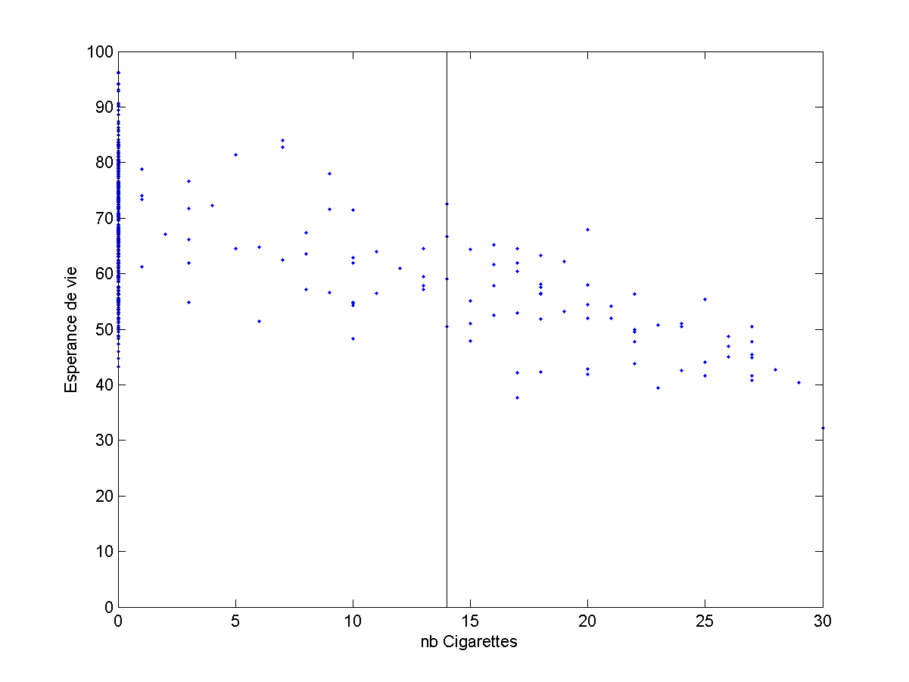

- Pouvez-vous prendre une décision concernant le point inconnu ? (Vous pourriez déduire une espérance de vie autour de 60 ans.)
- Pourriez-vous écrire un programme qui prenne cette décision ? (Éventuellement, repensez à cette idée de voisins proches.)

Si les plus matheux d'entre vous auront peut-être pensé à faire une régression linéaire pour extraire la droite la plus proche des données, je vous propose ci-dessous une version plus simple.

On cherche, parmi les exemples, tous les 5 plus proches en termes de nombre de cigarettes fumées. On prend la moyenne des espérances de vie de ces exemples.

#### Conclusion sur ces applications

Résumons ce que nous avons vu.

Pour que nos algorithmes s’appuient exclusivement sur les exemples qu'on leur fournit pour prendre une décision, une solution pourrait s'appuyer sur la notion de distance. Pour la classification ou la régression, pour prendre une décision sur un exemple inconnu, on peut chercher :

- Le plus proche voisin parmi les exemples connus. On prendra la même décision que celle associée à ce voisin dans notre base d'exemples ;
- Les $$k$$ plus proches voisins parmi les exemples connus ($$k=3$$ ou $$k=5$$. On pourra combiner les décisions associées à ces voisins (moyenne ou vote). 

Pour le clustering, on peut également s'appuyer sur la notion de distance et regrouper récursivement les points/groupes les plus proches jusqu'à obtention du nombre de groupes souhaités.

À ce stade, nous avons posé le contexte et vous avez quelques idées sur des solutions potentielles. Pour aller plus loin, il va falloir rendre tout cela un peu plus carré et donc formaliser un peu ces problèmes.

Notez néanmoins que, dans cette section, nous avons réussi à développer des algorithmes, certes simples, mais capables de prendre une décision exclusivement en fonction des exemples proposés, et **dont la logique est totalement indépendante du problème à traiter**. C'est tout l'objectif du **machine learning**.
<script type="text/javascript" async src="//cdn.bootcss.com/mathjax/2.7.0/MathJax.js?config=TeX-AMS-MML_HTMLorMML"></script>
<script type="text/javascript" async src="https://cdnjs.cloudflare.com/ajax/libs/mathjax/2.7.1/MathJax.js?config=TeX-MML-AM_CHTML"></script>


## Formalisation

Rappelons tout d'abord notre objectif. Pour mieux l'expliquer, je vais reprendre l'exemple de classification vu dans la section précédente : Ce que nous cherchons à mettre au point n'est pas un programme qui reconnaisse au mieux les hommes et les femmes sur la base de leur poids et de leur taille, mais un programme qui, si on lui donne des exemples de (taille, poids, sexe) sera capable de choisir un sexe pour n'importe quelles entrées (taille, poids).

Il s'agit donc de se détacher du problème précis, pour trouver des solutions plus ou moins universelles à ces problèmes généraux. Mais comme nous devons discuter de ces problèmes, il nous faut un peu de vocabulaire.

### Le vecteur de caractéristiques

Tout d'abord, nous l'avons vu, nous étudions des objet ou des situations, chacune définie par un ensemble de **caractéristiques** (ou **features**).

*Important* : Ces **caractéristiques** devront être présentés à nos algorithmes sous forme de **nombres** (ce qui pourra parfois nécessiter un léger prétraitement. Imaginez qu'une de vos caractéristiques soit la couleur des yeux. Il faudra l'encoder sous forme de nombres. Nous aurons plusieurs solutions pour cela).

Ces nombres sont rangés dans un **vecteur**, que l'on nomme « **vecteur de caractéristiques** » (ou encore **feature vector** en anglais).

- Dans les applications de clustering et de classification que nous avons vues, notre vecteur de caractéristiques était le vecteur *[taille, poids]*.
- Dans le cas de la régression présentée précédemment, les informations dont nous disposions étaient une seule valeur *nbClopes* que l'on peut voir comme un vecteur de dimension 1 *[nbClopes]*.

La taille de ce vecteur est extrêmement importante. Cette taille est appelée « **dimension de l'espace des caractéristiques** ». C'est de cet espace dont nous allons parler maintenant.

### L'espace des caractéristiques

*Définition* : Le vecteur constitué des caractéristiques de chaque exemple appartient à un espace vectoriel : l'**espace des caractéristiques**. C'est l'ensemble de positions possibles pour nos exemples.

Notre espace des caractéristiques est (inclus dans) :

- $$\mathbb{R}^2$$ lorsque le vecteur de caractéristiques est *[tailles, poids]* ;
- $$\mathbb{R}$$ lorsque le vecteur de caractéristiques est *[nbClopes]*. 

La taille de l'espace des caractéristiques est primordial en Apprentissage Automatique. En particulier, du fait de la **Malédiction de la dimensionalité**, que nous verrons plus loin, **plus ce vecteur sera grand, plus il faudra d'exemples pour apprendre**.

Notez que nous travaillerons couramment avec des espaces de caractéristiques de dimensions 3,4, 100 ou 1000. Une branche complète de l'apprentissage automatique s'intéresse aux espaces de grandes dimensions, c'est ce que l'on a nommé un certain temps  « **Big Data** » (en fait, cela devient du big data quand il y a vraiment beaucoup d'exemples. Notez aussi que ce terme est en voie de désaffection car en sciences aussi, il y a des modes...Je vous le présente pour que vous ne soyez pas perdus si vous le croisez)

Notez également que l'on ne peut pas visualiser réellement des exemples dans des espaces de dimension supérieure à 3. Ceci ne nous empêche pas de réfléchir et de calculer dans ce type d'espaces.

### Apprentissage supervisé et non supervisé

Si les problèmes d'apprentissage automatique consistent toujours à apprendre à réaliser une tâche à partir d'exemples, on divise traditionnellement ces problèmes en deux catégories : **apprentissage supervisé** et **apprentissage non supervisé**.

On parle d'**apprentissage supervisé** lorsque **chaque exemple est accompagné de la bonne réponse attendue**.

Les applications de classification et de régression vues auparavant entrent dans ce cadre.

On parle d'**apprentissage non supervisé** lorsque **chaque exemple n'est pas accompagné de la bonne réponse attendue**.

C'est le cas par exemple du clustering vu avant. Il existe d'autres tâches non supervisées, qui ne seront pas abordées dans ce cadre. On peut noter aussi qu'il existe de l'apprentissage semi-supervisé, dans lequel les algorithmes essayent d'apprendre à prendre une bonne décision, en prédisant eux mêmes la bonne réponse. Ce point ne sera pas non plus abordé dans ce cours, ou nous nous concentrerons sur les problèmes les plus classiques.

### Apprentissage / Inférence / Bases d'exemples.

Ici encore, un peu de formalisation sur les phases de l'apprentissage automatique, et la nécessité de disposer d'au moins deux bases d'exemples.

#### Apprentissage et Inférence

Un programme d'**Apprentissage supervisé**, on l'a dit, doit apprendre, à partir d'exemples dont la réponse attendue est connue, à prendre une décision pour des exemples dont la réponse est inconnue.

On distingue donc deux phases bien distinctes, lors d'un apprentissage automatique.

1. Tout d'abord, une **phase d'Apprentissage** pendant laquelle le programme apprend à partir des exemples qu'on lui a donné.
2. Lorsque l'on souhaite prendre une décision sur un exemple, on parle d'une **phase d'inférence**.

Dans le cas d'un algorithme du plus proche voisin, il n'y a pas à proprement parler de phase d'apprentissage. Pour bien que vous compreniez ce concept, nous allons modifier notre algorithme de reconnaissance de sexe en fonction de la taille et du poids. Nous voudrons que :

1. une première phase extraie des informations de la base d'exemples (phase d'apprentissage)
2. une seconde phase (phase d'inférence) prenne la décision en se basant exclusivement sur :
    - le vecteur de caractéristiques de l'objet inconnu
    - les informations apprises en phase 1.

Je remets ci dessous la figure du nuage de points de notre base d'exemples :


*Une des façon d'extraire des informations à partir des exemples est de ne retenir que ce qu'est un « homme moyen » et une « femme moyenne »*, ce que je peux faire en calculant le **barycentre** de chacune des classes. Ce sont les cercles rouges et bleus de la figure ci-dessous.


**Notre phase d'apprentissage, ici consisterait simplement en ce calcul de barycentre**. Ce calcul effectué, **il est alors très rapide de comparer un vecteur de caractéristiques à ce que nous avons retenu** :


Dans ce cas précis :

- la phase d'apprentissage est un calcul de moyenne ;
- la phase d'inférence compare le vecteur inconnu à ces moyennes (et peut choisir le plus proche).

**On est éventuellement près a passer beaucoup de temps à apprendre, si une fois appris, le temps de prise de décision est très réduit.**

Comparez par exemple la complexité des opérations pour un algorithme du plus proche voisin (ppv) et notre nouvel algorithme lors de la  phase d'inférence, sur notre problème si l'on dispose de 10 000 exemples (et deux classes).

- ppv : la complexité est en O(10 000). Il faut, pour chaque prédiction à faire, scruter les 10 000 exemples, trouver le plus proche de la situation à traiter et prendre la même décision.
- nouvel algorithme : la complexité est en O(1). Il faut, pour chaque prédiction à faire, trouver le centre (parmi les deux possibles) le plus proche de la situation à traiter et prendre la même décision.

**C'est d'ailleurs une des grandes limites des algorithmes type ppv ou k-ppv**

Il est par ailleurs possible d'apprendre tout un tas d'autres choses. Nous aurions pu, par exemple, apprendre les paramètres de la droite séparant au mieux les exemples.

**Un algorithme d'apprentissage automatique**, c'est ainsi **un modèle** permettant un calcul d'inférence. La phase d'apprentissage permet de **fixer les paramètres du modèle** pour qu'il soit aussi efficace que possible.

Dans l'exemple, simpliste, présenté ci dessus, notre classifieur cherche, pour prédire la classe d'un point, quel est le barycentre le plus proche. Cela revient à tracer la bissectrice de nos deux barycentres, puis à regarder de quel côté se trouve le point dont on veut connaitre la classe. Le modèle de notre classifieur est donc une droite, dont les paramètres (pente et ordonnée à l'origine) sont appris lors de la (petite) phase d'apprentissage par la détermination des barycentres. Nous verrons plus loin des cas plus complexes d'apprentissage.

#### base d'apprentissage / base de généralisation

Nous avons vu que l'apprentissage nécessitait des exemples dont la réponse est connue, de façon à apprendre les paramètres du modèle. Avant de pouvoir utiliser notre algorithme en conditions réelles, il serait bon d'évaluer ses performances.

Si on évalue ses performances sur les exemples sur lesquels l'algorithme a appris, nous allons sur-évaluer ses performances réelles. (Comme si en partiel, on vous posait exactement les mêmes questions que celles vu en TD. Votre note ne reflètera pas votre capacité a généraliser les techniques vues en TD).

De ce fait, il faut impérativement séparer la base d'exemples dont on dispose en deux sous-bases (minimum) :

- la **base d'apprentissage** contenant les caractéristiques des exemples et leur réponse attendue, qui servira à l'algorithme lors de la **phase d'apprentissage**. On pourra évaluer sur cette base ses **performances en apprentissage**.

- la **base de généralisation** appelée aussi parfois **base de validation** (voir **base de test**, mais ce terme prend parfois un autre sens), qui contient également les caractéristiques des exemples et leur réponse attendue mais **pour des exemples que l'algorithme n'a jamais vu lors de l'apprentissage**. Cette base servira pour évaluer la capacité de l'algorithme à généraliser ce qu'il a appris sur de nouveaux exemples. Les performances mesurées sur cette base sont appelées **performances en généralisation** et **évaluent les performances attendues de l'algorithme en utilisation réelle**.

Nous verrons plus loin, de façon précise, comment effectuer cette séparation en deux bases, au mieux.

#### Mise au point des algorithmes

Compte tenu de ce qui précède, le développement d'un algorithme d'apprentissage automatique suit à peu près les trois phases suivantes, dans cet ordre :

1. phase d'apprentissage (sur la base d'apprentissage)
2.  évaluation des performances en généralisation (sur la base de validation). Si ces performances sont correctes, on passe à la phase 3.
2. mise en place opérationnelle sur des exemples dont on ne connait pas la bonne réponse. C'est la **phase de prédiction**.

Voyons donc maintenant un peu plus précisément cette notion d'évaluation de performances.

### Evaluation de performances

L'objectif de l'apprentissage automatique est d'essayer de construire des algorithmes aussi bons que possible pour un problème donné. Il sera donc nécessaire d'évaluer les performances de nos différents algorithmes. Nous verrons dans la partie Apprentissage par optimisation que l'on cherchera les paramètres du modèle permettant d'obtenir les meilleures performances. C'est sur cette notion que je vais me pencher maintenant, **en me concentrant sur un problème de classification**.

Quand on cherche "la meilleure solution à un problème", quel qu'il soit, il est extrêmement utile de **disposer d'une mesure permettant de quantifier la qualité d'une solution donnée**. Ainsi, si je dispose de deux solutions possibles, si je peux mesurer leurs qualités respectives, je peux privilégier l'une ou l'autre de ces deux solutions.

#### Première mesure de performance : la probabilité d'erreur.

Ici, une solution est un algorithme donnant des prédictions pour chaque exemple de la base. La question qui se pose est donc : *Comment mesurer la qualité d'un algorithme de classification*. Ou encore, *si j'ai deux algorithmes, lequel est le meilleur ?*

Une réponse raisonnable est : **Celui qui, en moyenne sur de nombreux exemples, a le plus souvent raison*. Ceci est complètement équivalent à : *celui qui, en moyenne, se trompe le moins*. Si l'on dispose d'un algorithme et d'une base d'exemples avec leurs classes associées, nous avons donc une première mesure :

En classification, une mesure de performances intéressante sur une base d'exemple est simplement le nombre moyen d'erreurs de classification de notre algorithme sur ces exemples. Ce chiffre est assimilable à une **probabilité d'erreur**.

Une autre mesure possible serait bien évidemment la **probabilité de classification correcte** qui est la probabilité de reconnaître correctement un exemple.

Ces deux mesures sont équivalentes. Simplement, **on essaiera d'obtenir l'algorithme avec la probabilité d'erreur moyenne la plus faible**. Cet algorithme aura également la probabilité de classification correcte la plus haute parmi tous les algorithmes possibles.

Nous verrons dans les pages de niveau 1 d'autres mesures de performances, pour la classification ainsi que pour d'autres problèmes, mais restons en pour le moment à la probabilité d'erreur.

#### Introduction au sur-apprentissage

Nous l'avons dit, nous pouvons mesurer les performances :

- **lors de l'apprentissage** : on calcule la proba d'erreur sur les exemples de la base d'apprentissage. Cela nous permet de dire à quel point notre algorithme est bon sur des exemples qu'il a déjà vus ;
- **lors de la validation** : on calcule la proba d'erreur sur les exemples de la base de validation. Cela nous permet de dire à quel point notre algorithme est bon sur des exemples qu'il n'a jamais vus.

Ce sont bien ces **performances en validation** qui permettent de savoir si notre algorithme est suffisamment fiable pour passer en phase de prédiction.

On distingue trois cas possibles. Si notre algorithme a :

- des performances en validation légèrement inférieures aux performances en apprentissage, tout va bien jusque-là.
- des performances en validation très inférieures aux performances en apprentissage, vous avez vraisemblablement un problème de **sur-apprentissage** (ou **overfitting** en anglais). Ce cas est tellement courant qu'il fait l'objet d'une section dédiée.
- des performances en validation supérieures à ses performances en apprentissage, c'est bizarre. Votre programme est sans doute buggé ou bien vous avez un problème dans la base d'exemple, ou encore vous avez mal séparé votre base d'exemple.

Je pense que ce qui précède est facile à comprendre vu que n'importe quelle intelligence (artificielle ou non) s'en sort souvent mieux sur les exemples qu'elle a déjà vu que sur de nouveaux exemples.

Un autre problème majeur est le suivant. Admettons que mon algorithme ait atteint les probabilités de classifications correctes suivantes : 0.79 en apprentissage, 0.75 en généralisation. Est il bon ou pas ? En d'autres termes, quelles performances peut-on atteindre avec un algorithme de machine learning ? Ce point est délicat et implique, notamment, la notion de difficulté intrinsèque du problème et de complexité du modèle.

Tous ces points (détection et lutte contre le sur-apprentissage, complexité du modèle, difficulté du problème) seront détaillés plus loin . Ici, ce qui m'importe, c'est que vous commenciez à vous familiariser avec ces questions.

### A retenir

Dans ce chapitre, nous avons vu un certain nombre de notions importantes concernant l'apprentissage automatique. Ces notions seront considérées acquises pour la suite de ce cours. Pour vous aider à vérifier que vous les maitrisez, voici un bref résumé dont vous devriez être en mesure de comprendre chaque partie :

Pour prendre une décision sur un exemple, les algorithmes s'appuient sur des informations numériques, regroupées dans le **vecteur de caractéristiques**.

Classification et régression sont des tâches d'**apprentissage supervisé** (où la bonne réponse est connue, pour chaque exemple. On appelle parfois cette bonne réponse le **label** de l'exemple). Le clustering, quand à lui, est une tâche d'**apprentissage non supervisé** (la bonne réponse n'est pas fournie avec chaque exemple).

Pour les algorithmes d'apprentissage supervisé, on distingue deux phases :

- une **phase d'apprentissage**, où le **modèle** modifie ses **paramètres** pour améliorer ses performances sur la **base d'apprentissage**.
- une **phase d'inférence**, où le modèle doit simplement, pour un exemple, prédire une réponse à partir de ses caractéristiques.

Enfin, il est important de mesurer les performances de l'algorithme. **Ces performances sont mesurées sur deux bases d'exemples bien distinctes** :

- La **base d'apprentissage** permet, on l'a dit, d'apprendre les paramètres du modèle. Les **performances en apprentissage** permettent de savoir si l'algorithme prédit correctement les réponses pour les exemples qu'il connait.
- la **base de généralisation** permet d'évaluer les **performances en généralisation**, qui indiquent comment l'algorithme se comporte sur des exemples qu'il n'a jamais vu. Elle indique ainsi les performances qu'on peut atteindre de l'algorithme lorsqu'il sera utilisé en production.

Enfin, pour préparer la suite, nous avons proposé une première **mesure de performances** utilisable pour les algorithmes de classification : la **probabilité d'erreur moyenne** sur un ensemble d'exemples.


Nous pouvons maintenant passer à des explications plus détaillées concernant la phase d'apprentissage, en se penchant sur le concept d'apprentissage par optimisation.
<script type="text/javascript" async src="//cdn.bootcss.com/mathjax/2.7.0/MathJax.js?config=TeX-AMS-MML_HTMLorMML"></script>
<script type="text/javascript" async src="https://cdnjs.cloudflare.com/ajax/libs/mathjax/2.7.1/MathJax.js?config=TeX-MML-AM_CHTML"></script>


## Apprentissage par optimisation

### Principe

La plupart des véritables algorithmes de machine learning sont appartiennent à la catégorie de l'**apprentissage par optimisation**. Optimisation est ici à prendre au sens de "optimisation mathématique" : la recherche du minimum ou du maximum d'une fonction.

*Important* : C'est une idée majeure en ingénierie : si l'on cherche "la meilleure solution à un problème", qu'on peut mesurer la qualité d'une solution (on dispose d'une mesure de performances), et qu'on peut mettre au point un **modèle de solution** dont on peut faire varier les **paramètres**, la recherche de solution consiste en fait à **trouver le jeu de paramètres du modèle qui donne les meilleures performances**. (la proba de classification correcte la plus haute ou la proba d'erreur la plus faible).

*Notre problème d'ingénierie, assez complexe, est ainsi ramené à un problème mathématique classique, pour lequel on dispose de nombreuses solutions.*

### Exemple de mise en oeuvre

Pour vous illustrer cette démarche et sa mise en oeuvre, je vais me servir d'un exemple : On reprend le problème de séparation hommes-femmes, avec comme caractéristiques : *[taille, poids]*.

Je veux construire un algorithme qui va **trouver la meilleure droite pour séparer ces deux classes**. Pour simplifier le problème, je vais supposer que je sais de plus que cette droite passe par un point M, fixé par avance.

Voici ma base d'apprentissage et le point M (marqué en noir) :


L'équation de n'importe quelle droite (non verticale) passant par ce point $$(M[0],M[1])$$
est donnée par : $$\frac{y - M[1]}{x-M[0]} = p $$, avec $$p \in \mathbb{R}$$

en bricolant un peu cette équation, on passe successivement à :
$$y - M[1] = p.(x-M[0]$$, ou encore : $$y - M[1] - p.(x-M[0]$$ 

Pour un paramètre p fixé (donc pour une droite donnée), si le vecteur de caractéristiques est $$[x,y]$$, on peut donc calculer la quantité $$y - M[1] - p.(x-M[0])$$. Le signe nous indique si le point est au dessus (>0) ou en dessous de la droite (<0).

La décision de notre algorithme est prise de la façon suivante :
- Si $$y - p(x-M[0]) -M[1] > 0$$ : on décide que c'est un homme.
- Sinon, c'est une femme.

(le cas ou la valeur est nulle signifie qu'on pourrait prendre n'importe laquelle des deux décisions. Ici, j'ai choisi arbitrairement des femmes dans ce cas).

La figure suivante présente deux exemples de droites (donc deux algorithmes différents mais basés sur ce principe), dont les performances en apprentissage sont différentes. 


Posez-vous les questions suivantes :

1. Entre ces deux algorithmes, lequel est le meilleur ?
2. Peut-on faire mieux ?

Voici les réponses, et ce qu'elles nous indiquerons pour la modelisation du problème :

1. Le meilleur algorithme est le jaune, car il commet moins d'erreurs, en particulier sur les femmes à gauche du graphique. Je peux ainsi chercher à trouver la droite qui minimise le nombre d'erreurs commises en moyenne sur la base d'apprentissage. Ce nombre d'erreur est alors ma fonction de **mesure de performances**, dont la valeur dépend de la droite testée.
2. Pour faire mieux il faudrait continuer à augmenter la pente pour réduire les erreurs sur les hommes en bas à droite. La pente de la droite est le **paramètre du modèle**

Trouver la meilleure droite consiste ainsi à trouver le paramètre $$p$$ qui donne les meilleurs performances sur l'ensemble des exemples d'apprentissage.

Comme annoncé au début de cette section, « meilleure » est ici défini de façon très précise : c'est le paramètre qui **permet d'obtenir la meilleure mesure de performance en apprentissage**. C'est un problème d'**optimisation** (au sens mathématique : trouver la valeur qui maximise ou minimise une fonction).

Si vous avez eu des cours à ce sujet, vous connaissez peut être des solutions à ce type de problèmes. Sinon, pas de panique, voyons déja une solution simple à mettre en oeuvre

### Premier algorithme d'apprentissage par optimisation

La solution la plus simple pour trouver une « bonne » solution consiste à :

1. Partir d'un jeu de paramètres fixé (une valeur initiale pour la pente de la droite) ;
2. Évaluer les performances de ce jeu de paramètre (en mesurant sa proba d'erreur par exemple) :
3. Modifier au hasard ce (ou ces) paramètre(s) en observant si la modification améliore les performances ;
4. Si une amélioration est constatée, on s'en sert comme nouveau point de départ ;
5. On recommence en 3.

Une version pseudo code de cet algorithme figure ci-dessous :

```python
# On se donne une situation de départ
testp=-50
# On crée une variable pour mémoriser les meilleurs performances trouvées
bestPerreur = 1
# On crée une variable pour fixer le nombre d'essais maximum
nMax= 1000
# On crée une variable pour compter les tests déjà faits
# Puis on va chercher de meilleures solutions.
while n < nMax:
  # On mesure les perf obtenues sur la base d'apprentissage avec ces paramètres.
  newPerreur = mesureProbaErreur(testp, baseApprentissage)
  # On met à jour les meilleurs perf trouvées et les meilleurs param trouvés
  if newPerreur < bestPerreur :
    p = testp
    bestPerreur = newPerreur
  # On génère une nouvelle configuration en déplaçant testp # UN PETIT PEU et AU HASARD !
  testp+= random.random() *pas
  n+=1
```

Mon pseudo code fonctionne en Python (sous réserve d'avoir fait la fonction *mesureProbaErreur*). À ceci près que je n'ai pas fixé de valeur à la variable *pas*... Cette variable s'appelle  « le **pas de la descente** ».

À l'issue de cet algorithme :

- on aura testé 1000 possibilités pour p
- en partant de p=-50
- en conservant toujours la meilleur possible
- en essayant toujours juste à coté de la meilleure solution trouvée jusque-là

Cet algorithme, relativement simple mais efficace, rentre dans la grande catégorie des algorithmes d'optimisation qui servent à peu près à tout. Notamment, ils peuvent servir à **trouver les poids d'un réseau de neurones**, réseaux que nous verrons dans le prochain chapitre. Le paramètre **pas de la descente** évoqué dans notre pseudo code se retrouve dans toutes ces méthodes, sous une forme ou une autre. Il faut souvent l'adapter au problème traité.

Notre algorithme en particulier utilise une grande part de hasard. Il fait partie de la famille des **algorithmes de descente stochastique**, appelés aussi algorithmes « de **Monte-Carlo** ». Nous verrons des algorithmes plus élaborés dans les pages de niveau 1.

Pour information, voici les résultats trouvés sur ce jeu de test par cet algo :

```
pente : -177.35109477634492
proba d erreur : 0.086
```


Cet algo fonctionne !

La bonne nouvelle, c'est que vous pouvez aller [le tester](https://colab.research.google.com/drive/18lgzZKC7N9-24rP62h3PlDY_ymPu5MsB). Je vous recommande d'essayer de changer le pas, le nombre d'itérations nMax pour voir ce que cela change (et de comprendre pourquoi)...

#### Recherche de plus d'un paramètre

Le mode de fonctionnement est très similaire si **l'algorithme travaille avec plus d'un paramètre**.

Imaginons que je ne sache pas placer le point $$M$$. Les droites que je cherche maintenant ont pour équation par $$y - px -b = 0$$. On cherche donc maintenant le meilleur couple $$(p,b)$$. Sauriez vous adapter l'algo précédent ?

Réponse : Il suffirait de changer :

- la description de la configuration initiale : on choisit un $$p$$ et un $$b$$ initiaux, 
- la génération de nouvelle configuration : on modifie $$p$$ et $$b$$ un petit peu, à partir de la meilleure solution trouvée jusque là

#### Complexité du modèle

Nous l'avons vu, cet algorithme recherche "la meilleure droite" pour séparer les classes. Nous aurions pu utiliser un modèle plus complexe pour trouver "le meilleur polynome de degré 2" ou toute autre modèle plus complexe, potentiellement capable de mieux séparer nos deux classes.

*Important* : **Il revient au développeur de choisir un modèle capable de s'adapter à ses données**.

Dans l'exemple qui suit, les données ne sont vraiment pas adaptées à un modèle de séparation linéaire (par une droite), qui quel que soit le jeu de paramètre choisi, n'obtiendra pas de bonnes performances.


Notez qu'il peut arriver que, quel que soit le modèle, il soit simplement impossible d'obtenir des performances correctes pour un problème donné. C'est le cas par si les caractéristiques ne permettent pas de prendre une décision correcte. Ceci est illustré dans la figure suivante, présentant un problème de classification très ardu. Dans ce problème, les exemples des deux classes se superposent beaucoup. Quel que soit le modèle, il fera nécessairement un nombre d'erreurs important.

Formellement, si plus les distributions des caractéristiques de chaque classe se superposent, plus le problème est difficile.


#### Évolution des performances pendant l'apprentissage

On voit dans le pseudo code qui précède, que l'algo va en fait voir la totalité de la base de nombreuses fois (1000 fois).

Au fur et à mesure des essais, la **probabilité d'erreur devrait diminuer**. Dit autrement, la **précision en apprentissage** doit augmenter avec le temps, pendant l'apprentissage. Elle doivent (si tout se passe bien) évoluer de la façon suivante :


La figure précédente est en fait tirée de tests effectués sur de la reconnaissance de chiffres à partir d'images (à l'aide d'un réseau de neurones). Dans ce problème, il y a 10 classes possibles. L'algorithme aurait donc, en tirant totalement au hasard sa réponse, une probabilité de succès de 0.1. Ce sont les performances au début de l'apprentissage. On note très clairement qu'il progresse, puis stagne.

On voit que notre algorithme a atteint, à la fin de son apprentissage, une précision en apprentissage d'à peu près 0.80. La valeur finale est peu importante (elle dépend de la qualité de l'algorithme et de la difficulté du problème). Par contre, on voit qu'il ne sert plus à rien de continuer à entraîner cet algorithme, il a déjà atteint ses limites depuis longtemps.

Je vous rappelle que **ces performances ne sont toutefois pas une évaluation correcte de ce que ferait notre algorithme en situations réelles**, car il est ici évalué sur des exemples qu'il connaît déjà. On doit donc mesurer maintenant sa probabilité de classification correcte sur la base de généralisation.

Dans le cas correspondant à l'image présentée au-dessus, **la probabilité de classification correcte en généralisation était de 0.76**. Qu'en déduisez-vous ?

(Réponse : pas d'overfitting, il faudra **améliorer le modèle** pour espérer avoir de meilleures performances.)

### A retenir

Durant ce chapitre, nous avons vu de nombreuses notions primordiales concernant les techniques d'apprentissage automatique. Je vous en fais ici le résumé rapide. J'en profiterais pour ajouter encore un tout petit peu de vocabulaire qui sera utile plus loin.

Pour trouver un algorithme efficace, l'apprentissage par optimisation procède comme suit :

- on se donne une **mesure de performance** des algorithmes trouvés (par exemple la probabilité d'erreur).
- on se donne un **modèle**, adaptable aux données en fonction de ses **paramètres** (par exemple, une droite)
- En partant d'un **jeu de paramètres initial**, un **algorithme d'optimisation** va chercher le jeu de paramètre permettant d'obtenir **les performances les meilleures sur la base d'apprentissage**. Ceci peut nécessiter de nombreuses itérations sur la base. En fin d'apprentissage, le jeu de paramètres adéquat est supposé trouvé.

Si l'algorithme obtient des performances médiocres sur la base d'apprentissage, il est possible que le modèle ne soit pas assez complexe (auquel cas il faut changer de modèle). On dit alors que le modèle est en situation de **sous-apprentissage**. Il peut arriver aussi que la difficulté intrinsèque du problème soit trop grande (auquel cas, on est foutus !).

Si l'algorithme obtient des performances acceptables sur la base d'apprentissage, on doit évaluer ses performances sur la base de généralisation. Il peut arriver que l'algorithme obtienne de très bonnes performances sur la base d'apprentissage, mais médiocres sur la base de généralisation. L'algorithme est alors en situation de **sur-apprentissage**.

Enfin, notons un nouveau terme pour la suite :

*Définition* : Lors de l'apprentissage, il est de coutume d'utiliser une mesure de performance que l'on veut minimiser (comme la probabilité d'erreur). Cette mesure de performance est alors appelée **Fonction de Coût** (ou **loss function** en anglais).

L'apprentissage par optimisation consiste donc le plus souvent à trouver, à l'aide d'un algorithme d'optimisation, le jeu de paramètres de notre modèle permettant de **minimiser le coût**, sur l'ensemble des exemples de la base d'apprentissage.

Dans les pages de niveau 1 et 2, nous aurons l'occasion de définir d'autres fonctions de coûts, plus efficaces que la probabilité d'erreur. Nous verrons également des algorithmes d'optimisation plus rapides ou plus efficaces que notre descente stochastique simple.

Enfin, nous aurons également l'occasion d'étudier des modèles plus complexes que notre simple droite, ce que nous ferons dans le prochain chapitre, qui traitera des réseaux de neurones artificiels.
<script type="text/javascript" async src="//cdn.bootcss.com/mathjax/2.7.0/MathJax.js?config=TeX-AMS-MML_HTMLorMML"></script>
<script type="text/javascript" async src="https://cdnjs.cloudflare.com/ajax/libs/mathjax/2.7.1/MathJax.js?config=TeX-MML-AM_CHTML"></script>

## Introduction aux Réseaux de Neurones.

### Introduction

Ne nous le cachons pas, lorsque l'on pense aux techniques d'apprentissage automatique (machine learning), ce sont actuellement surtout aux Réseaux de Neurones Artificiels auxquels on fait référence. Quand on parle de **Classification** ou de **Régression** (pas trop pour le clustering), ils ont, à proprement parler, **écrasé toutes les autres techniques**.

Il faut noter que **ce ne sera vraisemblablement pas toujours le cas**. Il y a eu des modes en machine learning (nous verrons ces notions dans les pages de niveau 1 et 2 mais historiquement,la *théorie bayésienne* du début a cédé la place aux *arbres de décision* qui ont été parfois supplantés par les *Support Vector Machines*...). Maintenant, ce sont les réseaux de neurones qui dominent le domaine de l'Apprentissage Automatique. Pourtant, ces réseaux existent depuis 1960 !

Ce qui a changé et a permis leur domination absolue actuelle, c'est une conjonction des facteurs suivants :

- des développements récents (pas si récents) : les réseaux convolutionnels, ...
- une augmentation énorme des puissances de calcul, 
- la possibilité d'accéder à des bases de données énormes et nombreuses (par exemple, www.kaggle.com, mais je ne suis pas là pour leur faire de la pub), 
- des **frameworks de développement** très matures (*Tensor Flow* ou *Torch*, ...) qui rendent leur programmation suffisamment aisée pour que les entreprises puissent envisager de les utiliser sans avoir besoin d'un réel spécialiste (dans un premier temps).

Il faut tout de même noter que cette nouvelle mode se distingue des précédentes par un point majeur que nous allons voir maintenant.

### Ampleur des améliorations obtenues avec eux

L'ampleur de l'amélioration qu'ils ont amenés (dans leurs formes récentes) est sans commune mesure avec les améliorations précédentes. Avant, une amélioration permettait de gagner quelques points sur le pourcentage de décisions correctes. Les réseaux de neurones ont tellement bien réussi qu'il est difficile de les départager sur les anciennes bases d'exemples (sur la base MNIST, les versions élaborées performent toutes avec une proba de classification correcte au dessus de 0.98, par exemple).

Il a fallu créer **de nouvelles bases** constituant des problèmes plus difficiles. Par exemple, un problème classique, avant, était la reconnaissance d'un chiffre manuscrit (10 classes possibles) dans des images de taille identiques (28x28 pixels). C'était la base MNIST. Un problème plus actuel correspondrait à la base Image.Net dans laquelle il faut reconnaître quels objets apparaissent (1000 classes possibles) dans des images de taille variable. Je n'ai pas connaissance d'algo autre que les réseaux de neurones pouvant s'attaquer à cela.

Sans forcément parler de révolution *(seul l'avenir nous le dira, à l'échelle d'une vie humaine)*, nous sommes donc en train de vivre un saut technologique très net.

### Présentation des Réseaux de Neurones Artificiels.

Dans cette partie, nous verrons les éléments de base de tout ce que l'on nomme « Deep Neural Networks » (Réseaux de Neurones Profonds), qui nous permettront de mettre au point des **réseaux de neurones denses**.

Quoique les modèles de neurone et les modèles de réseaux de neurones présentés ci-dessous s'inspirent de la biologie (c'est vrai, mais ces modèles seraient simplistes s'il s'agissait de simuler des neurones biologiques et leurs réseaux), ce qui nous intéresse dans ce cours, c'est la **capacité de nos modèles à apprendre** à partir d'exemples. Voici donc comment ces réseaux de neurones artificiels fonctionnent.

Au cœur de ces réseaux, il y a ... des Neurones artificiels, dont voici les principes.

### Le neurone artificiel classique

Un neurone standard en informatique prend des **valeurs numériques en entrée**. Notons $$x$$ ce vecteur à $$N$$ composantes : $$ x = [x_1, ... x_N] $$.

Ce sont les informations que reçoit le neurone (ce sont nécessairement des nombres). On peut ainsi imaginer que notre neurone travaille sur des individus, et pour chaque individu, $$x_1$$ soit son âge, $$x_2$$ soit son poids, ...

Le neurone calcule une **sortie** (un nombre réel) en fonction **des entrées et de paramètres internes**. Ces paramètres internes sont les **poids du neurone**. Nous les noterons $$w_i$$. Ils sont au nombre de $$N+1$$ (nous allons voir pourquoi ci-dessous). Ces poids sont également des nombres, et leurs valeurs sont spécifiques à chaque neurone. Initialement (avant apprentissage), **les valeurs de ces poids sont tirées aléatoirement**.

on note l'ensemble de ces poids comme suit : $$ \{w_i , i \in \{0,...n\}\} $$

C'est bien une petite unité de calcul élémentaire dont la puissance viendra de sa mise en réseau.

Son fonctionnement est décrit dans la figure suivante :


À gauche figurent les N **entrées du neurone**.

En fonction des valeurs observées sur les entrées, le neurone calcule alors la **somme des entrées, pondérées par leurs poids respectifs**. L'expression en est la suivante : 

$$ S = \sum_{i =1..n} w_i.x_i + w_0 $$

*Remarque*
Si vous regardez bien l'équation précédente, vous voyez qu'il y a un poids $$w_0$$ qui n'est associé à aucune entrée, mais à une valeur fixe $$1$$. On l'appelle le « **biais du neurone** ». Dans la pratique, c'est pris en compte automatiquement. Il permet de **décaler arbitrairement la valeur de sortie du neurone lorsqu'on lui présente un vecteur d'entrée nulle** (comme l'ordonnée à l'origine d'une droite).

Au début des réseaux de neurones (1960), les neurones fonctionnaient comme cela. Mais, dans ce cas, le neurone ne fait qu'une **combinaison linéaire de ses entrées**, ce qui lui donne des capacités limitées. Il est très rapidement apparu très utile d'ajouter au neurone un étage : sa **fonction d'activation**. La fonction d'activation est une fonction non linéaire qui prend en entrée la somme pondérée et la transforme.

Une fonction courante pour cela est la fonction **ReLU**, dont voici le graphe :


La sortie de la fonction d'activation est la **sortie du neurone** $$(y)$$, on a donc la formule suivante pour le calcul de la sortie d'un neurone :

$$ y = f(\sum_{i =1..N} w_i.x_i + w_0) $$

Dans le cas de la fonction ReLU, le fonctionnement du neurone est donc le suivant :

1. Le neurone calcule la somme pondérée des entrées S.
2. Le passage de cette somme S dans la fonction d'activation donne la sortie y du neurone :
    - Si $$S>0$$, alors $$y = S$$
    - Sinon $$y = 0$$

Il existe de nombreuses autres fonctions d'activations. Éventuellement, nous y reviendrons. Elles obéissent toutes plus ou moins (sauf cas très spécifique) à l'idée suivante : « **Plus la somme pondérée des entrées est grande, plus la sortie est grande.** »

L'idée derrière tout ces calculs est la suivante : un neurone va synthétiser les informations qui lui parviennent (ses entrées), de façon personnalisée (en fonctions de *ses* poids). Il décidera alors de réagir avec une sortie plus ou moins grande.

Voyons maintenant comment utiliser ces neurones pour une tâche de classification.

### Le réseau de neurones à couches en classification

Un **réseau de neurones** consiste simplement en un ensemble de neurones à connectés entre eux. La sortie d'un neurone constitue une entrée pour un ou plusieurs autres neurones.

Le réseau de neurones le plus classique, acyclique et dense (**FeedForward dense**) est construit avec une **architecture** en **couches**.

Comme il sera souvent appliqué à des problèmes de classification, une architecture dédiée à ce type de problème est présentée dans la figure suivante :


On trouve dans cette architecture 3 types de couches différentes :

- La **couche d'entrée**, qui reçoit les données (les caractéristiques de l'objet à classifier) ;
- Aucune, une ou plusieurs **couches cachées**, qui permettent de traiter les données ;
- La **couche de sortie** qui présente **autant de neurones que le problème a de classes**.

Lorsque les neurones ont une entrée connectée à la sortie de chaque neurone de la couche précédente, on dit que « **le réseau est dense** ». C'est le modèle le plus courant que vous rencontrerez dans un premier temps.

#### Enchainement des calculs dans le réseau (en inférence)
Imaginons un réseau de neurones dense, **déja entrainé**.
Reprenons alors l'enchaînement des opérations effectuées par le réseau quand on lui présente un exemple de la base de données (en **inférence**) :

1. Le vecteur de caractéristiques de cet exemple est placé sur la couche d'entrée.
2. Chaque neurone de la couche 1 calcule ses sorties en fonction de ses poids et de ces entrées.
3. Ces sorties sont communiquées à la couche 2, qui procède de la même façon.
4. Les calculs se poursuivent ainsi jusqu'à la couche de sortie.

#### Prise de décision

Comme dit précédemment, la couche de sortie possède autant de neurones que le problème a de classes possibles. **Chaque neurone de la couche de sortie est en charge de reconnaître une classe spécifique**.

Ainsi, quand on communique des caractéristiques à un réseau de neurone, chaque neurone de sortie calcule **un score pour la classe correspondante**. La décision du réseau pour un exemple donnée est prise en regardant quel neurone de sortie a la sortie la plus grande.

Reprenons cela sous forme plus mathématique :

Considérons qu'on présente un exemple, de caractéristiques $$x$$. Le réseau calcule successivement les sorties de chaque couche, jusqu'à obtention des sorties de la dernière couche. Si l'on note $$y_j$$ les sorties de chaque neurone de la couche de sortie, celle ci fournit donc un vecteur $$y$$ de dimension égale au nombre de classes du problème.

La décision du réseau pour cet exemple est la classe numéro $$d$$, avec $$ d = argmax_{i} (y_i) $$

### Les poids du réseau de neurones : exemple d'application

Les poids de l'ensemble des neurones du réseau sont primordiaux puisque ce sont eux qui déterminent les sorties du réseau pour une entrée particulière. Chaque neurone a autant de poids qu'il a d'entrées, plus une (pour le biais). Ces poids sont les **paramètres libres** de notre réseau, qu'il faudra **régler pendant la phase d'apprentissage**.

Par exemple, imaginons que vous vouliez classifier des individus selon leur sexe, en fonction de leur taille et de leur poids.

- Notre réseau aura 2 entrées : une pour la taille, une pour le poids ; 
- Notre réseau aura 2 sorties : une pour les hommes, une pour les femmes ;
- Je décide de façon arbitraire de mettre entre les deux 2 couches cachées, de 5 neurones chacune.

Une représentation sommaire de ce réseau est la suivante :


On retrouve dans cette image toute notre architecture :

- Sur la couche d'entrée, on a bien 2 informations par exemple présenté (poids, taille). Le « ? » signifie qu'on pourrait envoyer plusieurs exemples en même temps, qui seront traités de façon parallèle. Notez que **la couche d'entrée ne contient pas de neurones**. C'est juste le lieu où l'on place les caractéristiques... Elle a donc 2 sorties pour chaque exemple (poids et taille)
- La première couche cachée a donc bien 2 entrées (pour chaque exemple) et cette couche produit bien en sortie 5 informations (la sortie de chacun de ses 5 neurones) ; 
- La seconde couche cachée est composée de neurones ayant tous 5 informations en entrée, et produisant en sortie 5 informations (il y a 5 neurones aussi dans cette couche) ;
- La couche de sortie a bien 5 entrées, et 2 sorties, correspondant au nombre de classes du problème.

Pour s'assurer que tout est bien compris, voyons quel est le nombre de paramètres libres de notre réseau :

- Première couche : chaque neurone a 2 entrées et un biais, soit  5.(2+1) = 15 poids au total ;
- Seconde couche (complètement connectée à la première) : chaque neurone a 5 entrées (autant que de neurones sur la première couche), soit 5. (5+1) = 30 poids au total ;
- Couche de sortie : chaque neurone a 5 entrées, soit 2.(5+1) = 12 poids au total.

Soit un total de $$15+30+12=57$$ **paramètres libres** pour notre réseau. Ce nombre est important pour la **capacité d'apprentissage** du réseau. Trop faible, le réseau sera en situation de **sous-apprentissage**. Trop grand, le réseau risque de faire du **sur-apprentissage** (nous reviendrons sur ces notions plus loin).

Comme annoncé auparavant tous ces poids sont **initialement fixés aléatoirement**. Le réseau **prend donc ses décisions initialement au hasard**. Il va donc falloir que le réseau règle ses poids lors de l'apprentissage, ce que nous allons voir maintenant.

### Apprentissage supervisé des poids

Pour que le réseau adapte ses poids au problème traité, il faut procéder à la phase d'apprentissage. Elle nécessite de disposer de nombreux exemples, réunis dans la base d'apprentissage. Pour chaque exemple, on dispose :

- des **caractéristiques** de l'exemple
- du **label** : la réponse attendue pour cet exemple (un numéro allant de 0 à $$m-1$$, si $$m$$ est le nombre de classes possibles).

La **phase d'apprentissage** va consister à réitérer la séquence suivante de nombreuses fois :

- lui présenter des exemples,
- lui faire calculer sa réponse (le numéro du neurone de sortie ayant donné la sortie la plus forte) et les comparer aux labels attendus,
- puis **corriger ses poids** de façon à améliorer sa réponse la prochaine fois qu'il verra ces exemples.

Lors de cette correction, on doit corriger les poids en entrée de la couche de sortie, mais aussi les poids entre toutes les couches cachées, jusqu'à la couche d'entrée. La détermination des modifications vers l'arrière du réseau se nomme  « la **rétropropagation du gradient d'erreur** » (**backpropagation** en anglais).

Pour chaque exemple (parfois, on présente plusieurs exemples en parallèle et l'on calcule la modification globale à effectuer), la correction **améliorera légèrement le résultat du neurone**, si on lui présentait le même exemple. Pour des questions de stabilité, on n'effectue pas une correction parfaite de la réponse du neurone à cet exemple.

On présente ainsi successivement tous les exemples de la base d'apprentissage. Une passe complète de la base d'apprentissage s'appelle une « **epoch** ». Il faudra enchaîner de nombreuses epoch pour atteindre des performances correctes.

Notre apprentissage consiste donc à trouver les meilleurs poids possibles pour la base d'apprentissage, ce que, nous l'avons vu auparavant, on peut traduire en :  "c'est un problème d'**optimisation de paramètres**". Celle-ci est faite par un algorithme de descente stochastique (semblable à notre algorithme d'optimisation simple vu dans le chapitre précédent, mais beaucoup plus efficace), à partir d'une situation initiale prise au hasard.

À l'issue de l'apprentissage, les poids sont considérés comme appris, et comme pour tout algo d'apprentissage supervisé, on évaluera ses performances à l'aide d'une **base de validation**.

Ce qui précède décrit l'essentiel du principe de fonctionnement des réseaux de neurones **feedforward (en couches) denses**. Il me faudra néanmoins revenir sur quelques notions pour la mise en pratique. En particulier, je serai plus précis sur la notion de calcul de performances, liées à la fonction de perte dans la partie suivante.

Par ailleurs, si vous voulez avoir plus de détail sur les algorithmes d'optimisation, il y a une sous section dédiée dans les pages de niveau 1 et 2. Certains trouveront sans doute intéressant d'en savoir plus sur les mathématiques impliquées dans l'apprentissage des réseaux de neurones.

<script type="text/javascript" async src="//cdn.bootcss.com/mathjax/2.7.0/MathJax.js?config=TeX-AMS-MML_HTMLorMML"></script>
<script type="text/javascript" async src="https://cdnjs.cloudflare.com/ajax/libs/mathjax/2.7.1/MathJax.js?config=TeX-MML-AM_CHTML"></script>

## Exemples d'application

### Introduction

Ce chapitre est dédié à un exemple d'application.

On utilisera une véritable base d'exemple, pour un problème de classification. La base d'exemple est celle de l'UCI concernant des problèmes cardiaques, et son traitement nous permettra de revoir en détail les notions abordées jusqu'ici. Nous verrons donc ainsi, en plusieurs **Applications pratiques** (des tutoriels) :
1. comment charger la base dans des structures de données adaptés,
2. comment les prétraiter au besoin
3. comment mettre en oeuvre, en Python, quelques algorithmes de classification.

### Environnement Logiciel

Commençons par vous expliquer les choix qui ont été fait pour ce cours.

Tout d'abord, le langage utilisé. C'est simple, c'est **Python**, qui est le langage standard en apprentissage automatique.

Par ailleurs, nous avons fait le choix de travailler dans un environnement virtuel, nommé **Google Colab**, que je vais vous présenter plus loin. Voyons pourquoi :

Les applications d'apprentissage automatique nécessitent, on l'a dit, des bases d'exemples. A l'occasion, ces bases d'exemples sont énormes, et peuvent représenter un espace disque conséquent (quelques centaines de Mo est courant). Leur téléchargement peut donc être assez long si l'on ne dispose pas d'un **réseau performant**. Par ailleurs, lors de la phase d'apprentissage, les calculs peuvent être assez importants. Il est donc utile de disposer d'une **forte puissance de calcul**.

Ce cours a été conçu pour pouvoir être suivi en dépit de ces contraintes, par des étudiants ne disposant ni de réseau performant, ni de machines puissantes.

Pour cela, notre solution consiste à se connecter sur une machine virtuelle puissante, disposant d'une bonne connection réseau. Votre machine locale ne sert ainsi que d'interface de codage et de visualisation de résultats. Les échanges réseaux entre la machine virtuelle et votre machine locale seront donc extrêmement réduits. Vous n'aurez rien à installer en local.

La seule chose qu'il vous faut ou presque, c'est **un navigateur web relativement récent**.

Nous avions différentes possibilités pour le fournisseur de ces machines virtuelles (avec une contrainte de gratuité d'utilisation). Nous avons fait le choix de prendre une solution Google, essentiellement pour des raisons historiques.

Pour bénéficier au mieux de ce cours, il vous faudra un compte Gmail, qui vous permettra de vous connecter à ces machines virtuelles.

Avant d'attaquer les parties pratiques, il serait par ailleurs utile de vous familiariser un peu avec deux outils que l'on utilisera tout au long de ce cours :

- des fichiers Jupyter Notebook, 
- l'environnement Google Colab.

### Applications Pratiques 1

Dans ces premières applications pratiques, nous utiliserons une base d'exemple bien connue en Apprentissage Automatique : la base Heart Disease Cleveland. Le problème sous-jacent consiste à détecter, chez des patients, des pathologies cardiaques. La décision sera fondée sur des informations médicales assez variées.

Il s'agit d'une base assez ancienne (1988), contenant peu d'exemples (303) pour un assez grand nombre de caractéristiques (13), afin de se familiariser avec des espaces de caractéristiques assez grands.

#### Application Pratique 1.1 : Lecture d'une base et manipulation des exemples.

Dans cette première Application pratique, nous allons voir comment charger en mémoire une base d'exemple et visualiser un peu l'espace des caractéristiques. Je recommande de ne pas chercher à mémoriser les lignes de code en elles-même, mais concentrez vous sur deux points :

- retrouver les concepts vus en cours (*caractéristiques, label*, ...)
- mémoriser les noms des structures de données utilisés (*ndarray, panda dataframe*...)

Le lien vers le Jupyter Notebook est ici : [https://colab.research.google.com/drive/1iySQjRxb88oNadZ9xOKrfW2gxsCy6X4K?usp=sharing](https://colab.research.google.com/drive/1iySQjRxb88oNadZ9xOKrfW2gxsCy6X4K?usp=sharing)

#### Application Pratique 1.2 : Quelques algorithmes de classification

Dans cette seconde Application pratique, nous allons reprendre notre base Heart Disease Cleveland, et voir comment mettre en oeuvre quelques algorithmes classiques, déja abordés en cours : **plus proche voisin** ou ppv (nearest neighboor en anglais) ainsi que certains algorithmes que nous décrirons plus tard dans ce cours (**k-ppv** et **svm**).

Nous y verrons également brièvement une notion pas encore introduite dans le cours : la **normalisation des données**. (Nous en reparlerons dans les pages de niveau 1)

Ici encore, n'essayez pas d'apprendre le code par coeur (vous pourrez faire des copier/coller à volonté) mais focalisez sur le fait de retrouver dans l'implémentation les concepts vus en cours.

Le lien vers le Jupyter Notebook est ici : [https://colab.research.google.com/drive/1xU1YtiBdYnbWPVx3opAW7ZXE4yUBju59?usp=sharing](https://colab.research.google.com/drive/1xU1YtiBdYnbWPVx3opAW7ZXE4yUBju59?usp=sharing)

#### Application Pratique 1.3 : Les réseaux de neurones artificiels

Dans cette troisième application pratique, nous allons reprendre notre base Heart Disease Cleveland, et voir comment mettre en oeuvre les **réseaux de neurones**, déjà entrevus en cours.

Compte tenu de la difficulté intrinsèque du problème, ne nous attendons pas à des miracles ! Il s'agit ici de vous montrer comment on les implémente, à l'aide de la librairie *TensorFlow*.

Ici encore, n'essayez pas d'apprendre le code par coeur (vous pourrez faire des copier/coller à volonté) mais focalisez sur le fait de retrouver dans l'implémentation les concepts vus en cours.

Le lien vers le Jupyter Notebook est ici : [https://colab.research.google.com/drive/12gyxx5bLkiwT6l3x2DVBelhgph8hDVM5?usp=sharing](https://colab.research.google.com/drive/12gyxx5bLkiwT6l3x2DVBelhgph8hDVM5?usp=sharing)

<script type="text/javascript" async src="//cdn.bootcss.com/mathjax/2.7.0/MathJax.js?config=TeX-AMS-MML_HTMLorMML"></script>
<script type="text/javascript" async src="https://cdnjs.cloudflare.com/ajax/libs/mathjax/2.7.1/MathJax.js?config=TeX-MML-AM_CHTML"></script>

## Conclusion des pages de base

Au cours de ces premières heures, vous avez acquis les bases nous permettant de vous présenter les algorithmes les plus utilisés en **Apprentissage Automatique**. Voici un bref rappel de ce qui a été fait :

Nous avons tout d'abord explicité l'idée sur laquelle s'appuie l'apprentissage automatique : **Construire un programme capable d'apprendre à résoudre un problème à partir d'une base d'exemples**. Nous avons également identifié les trois problèmes classiques de l'apprentissage automatique (**Classification** / **Regression** / **Clustering**).

Vous avez découvert quelques techniques simples (knn et techniques assimilées) permettant de résoudre ces tâches, afin de bien s'imprégner de la logique de la discipline.

Avant de se lancer sur des techniques plus complexes, il faut impérativement comprendre la notion d'**apprentissage par optimisation**, que vous avez découverte sous une forme simple avec une droite dont les paramètres se modifient de façon à réduire une fonction de coût (la probabilité d'erreur).

Ceci fait, vous avez découvert le principe de fonctionnement des **réseaux de neurones feedforward denses** appliqués à la classification, qui mettent en oeuvre toutes ces notions et qui constitue la base de toute la branche de l'apprentissage automatique nommée **Deep Learning** (qui n'est pas abordée dans ce cours au delà de ce que vous venez de voir).

Enfin une session de mise en pratique vous a montré, sous forme de tutoriel, comment mettre en oeuvre ces algorithmes en python en utilisant les librairies dédiées (**scikit**, **tensorflow**, ...).

Avec ceci, nous pouvons envisager de voir l'ensemble des techniques historiques de l'apprentissage automatique, dans l'objectif de vous donner une culture suffisante dans le domaine pour choisir la ou les techniques les plus adaptées dans les applications que vous pourrez rencontrer dans votre vie.<script type="text/javascript" async src="//cdn.bootcss.com/mathjax/2.7.0/MathJax.js?config=TeX-AMS-MML_HTMLorMML"></script>
<script type="text/javascript" async src="https://cdnjs.cloudflare.com/ajax/libs/mathjax/2.7.1/MathJax.js?config=TeX-MML-AM_CHTML"></script>

## Introduction et Objectifs

Si les pages de bases vous ont normalement permis de comprendre dans les grandes lignes les principes de l'apprentissage automatique, dans ces pages, nous allons entrer un peu plus dans le détail technique de certains points. Le niveau de mathématiques utilisé va monter un petit peu, sans être démesuré.

J'ai divisé ces pages en grandes fonctionnalités concernant : **les bases d'exemples** / **les performances** / **les algorithmes**. (Les pages de niveaux 2 suivront le même plan en enrichissant ces points.)

Dans ce chapitre, voici ce que contiendront les différentes parties, si vous voulez sauter directement à un point précis (en première lecture, je recommande de suivre l'ordre proposé) :

- bases d'exemples :
    - Je commencerais par revenir sur la **séparation des bases**,
    - puis présenterais les différents **types de caractéristiques** possibles,
    - avant de voir l'intérêt de la **normalisation des caractéristiques**.
    - Nous parlerons ensuite de la **malédiction de la dimensionnalité**,
    - et de l'éventuelle **sélection manuelle des caractéristiques**.
- performances :
    - Je présenterais les différentes **mesures de performances possibles** pour les algorithmes d'apprentissage automatique
    - je préciserais les notions de **complexité du modèle**, de **sous-apprentissage** et de **sur-apprentissage**
    - Enfin, je décrirais l'**algorithme de descente de gradient** qui sert de base à la plupart des optimisations de nos algorithmes.
- algorithmes :
    - nous verrons les **algorithmes classiques** pour chacune des 3 tâches en apprentissage automatique.


Ceci représente un programme assez conséquent, à l'issue duquel vous devriez avoir une culture tout à fait raisonnable du domaine de l'apprentissage automatique.
<script type="text/javascript" async src="//cdn.bootcss.com/mathjax/2.7.0/MathJax.js?config=TeX-AMS-MML_HTMLorMML"></script>
<script type="text/javascript" async src="https://cdnjs.cloudflare.com/ajax/libs/mathjax/2.7.1/MathJax.js?config=TeX-MML-AM_CHTML"></script>

## Bases d'exemples

### Séparer sa base d'exemples

Pour les applications d'apprentissage supervisé, il arrive fréquemment qu'on dispose d'une unique base d'exemples (la base initiale), définis par leur caractéristiques et munis d'une vérité associée. À partir de ces exemples, nous avons déjà vu qu'il nous faudrait créer au moins 2 bases :

1. la base d'apprentissage, 
2. la base de validation (appelée aussi base de généralisation. je mixerais souvent ces termes).

Il faut aussi définir combien d'exemples feront partie de chaque base.

De façon générale, on mettra quasiment toujours plus d'exemples dans la base d'apprentissage que dans la base de validation. Il faut en effet une **base d'apprentissage aussi grande que possible** pour que l'algorithme puisse extraire des règles de décisions les plus fines possibles. La taille de la base de validation doit être limitée à un minimum permettant de faire une évaluation correcte des performances. La **base de généralisation** doit néanmoins une **taille suffisante pour fournir une variété de cas** représentative des cas réels.

#### Règle ad hoc pour les tailles de base.

Cette règle est **complètement empirique** et concerne la taille relative des 2 bases. Les valeurs de proportion et de taille limite des bases sont purement indicatives. 

##### Petites bases

Pour une base de moins de 1000 exemples, on pourrait choisir quelque chose comme :

- 66% (2/3) des exemples iront en apprentissage 
- 33% (1/3) iront en validation

##### Grandes bases

Pour une base de plus de 100 000 exemples, on pourrait prendre quelque chose comme :

- 90% (9/10) apprentissage
- 10% (1/10) validation

Entre ces deux cas, on pourra utiliser des proportions intermédiaires (3/4 ou 4/5)

Voyons maintenant comment opérer cette séparation.

### Algo de séparation des bases.

Les deux bases doivent avoir des propriétés statistiques semblables même si c'est délicat à expliquer. Par exemple, on ne voudrait pas :

- Qu'une base contienne bcp d'exemples d'une classe alors que l'autre n'en contiendrait que peu ;
- Qu'une base contienne tous les exemples faciles, alors que l'autre contiendrait tous les exemples difficiles.

#### Principe de base

Si l'on dispose de suffisamment d'exemples, et que les classes sont équilibrées, on peut sans problème procéder comme suit :

1. On fixe une proba p d'appartenir à la base d'apprentissage (p=0.66 par exemple)
2. Pour chaque exemple :

    1. on tire un nombre tirage aléatoirement entre 0 et 1.
    2. Si tirage < p, on range l'exemple dans la base d'apprentissage.
    3. Sinon, on range l'exemple dans la base de généralisation.

Ceci garantit que les bases soient à peu près bien formées.

Comme nous l'avons vu dans les Applications Pratiques des pages de base, en Python, la fonction *train_test_split* du module *sklearn.model_selection* permet d'effectuer cette opération très simplement.

#### Principe amélioré

Il peut être important, si certaines classes sont peu représentées, de bien veiller à ce que certaines classes ne disparaissent pas ou presque de l'une ou l'autre des bases. On prendra alors certaines précautions lors des tirages aléatoires pour que ceci ne se produise pas.

Par exemple, on pourrait au préalable :

1. Séparer la base initiale selon les classes des exemples ;
2. Compter le nombre d'exemples total et le nombre d'exemples de chaque classe de la base initiale ;
3. Utiliser p pour établir le nombre d'exemples attendu pour chaque classe, dans chaque base ;
4. Pour chaque classe, on pourra alors choisir aléatoirement dans la base initiale le bon nombre d'exemples d'une classe à affecter à la base d'apprentissage. Les autres iront dans la base de validation.

En Python, la fonction *train_test_split* du module *sklearn.model_selection* permet de choisir ce comportement avancé, avec le paramètre *stratify*.

### Les types de caractéristiques

Ici, on s’intéressera aux différents types de caractéristiques possibles pouvant permettre de composer les vecteurs de caractéristiques. La typologie qui suit vient des proba/stat mais nous l'adopterons au vu des liens qui existent entre cette discipline et l'apprentissage automatique.

On distingue essentiellement deux grandes catégories : les variables **quantitatives** et les variables **qualitatives**.

#### Variables quantitatives

Les **variables quantitatives** sont des informations qui prennent la forme de nombres.

Par exemple, concernant un individu, on peut penser à son nombre d'enfants, sa taille, son âge...

En ce qui nous concerne, c'est parfait, ces nombres peuvent être directement injectés dans un classifieur. Pour le probabiliste, il convient néanmoins de distinguer deux cas : les **variables discrètes** et les **variables continues** car les techniques employées pour les traiter diffèrent. Pour nous, le plus souvent, cela ne change pas grand chose.

##### Les variables quantitatives discrètes

On parle de **variable discrète** lorsque les valeurs possibles sont entières
(ou représentent un ensemble discret, comme $${1.2, 4.3, 4.6, 5.2}$$)

Par exemple, le nombre d'enfants d'un individu. On a rarement 1.3 enfant.

##### Les variables quantitatives continues

On parle de **variable continue** lorsque les valeurs possibles sont réelles.

Par exemple, la taille d'un individu est plutôt une variable continue. L'âge d'un individu est moins clair. C'est théoriquement un nombre réel, mais on ne le définit au mieux qu'au jour près, et le plus souvent, on le donne sous forme d'entier.

#### Variables qualitatives

Les **variables qualitatives** sont des informations qui ne prennent pas la forme de nombres. Elles représentent en général les modalités d'une caractéristique (les catégories possibles d'une caractéristique).

Pour mieux comprendre cette notion, on pourra citer comme exemples la couleur des yeux d'un individu (vert, bleus, marrons,...), ou la taille d'une société (TPE, PME, GE).

Il peut arriver que ces données arrivent sous forme d'une chaîne de caractères, qui ne peut pas être injectée telle quelle dans les classifieurs. Il va donc être nécessaire de les **pré-traiter**. Le prétraitement peut différer en fonction de la **sous catégorie de variable**, selon qu'elle est **ordinale** ou **nominale**.

##### Variables qualitatives ordinales

On parle de **variable qualitative ordinale** lorsque les modalités possibles possèdent la **propriété d'ordre** (qu'ont peut les classer par ordre croissant ou décroissant).

Par exemple, la taille d'une entreprise est clairement ordonnée.

Dans ce cas, on peut éventuellement encoder ces informations sous forme d'un entier comme indiqué dans le tableau suivant.
|:---:|:---:|:---:|:---:|
| Taille de l'entreprise | TPE | PME | GE |
| Encodage | 0 | 1 | 2 |

Il arrive couramment que les bases d'exemples dont on dispose encodent déjà leurs caractéristiques quantitatives avec ce format.

Notez qu'on aurait pu aussi encoder/changer l'échelle de l'encodage pour qu'elle contienne l'information du nombre minimal d'employés dans chaque structure, ce qui donnerait ce qui suit :

|:---:|:---:|:---:|:---:|
| Taille de l'entreprise | TPE | PME | GE |
| Encodage | 1 | 10 | 250 |

Ceci peut être important si la décision de notre algorithme peut bénéficier d'un peu de finesse concernant cette information.

##### Variables qualitatives nominales

On parle de variable qualitative nominale lorsque les
**modalités possibles ne possèdent pas la propriété d'ordre**
(qu'on ne peut pas les classer par ordre croissant ou décroissant).

C'est le cas de la couleur des yeux par exemple.

Ce cas des variables qualitatives nominales est assez important pour nous.
On pourrait imaginer reprendre l'encodage vu ci-dessus, qui donnerait donc,
par exemple :

|:---:|:---:|:---:|:---:|
| Couleur des yeux | vert | marron | bleu |
|Encodage | 0 | 1 | 2 |

Ce sera même parfois le cas dans les bases que vous aurez à utiliser.

*Important* : Néanmoins, cet encodage peut parfois rendre la tâche de nos
algorithmes beaucoup plus compliquée.

En effet, un algorithme de classification manipule des chiffres,
des distances, des moyennes.
Or dans l'absolu, bleu n'est pas deux fois plus que marron, ...

Vous pouvez toujours essayer cet encodage basique.
Après tout, si les performances sont satisfaisantes, pourquoi chercher mieux ?

Il est éventuellement préférable d'encoder ces caractéristiques en utilisant
la notion de **One Hot Vector**.

Dans l'encodage One Hot Vector, la caractéristique est remplacée par
**un vecteur dont la taille correspond au nombre de modalités** possibles.
Chaque modalité possible est encodée par un vecteur ne comprenant qu'un seul 1.

Par exemple :

|:---:|:---:|:---:|:---:|
| Couleur des yeux | vert | marron | bleu |
| Encodage | (1,0,0) | (0,1,0) | (0,0,1) |

Ainsi, un algorithme distingue aisément que ces catégories sont très différentes.

#### Conclusion sur les types de caractéristiques

De fait, cette typologie n'est pas à apprendre par cœur, pour nous.
On conservera surtout en tête la **différence entre variables quantitatives et qualitatives**.

**Les variables qualitatives doivent être encodées numériquement**.
On pourra éventuellement s'intéresser à la pertinence d'un encodage
One Hot Vector pour certaines caractéristiques qualitatives,
si les performances de nos algorithmes restaient décevantes malgré tous nos efforts.

### Normalisation des caractéristiques

Ce point a été abordé très brièvement au cours de l'application pratique 1.2.
Je vais ici le détailler un peu plus précisément.

Les algorithmes d'apprentissages automatiques manipulent des
**caractéristiques numériques**, sur lesquelles ils font des calculs très
divers qui **mélangent allègrement ces caractéristiques**.

*Important* : Il est primordial pour de nombreux algorithmes que,
d'un exemple à l'autre, chaque caractéristique
**fluctue avec le même ordre de grandeur**.
Il est aussi important que la **valeur moyenne des caractéristiques
soit relativement semblable**.

Imaginez que l'on s'intéresse au poids (en kg) et à la taille (en mètres)
de différents individus.
La taille moyenne est de l'ordre de 1.7,
le poids moyen est de l'ordre de 65kg.
Par ailleurs, une fluctuation de taille typique entre deux individus
sera de l'ordre de 0.1 (10 cm),
alors que la fluctuation typique de poids serait plutôt de 10 (10kg).
Dans cet exemple, nos deux caractéristiques occupent des portions de
$$\mathbb{R}$$ très différentes.

**Ce type de situation met en difficulté un grand nombre d'algorithmes**,
pour des raisons variées.

Pour remédier à cela, il sera utile de procéder à la
**normalisation de chaque caractéristique**, qui va toutes les ramener
dans des portions de $$\mathbb{R}$$ semblables.

Il existe de multiples façons d'opérer cette normalisation. Je vais ci-dessous en décrire quelques unes.

Chacune de ces techniques est implémentée en Python par le module
*preprocessing* de la librairie *Scikit Learn*.

#### Normalisation standard

La technique de **normalisation standard**, appelée aussi
« **standardisation** », consiste à retirer sa moyenne à chaque
caractéristique, puis à diviser le résultat par l'écart type.

C'est ce que j'avais fait dans l'application pratique 1.2.

Dans la pratique, on mesure, pour chaque caractéristique,
sa moyenne $$m$$ et son écart type $$\sigma$$
**sur l'ensemble de la base d'apprentissage**
(ou sur l'ensemble des exemples pour du clustering).

Puis, pour chaque exemple, on calcule la nouvelle caractéristique
$$x_{norm}$$, calculée à partir de la caractéristique d'origine $$x$$
avec la formule suivante :

Formule de **standardisation** : $$x_{norm} = \frac{x-m}{\sigma}$$

À l'issue de ce traitement, $$x_{norm}$$ a une moyenne nulle et un écart type de 1.

Dans le cas d'applications d'apprentissage supervisé,
il faudrait procéder comme suit :

1. On mesure $$m$$ et $$\sigma$$ pour chaque caractéristique, sur la base d'apprentissage.
2. On applique la formule pour chaque caractéristique et chaque exemple de la base d'apprentissage.
3. On applique la formule pour chaque caractéristique et chaque exemple de la base de validation, **en utilisant les valeurs mesurées en 1**.
4. Si l'on souhaite faire une prédiction sur un exemple quelconque, hors des bases, **il faudra également lui appliquer la standardisation**, toujours en **utilisant les valeurs mesurées en 1**.

Il faut noter que l'on ne garantit pas l'intervalle de valeurs dans lequel
évolue $$x_{norm}$$.

En python, c'est un objet *StandardScaler* qui est en charge de ceci.

#### Normalisation

La **normalisation** à proprement parler consiste à
**ramener chaque caractéristique dans l'intervalle $$[0,1]$$**.

Pour cela, on calcule, le minimum et le maximum de chaque caractéristique sur l'ensemble des exemples de la base d'apprentissage (ou sur l'ensemble des exemples pour du clustering), puis on applique la formule suivante :

Formule de **normalisation** : $$x_{norm} = \frac{x-min}{max - min}$$

Dans le cas d'applications d'apprentissage supervisé, il faudrait procéder comme suit :

1. On mesure $$min$$ et $$max$$ pour chaque caractéristique, sur la base d'apprentissage.
2. On applique la formule pour chaque caractéristique et chaque exemple de la base d'apprentissage.
3. On applique la formule pour chaque caractéristique et chaque exemple de la base de validation, en utilisant les valeurs mesurées en 1.
4. Si l'on souhaite faire une prédiction sur un exemple quelconque, hors des bases, il faudra également lui appliquer la normalisation, toujours en utilisant les valeurs mesurées en 1.

Il faut noter qu'il est possible que certains exemples hors de la base
d'apprentissage aient des caractéristiques hors de $$[0,1]$$
(si l'une de leur caractéristiques est hors des intervalles $$[min, max]$$
mesurées sur la base d'apprentissage.
En général, cela ne posera pas vraiment de problème.

En python, c'est un objet *MinMaxScaler* qui est en charge de ceci.

#### Normalisation de données séquentielles

Dans le cas de données **correspondant à une séquence**, comme une séquence
temporelle dans le cas d'un **signal sonore**, ou une séquence spatiale dans
le cas d'**images**, il ne faut pas normaliser ses données comme on l'a vu
précédemment.

Prenons un exemple, dans lequel nos données seraient des images.
Cela n'aurait pas de sens, sur l'ensemble des images de la base,
de normaliser chaque premier pixel des images, puis chaque second, etc...
Cela **romprait la cohérence de chaque image**.

Dans ces cas là, si l'on souhaite que les séquences soient normalisées,
on peut (au choix):

- mesurer l'écart type et la variance de chaque séquence et standardiser la séquence avec la formule de standardisation ;
- mesurer le min et le max de chaque séquence et normaliser la séquence avec la formule de normalisation ;
- on peut également, dans le cas d'images, simplement diviser la valeur de chaque canal RGB par 256 pour la ramener entre 0 et 1.


#### Conclusion

Je ne vais pas illustrer l'intérêt de ces techniques, nous en avons déjà eu
un aperçu dans les applications pratiques.
J'insiste néanmoins sur le point suivant :

**Si vos algorithmes ne fonctionnent pas très bien**,
l'un des premiers points à vérifier, c'est que vous avez appliqué
une **technique de normalisation** adaptée à vos données !

### La malédiction de la dimensionalité

#### Le principe

Ce problème concerne les applications de classification de régression et de
clustering.
Je vais l'illustrer pour un problème de classification.

Quel que soit le problème que vous vouliez traiter, il semble intéressant de
disposer d'autant d'informations que possible à propos des objets que vous
voulez classifier.

Par exemple, on peut se dire qu'un algorithme devant déduire le sexe d'un
individu, qui travaille sur un vecteur de caractéristiques
$$[taille, poids]$$ sera moins efficace qu'un algorithme travaillant sur
les caractéristiques
$$[taille, poids, longueurCheveux, salaire, prixVoiture,...]$$

Étonnamment, avoir **plus d'informations sur chaque exemple** peut parfois
conduire à un **algorithme moins efficace**.

La raison pour laquelle ceci peut se produire est la suivante :
Quel que soit l'algorithme que vous utilisiez, il s'appuiera sur les
exemples que vous lui fournirez pour prendre sa décision.
Le nombre d'exemples d'apprentissage est donc directement lié à la connaissance
que votre algorithme aura du problème à traiter.
Or la **taille du vecteur de caractéristiques** influe grandement sur le nombre
d'exemples dont on doit disposer pour que l'algorithme dispose de suffisamment
d'informations.

Ce que je vais montrer ci-dessous, c'est que pour un nombre d'exemples donnés, il va y avoir un compromis à trouver :

- peu de caractéristiques => problème mal connu (c'est évident),
- trop de caractéristiques => pas assez d'exemples pour bien connaître le problème.

Vous pouvez sauter la section suivante si vous avez du mal avec les calculs, je vais essayer de quantifier ceci grossièrement.

#### Quantifions ceci

Je vais prendre un exemple simple pour vous donner une idée de la démonstration de ce point. Disons que :

- chacune de nos caractéristiques est discrète et prend une valeur entre 0 et 9
(il y a 10 valeurs possibles par caractéristique) ;
- on dispose au total de N exemples.

Intuitivement, on peut se douter que la connaissance de notre problème est liée
au **nombre d'exemples pour chaque valeur possible des caractéristiques**.
En effet, imaginons par exemple que dans notre base d'exemple, une valeur de
caractéristique apparaisse peu pour une classe, et à peine plus pour une autre.
Avec un nombre d'exemples élevé pour cette valeur des caractéristiques, on
pourra conclure avec confiance que même si ces classes sont peu représentées,
la seconde classe est effectivement plus probable.
Avec un nombre d'exemples faible, un fort doute subsiste et la différence entre
les deux est peut être simplement due à notre sélection d'exemples.

S'il n'est pas possible d'évaluer ce nombre d'exemple pour chaque valeur
possible, on peut en revanche calculer le nombre moyen d'exemples pour chaque
valeur possible des caractéristiques, qui nous donnera une indication
précieuse sur l'évolution générale de nos connaissances d'un problème.
Calculons donc ce nombre moyen, lorsque le nombre de caractéristiques
$$d$$ varie.

##### d=1 (une seule caractéristique)

Tous mes exemples tombent dans l'une des 10 valeurs possibles pour cette
caractéristique.
Le nombre moyen d'exemples par valeur possible est donc $$m_1 = N /10 $$ 

##### d=2 : (deux caractéristiques)

Chaque exemple possible est caractérisé par un couple de valeur.
Il y a donc $$10^2$$ valeurs possibles pour mes vecteurs de caractéristiques.
Le nombre moyen d'exemples par valeur possible est donc $$m_2 = N /10^2 $$

##### d quelconque (cas général)

On montre relativement facilement que le nombre moyen d'exemples par valeur
possible est $$m_d = N /10^d $$

#### Les implications

Comme on le voit, le nombre moyen d'exemples par valeur possible décroît
exponentiellement par rapport au nombre de dimensions.

En augmentant le nombre de caractéristiques, **l'information que je tire
d'un exemple décroît de façon exponentielle**.

**Voyons le problème de l'autre côté**.
Disons que l'on veut garantir un nombre moyen d'exemples par valeur possible
constant.

Disons que 100 exemples sont suffisants pour classifier selon le poids
seulement.
Ce nombre moyen utile est  $$ m_1 = 100/10 = 10 $$

On veut ajouter une information (la taille).
Il nous donc faudra ajouter des exemples pour conserver ce nombre
moyen d'exemples. On veut donc $$m_2 >= m_1$$.

Ce qui implique : $$N/10^2 >= m_1$$ soit $$N >= m_1 * 10^2$$.

Quand on augmente encore, pour un problème à d caractéristiques,
on a $$ N >= m_1 * 10^d $$.

Si l'on chiffre ceci, il faudrait :

- d = 2 : $$N = 10*10^2 = 1000$$ exemples pour la $$[taille, poids]$$.
- d = 3 : $$N = 10*10^3 = 10000$$ exemples pour $$[taille, poids, longueurCheveux]$$
- d = 5 : $$N = 10*10^5 = 1 000 000$$ exemples pour $$[taille, poids, longueurCheveux, salaire, prixVoiture,...]$$


#### Conclusion

La **malédiction de la dimensionalité** (the curse of dimensionality)
*le terme vient de Richard E. Bellman en 1957** est une propriété qui veut que
**le nombre d'exemples nécessaires** pour traiter un problème d'apprentissage
supervisé **augmente de façon exponentielle avec le nombre de caractéristiques**.

On voit ainsi qu'il serait important de conserver uniquement des informations
pertinentes pour la classification, sinon le nombre d'exemples nécessaires
peut devenir rapidement ingérable.

En résumé, si votre algorithme a de mauvaises performances, peut être est ce que :

- le problème est intrinsèquement trop difficile
(par exemple, prédire le QI d'un individu à partir de son sexe et de sa taille
semble très délicat) ;
- votre algorithme est mauvais
(le modèle est trop simple ou l'algorithme d'optimisation ne converge pas bien) ;
- votre algo n'a pas assez d'informations (de caractéristiques) ;
- votre algo doit traiter trop d'informations (de caractéristiques)
pour la base d'exemples que vous lui avez fourni.

Ce dernier point était l'objet de la présente section !

### Sélection manuelle des caractéristiques

Comme signalé dans la partie portant sur la **malédiction de la dimensionnalité**,
il est parfois nécessaire de limiter le nombre de caractéristiques.
Nous verrons dans les pages de niveau 2 une méthode
(l'Analyse en Composante Principale) permettant éventuellement de réduire ce
nombre de caractéristiques, mais dans cette section, nous nous concentrerons
sur la **sélection manuelle par simple inspection visuelle**.

Cela me permettra aussi de revenir sur l'importance de visualiser ses données,
ce qui est forcément délicat lorsque l'on travaille dans des espaces vectoriels
de dimensions supérieures à 3.

Dans ce qui suit, j'ai utilisé la base d'exemples *Heart Disease Cleveland*,
que vous avez déjà croisée dans Applications Pratiques 1.

#### Visualisation d'une seule caractéristique

Imaginons que l'on veuille observer la répartition d'une caractéristique des exemples dont on dispose. Nous allons voir différentes façons de visualiser ces informations.

##### Nuage de Points

Le plus simple est de regarder le nuage de points 1d de cette caractéristique.
En ordonnée, une constante, en abscisse, le cholestérol.
Chaque point est un patient.

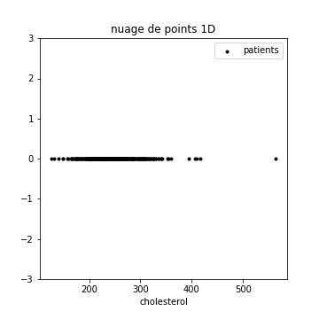

Il pourrait être intéressant de visualiser notre caractéristique pour chacune
des classes possibles.

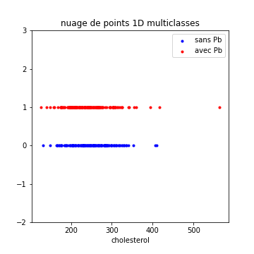

Ici, par exemple, on ne trouve pas à première vue de différence flagrante entre
les deux classes...

##### Histogrammes


Pour obtenir plus d'informations sur la distribution de cette caractéristique,
on peut tracer l'histogramme d'une caractéristique.

Dans la figure qui suit, j'ai tracé l'histogramme du cholestérol des personnes
sans problème cardiaque, ainsi que celui des personnes ayant des problèmes
cardiaques.
L'ordonnée est normalisée pour être homogène à une densité de probabilité.

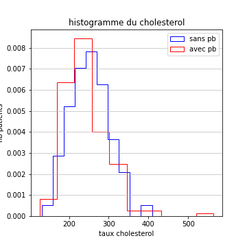

C'est confirmé, les distributions sont très semblables
(des gaussiennes ou presque, de moyenne et variance très similaires).

On peut faire ceci pour toutes les caractéristiques.
Pour des raisons pratiques, je présente ci-dessous les histogrammes de toutes
les caractéristiques pour les patients sans problème cardiaque, avant de faire
de même pour les patients avec problèmes cardiaques.

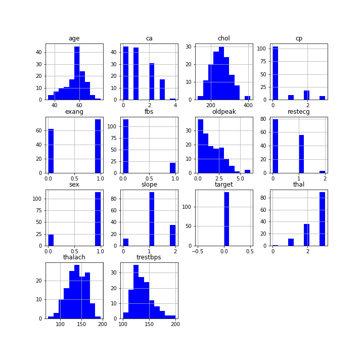

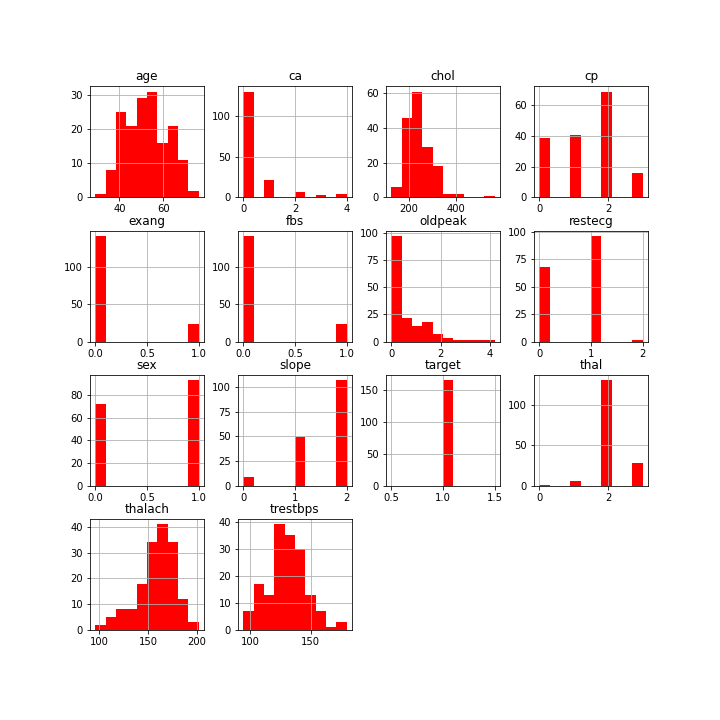

On va chercher dans ces courbes des caractéristiques dans lesquelles les
**histogrammes des différentes classes se superposent le moins possible**.

Ceci permet par exemple de se rendre compte que **talach** et **thal**
semblent être intéressants pour détecter partiellement les problèmes
cardiaques (j'ai regardé vraiment rapidement).

#### Visualisation de deux caractéristiques

Si on ne regarde les caractéristiques que l'une après l'autre, on peut passer
à côté d'informations primordiales, concernant les **liens statistiques**
entre les caractéristiques.
Voici ci-dessous le nuage 2D age / talach, pour l'ensemble des patients.

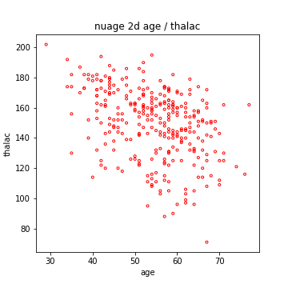

On voit clairement que la seconde caractéristique (*thalach*) diminue en
moyenne lorsque l'âge augmente.

Par ailleurs, et pour revenir à la sélection des données, si j'observe
les caractéristiques pour chaque classe, cela peut être très intéressant :

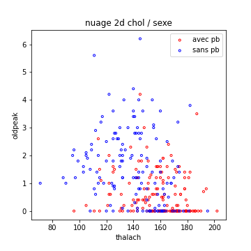

Le graphe précédent montre clairement que le couple thalach / oldpeak permet
de discriminer pas mal les patients atteints de problèmes cardiaques
et les autres.
Ceci serait très utile si, par exemple, je ne devais conserver que quelques
caractéristiques pour **réduire la dimension du problème**.

#### Visualisation de trois caractéristiques

Je vous mets ci-dessous un nuage 3D.
C'est beau et parfois utile, mais surtout si on peut le faire tourner pour
l'observer sous plusieurs angles...

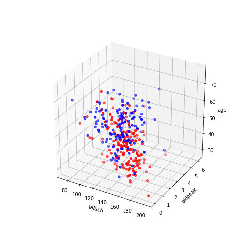

Dans le cas du graphe précédent, si on ne peut pas le faire tourner,
il est difficile d'en tirer des conclusions.

Voilà, donc ce qui clôt notre bref aperçu de ce que l'on peut faire en
visualisation de données, notamment pour choisir les caractéristiques
les plus pertinentes.

Par ailleurs, comme je crois fermement aux vertus du copier-coller
dans l'apprentissage de l'informatique, vous trouverez ici un lien vers
le Jupyter Notebook ayant permis de créer ces courbes :
[https://colab.research.google.com/drive/1hUqTKF5Zh_gfj79aelprjQz1Y_lq37KK?usp=sharing](https://colab.research.google.com/drive/1hUqTKF5Zh_gfj79aelprjQz1Y_lq37KK?usp=sharing)

<script type="text/javascript" async src="//cdn.bootcss.com/mathjax/2.7.0/MathJax.js?config=TeX-AMS-MML_HTMLorMML"></script>
<script type="text/javascript" async src="https://cdnjs.cloudflare.com/ajax/libs/mathjax/2.7.1/MathJax.js?config=TeX-MML-AM_CHTML"></script>

## Performances

Dans ce chapitre, ce que je veux vous apprendre concerne tout d'abord les **performances des algorithmes d'apprentissage automatique**. Comment les mesure-t-on pour chaque type de problème (classification / régression / clustering) ? Nous verrons de plus que **certaines mesures de performances** peuvent apporter **différentes informations utiles**.

Nous verrons également dans la seconde partie de cet algorithme, la façon dont vos algorithmes d'optimisation peuvent trouver un bon jeu de paramètres pour votre modèle. Nous parlerons ainsi de l'adéquation nécessaire entre la **complexité du problème et celle du modèle**. Je vous décrirais enfin plus précisément le **fonctionnement d'une descente de gradient**, qui est la base de presque tous les algorithmes d'optimisation.

Commençons donc par voir comment mesurer les performances de nos algorithmes.

### Mesures de performances d'un algorithme.

Nous savons déjà quelques petites choses sur ces mesures de performances.

En particulier, nous savons que :

- dans le cas de l'**apprentissage supervisé** (classification ou régression), à la suite d'un apprentissage, on voudra évaluer les performances de l'algorithme sur une base d'exemples (base d'apprentissage ou base de validation). 

- dans le cas de l'**apprentissage non supervisé** (principalement le clustering), on voudra évaluer la qualité des clusters trouvés.

Jusqu'ici, nous n'avons évoqué comme mesure de performances que la probabilité de classification correcte, adaptée aux problèmes de classification. Il va être temps d'enrichir tout ceci.

#### Évaluations de performances pour la classification.

##### Proba d'erreur et proba de succès.

Nous l'avons déjà vu de nombreuses fois, la **probabilité d'erreur** est mesurée comme la proportion d'erreurs commises sur un ensemble d'exemples. Son pendant est la **probabilité de classification correcte** : la proportion de bonnes décisions.

*Attention* : Probabilité de classification correcte se traduit par « **accuracy** » en anglais  Ceci est trompeur car la traduction littérale de « accuracy » est « précision », mais ce terme a, en français, un autre sens en apprentissage automatique, que l'on verra plus loin.

On pourra, par exemple, avoir un algorithme qui reconnaît les hommes et les femmes avec une **accuracy** de 0.9 en validation. On peut donc s'attendre à ce qu'il reconnaisse le sexe d'un individu dans 90% des cas en moyenne.

Mais ce n'est pas la seule façon d'évaluer les performances d'un algorithme de classification. Je vais vous en proposer quelques autres ci-dessous.

##### Matrice de confusion

L'objectif des matrices de confusion est d'en apprendre un peu plus sur les cas conduisant à des succès ou des échecs.

Considérons un exemple, dans un problème de classification à $$m$$ classes. Pour un exemple, il y a $$m$$ possibilités pour son label (**sa vraie classe**). Si je fais passer cet exemple dans un classifieur, il y a également $$m$$ possibilités pour la **classe prédite** par l'algorithme. Les exemples se répartissent ainsi entre $$ m \times m $$ cas possibles, chacun correspondant à un couple $$(vraie classe / classe prédite)$$.

On compte, pour chaque classe possible $$ y_i $$ et chaque classe prédite possible $$ ypred_j $$, le nombre d'exemples d'une base correspondant au couple
$$ (y_i, pred_j) $$.
Le nombre d'exemples obtenu est placé dans une matrice de taille $$ m \times m $$.
La matrice ainsi construite s'appelle la « **matrice de confusion** » de
l'algorithme.
Elle **comporte autant de lignes et autant de colonnes que de classes**.

Voyons rapidement un exemple pour bien comprendre cette idée.

Prenons une base de 500 exemples (300 hommes et 200 femmes). Je noterais :

- label : le véritable sexe des individus, qui peut prendre les valeurs
*Homme, Femme*, que je noterais ici respectivement $$  Hvrai $$ , $$ Fvrai $$
- prediction : le sexe des individus prédit par l'algorithme, qui peut aussi prendre les valeurs *Homme, Femme*, que je noterais ici respectivement
$$ Hpred $$, $$ Fpred $$.

On compte simplement pour chaque exemple dans quelle case $$(label, prediction)$$ il tombe.

Par exemple, on comptera le nombre d'exemples d'individus femme, dont l'algorithme a prédit qu'ils étaient des hommes. On placera ce nombre dans la case $$ (Fvrai, Hpred) $$ de la matrice suivante.

On pourrait observer quelque chose comme :
|:--:|:--:|:--:|
| | Hvrai | Fvrai |
| Hpred	| 280 | 10 |
| Fpred	| 20 | 190 |

**Les éléments sur la diagonale correspondent à des succès** (la classe prédite et la vraie classe sont identiques). **Toutes les autres cases correspondent à des erreurs.**

Une matrice de confusion est souvent riche d'enseignements.

- On peut en déduire la probabilité de classification correcte de notre classifieur (ici (280 + 190) / 500 )
- On peut en déduire aussi la probabilité d'erreur de notre classifieur (ici (10 + 20) / 500 )

Notez que l'on souhaite parfois présenter cette matrice sous forme de probabilités. Si on divise le tout par le nombre d'exemples, cela estime la probabilité d'observer un sexe ET que l'algorithme fasse une prédiction donnée.

Voici par souci d'exhaustivité la matrice de confusion sous forme probabilisée, présentant $$ P(label, prediction) $$.

|:--:|:--:|:--:|
| | Hvrai | Fvrai |
| Hpred | 280 / 500 | 10 / 500 |
| Fpred | 20 / 500 | 190 / 500 |

Ce qui va suivre est peut être assez complexe à comprendre si vous n'avez pas eu de cours sur les variables aléatoires conjointes. Dans ce cas, pas de panique, nous reviendrons là-dessus grandement dans la section **Théorie Bayésienne de la Décision** du chapitre sur les Algorithmes.

Je vous présente aussi la version probabiliste présentant cette fois $$P(prediction / label) $$. Prenez le temps d'observer le diviseur de ces probabilités - *c'est le nombre d'exemples de la vraie classe correspondante (300 pour les hommes, 200 pour les femmes)* .

|:--:|:--:|:--:|
| | Fvrai | Hpred |
| Hvrai | 180 / 300 | 10 / 200 |
| Fpred	| 20 / 300 | 190 / 200 |

Cette dernière matrice me permet de voir que notre algorithme se débrouille moins bien pour reconnaître les hommes que pour reconnaître les femmes. Il commet des erreurs quand on lui présente un homme avec une probabilité de 0.066 (20/300), contre 0.05 pour les femmes (10/200)

C'est cette dernière matrice qu'il faut observer si l'on souhaite évaluer comment l'algorithme se débrouille sur les différentes classes du problème

##### Précision / Rappel

Les notions de **précision** et de **rappel**  sont très importantes, car elles vous montreront que deux classifieurs présentant la même **probabilité de classification correcte** ne se valent pas forcément.

Ce sont des mesures que l'on utilise pour les problèmes à deux classes, en particulier dans le domaine des tests médicaux ou les problèmes de recherche de documents pertinents (moteurs de recherche). Il vous faudra sans doute plusieurs lectures pour réussir à comprendre les deux définitions qui suivent, et un peu de pratique pour les mémoriser .

La **précision** d'un algorithme est la proportion de vrais cas détectés parmi les détections que fait l'algo (en anglais, on l'appelle « *precision ratio* ou **specificity** »).

Le **rappel** d'un algorithme est la proportion de cas détectés parmi les cas qu'il aurait dû détecter. On l'appelle aussi **sensibilité** (en anglais, on l'appelle « *recall ratio* ou **sensitivity** »).

Pour bien comprendre ces notions, reprenons un exemple, correspondant à un test de grossesse (vous pouvez penser à un test du covid, si vous préférez)

Ci-dessous, je vous montre la matrice de confusion d'un algorithme donné, testé sur 800 femmes, dont 500 étaient enceintes, 300 ne l'étaient pas.

|:--:|:--:|:--:|
| | Enceinte vrai | Pas enceinte vrai |
| Enceinte pred	| 480 | 10 |
| Pas enceinte pred | 20 | 290 |

La **précision** de cet algo compte les vraies détections (480) sur l'ensemble des détections faites par l'algo (490), soit 480/490 : 0.979

**La précision est ici la probabilité d'être enceinte si le test dit que vous l'êtes.**

Le **rappel** de cet algo, ou sa **sensibilité**, compte les vraies détections (480) sur l'ensemble des détections à faire (500), soit 480/500 : 0.96

**La sensibilité (rappel) est ici la probabilité que le test dise que vous êtes enceinte si vous l'êtes.**

Ces deux grandeurs sont importantes (on voudrait idéalement qu'elles soient toutes deux les plus grandes possibles).

Pour précisément l'importance de chacune, il va nous falloir encore un peu de vocabulaire :

- On appelle faux négatifs les cas attribués par erreur à un test négatif.
- On appelle faux positifs les cas attribués par erreur à un test positif.

Notez bien ce qui suit :

**Si entre deux algorithmes, l'un présente une précision et une sensibilité meilleure que l'autre, c'est clairement le meilleur des deux. Si chaque algorithme a l'une des mesures en sa faveur, il faut choisir, en fonction de l'importance respective des Faux Positifs et des Faux Négatifs.**

Je donne ci-dessous la matrice de confusion d'un autre algorithme, qui présente la même probabilité de classification correcte que le premier, mais dans lequel précision et rappel ne sont pas les mêmes :

|:--:|:--:|:--:|
| | Enceinte vrai | Pas enceinte vrai |
| Enceinte pred | 480 | 29 |
| Pas enceinte pred | 1 | 290 |

Ici, la précision vaut 480 / 509 (elle a baissé).
Sa sensibilité est 480 / 481 (elle a augmenté).

Quel test préférez-vous ?
Peut-être le premier (ca se discute), car avec le second, 29 femmes auront
pensé être enceinte alors qu'elle ne l'étaient pas contre 10 pour le premier
test.
Cela représente beaucoup de fausses joies ou de grosses frayeurs.
À l'inverse, 20 femmes enceintes pensent ne pas l'être avec le premier test.
Elles le découvriront sans doute plus tard, sans que cela ait de grosses
conséquences.

Ce qui est intéressant, c'est si l'on considère maintenant que
**ce test détecte les cancers en phase précoce**, et non plus le fait d'être
enceinte.
Quel test préférez-vous ?
Personnellement, je choisis sans hésiter le second.
Au risque de me faire une grosse frayeur pour rien, je minimise les chances de
passer à coté d'un diagnostic qui me sauverait peut-être la vie.

Imaginez maintenant une situation où le choix de la subvention d'un test ou
d'un autre est une décision politique.
Vous conviendrez sans doute qu'il vaut mieux que les différentes personnes
en charge de ces problèmes, ainsi que les personnes en discutant dans la sphère
publique soit, a minima, au point sur ces notions...
(spoiler : *pour les second, ce n'est pas toujours le cas*).

Si vous êtes amenés à travailler sur un problème médical, vous croiserez à
l'occasion d'autres notions du même ordre que celles que nous venons de voir.
Pour ne pas alourdir inutilement ce cours, j'ai choisi de ne pas toutes les
détailler.
Avec ce que nous venons de voir, vous apprendrez à domestiquer leurs
semblables par la pratique, si besoin est.

Voila qui clôt la présentation des quelques mesures de performances à retenir
pour les problèmes de classification.
Passons donc aux autres problèmes.

#### Mesures de performance pour la régression

Commençons par définir proprement notre problème de régression pour bien poser
les notations.

On dispose d'exemples, définis par leurs vecteurs de caractéristique.
Nous sommes dans un cadre d'apprentissage supervisé, donc à chaque exemple
correspond une réponse attendue.
Nous noterons cette réponse $$y$$.
On l'appelle souvent **cible** ou **target** dans les problèmes de régression.
$$y$$ est, dans le cas général, un vecteur de réels.
Notre algorithme de régression devra, quand à lui, fournir sa réponse,
sous forme d'un vecteur de même taille, que nous noterons $$yp$$.

On pourra, par exemple, essayer de prédire la position finale d'une boule de
billard, lancée sur un tapis donné, en fonction de la position initiale de la
bille, de la direction donnée, des effets...
Dans ce cas, la position finale est le couple de réels donnant la position de
la bille sur le tapis.
Le vecteur correspondant à une réponse est de dimension 2.
Toutes les valeurs données seront supposées exprimées en centimètres.

La question centrale de cette section consiste à expliciter des mesures
permettant de quantifier la qualité d'un algorithme de régression sur un
ensemble d'exemples.

On commence par s'intéresser à l'$$erreur commise pour chaque exemple$$.
Pour un exemple, cette erreur s'écrit $$ e =  y - yp $$

Si pour un exemple, la valeur attendue était $$ [0.4, 0.35] $$ et que
l'algorithme prédit $$ [0.5, 0.3] $$.
L'erreur commise est alors $$ [-0.1, 0.05] $$.
On voit que l'erreur est un vecteur de la taille de $$y$$.

Dans le cas où le vecteur de sortie est de dimension supérieure à 1, notre
mesure de performance devra
**combiner les erreurs commises sur chaque dimension**.

De plus, il pour évaluer les performances sur l'ensemble de la base, il
faudra aussi **combiner les performances obtenues sur les différents exemples**.
Cette partie est la plus simple :
si l'erreur sur un exemple est quantifiée, on mesure, en général, la
**performance moyenne sur l'ensemble des exemples**.

Ci dessous, je vais vous présenter quelques exemples de mesure de performance sur un exemple donné.

##### Erreur quadratique et erreur quadratique moyenne

Une idée qui vous viendra peut être pour mesurer l'écart entre en un vecteur
attendu et le vecteur en sortie du réseau est l'**erreur quadratique** existant
entre ces deux vecteurs.

L'**erreur quadratique** est simplement la somme des carrés de l'erreur
(on la nomme **squared error** en anglais, ou SE)

Compte tenu de nos notations, cela s'écrit :

Expression de la **Squared Error** : $$ SE (y, yp) = \sum_i (y_i - yp_i)^2 $$

Cette mesure est la base d'une des mesures de performances en régression
couramment utilisées en apprentissage automatique :

L'**Erreur Quadratique Moyenne** ou **Mean Squared Error** (MSE):
Si l'on souhaite mesurer la performance associée à N exemples, on calcule
simplement la moyenne des erreurs quadratiques sur l'ensemble des exemples.
On souhaite que cette MSE soit aussi **faible** que possible

*Remarque :* Notez que si l'on utilise l'erreur quadratique, on utilise le
carré des écarts.
Les grosses erreurs comptent beaucoup plus que les petites.
Un écart de 0.8 sur une composante comptera pour 0.64 dans l'erreur quadratique.
un écart de 0.1 comptera pour 0.01 (soit 64 fois moins que le précédent).
Je reviendrais sur l'importance de cette notion dans les pages de niveau 2,
lorsqu'on évoquera plus précisément l'importance des fonctions de coûts dans
les algorithmes d'optimisation.

Une variante intéressante consiste à observer la racine carrée de la MSE
calculée sur l'ensemble des exemples.
On parle alors de **Root Mean Squared Error**.
Vous la croiserez sans doute un jour ou l'autre aussi.

##### Erreur absolue et erreur absolue moyenne

Rien ne nous empêche d'utiliser une quantification différente de l'erreur.
Par exemple, nous pourrions utiliser celle ci qui somme les valeurs absolues
des écarts entre valeur attendue et valeur en sortie pour chaque exemple.

$$ E (y, yp) = \sum_i |(y_i - yp_i| $$

Comme précédemment, cette mesure d'erreur pour chaque exemple peut être
moyennée sur un ensemble d'exemple.

l'**Erreur absolue moyenne** ou **Mean Absolute Error** (MAE) est la moyenne
sur un ensemble d'exemples de la somme des valeurs absolues des compsante de
l'erreur commise sur chaque exemple.

Si on utilise cette loss, on somme les valeurs absolues des écarts.
Une grosse erreur compte proportionnellement autant qu'une petite.
(un écart de 0.8 sur une composante comptera pour 0.8.
Un écart de 0.1 comptera pour 0.1)

La **Mean Absolute Error** est souvent bien meilleure que la
**Mean Squared Error** en termes d'interprétation des résultats.

Si l'on reprend notre exemple du billard, et que, sur l'ensemble de votre base
de validation, vous obtenez une MAE de 1.5, cela signifie que pour chaque
exemple en moyenne, vous vous trompez de 1.5, répartis sur les deux axes.
Globalement, vous prédisez vos positions à 1.5 cm près.

Dans le cas de la MSE, mettons que vous obteniez 4.3.
C'est la valeur moyenne de la somme des carré des composantes de l'erreur.
Une façon de chiffrer grossièrement (et de facon inexacte) la précision de
notre algorithme consiste à prendre la racine carrée de la MSE, qui nous
indiquerait que nous prédisons nos valeurs à ~2.1 cm près en moyenne.

##### Conclusion

Avec tout ceci, nous disposons de deux mesures de performances pour la
régression (MSE, MAE).
Elles nous servirons à évaluer notre algorithme en fin d'apprentissage.
Elles serviront également, pour l'algorithme d'optimisation, comme fonction
de coût qu'il cherchera à minimiser pour définir les paramètres du modèle.

En termes d'interprétation, la MAE est souvent beaucoup plus parlante, mais
gardez en tête l'existence des deux.
Penchons nous maintenant sur le cas du clustering.

A noter : Si vos variables en sortie sont de nature très différente (disons
que vous prédisiez une vitesse et un poids), rien ne vous empêche de mesurer
la MAE sur chacune des sorties pour en faciliter l'interprétation.

#### Mesures de performance pour le clustering

##### Introduction et principe

L'objectif du clustering est de regrouper les points en groupes aussi homogènes
que possibles, les groupes étant bien distincts entre eux.
Ceci résume les deux propriétés des clusters que nous désirons trouver.
On souhaite :

- des clusters présentant une **forte séparation** entre eux.
La séparation sera indicative de la distance existant entre chaque cluster.
Cette séparation serait, idéalement, aussi grande que possible.
- Des clusters présentant une **grande homogénéité**.
L'homogénéité sera indicative de la compacité de chaque cluster.
Plus le cluster est compact,  mieux c'est.

Pour bien fixer les idées, je vais vous montrer quelques exemples de clusters,
par ordre de qualité décroissante.
Pour simplifier la visualisation, nous travaillerons dans un espace de
dimension 2, mais gardez en tête que le problème général du clustering est
traité en dimension quelconque.

Tout d'abord, la figure suivante présente une situation facile, ou les clusters
sont bien séparés (visuellement).
Vous voyez peut être nettement 3 groupes de points.


Ceci pourrait conduire au résultat de clustering suivant. Les groupes sont bien séparés, et les points d'un groupe bien compacts.


La figure suivante présente une situation plus complexe, et deux possibilités
de clustering, soit en trois groupes, soit en deux :

| données | Résultat à 3 clusters | résultat à 2 clusters |
|:---:|:---:|:---:|
| 	| 	|  |

Il est délicat, visuellement, de savoir s'il faut séparer en 2 ou en 3 groupes
(en 3 groupes, les clusters rouges et bleus sont assez compact, mais peu
séparés).

Enfin, on peut imaginer un algorithme qui, partant de la situation initiale
précédente, donne les (très mauvais) résultats suivants :

| données | résultat à 2 clusters |
|:---:|:---:|
| 	|  |

Dans ce dernier exemple, bien que la séparation soit relativement claire entre
les deux groupes de points, l'algorithme les affecte de telle manière que les
clusters ne sont ni homogènes, ni bien séparés.

L'objectif des mesures de performances pour le clustering est de
**quantifier la qualité des clusters trouvés**, de façon à trouver les
meilleurs groupes de points finaux.
Nos mesures diraient ainsi que le dernier clustering est mauvais.
Cette mesure peut aussi parfois être utilisée pour choisir le nombre de cluster
optimal, permettant le choix entre 2 ou 3 clusters dans l'avant dernière
figure.

Encore une fois, gardez en tête que, la plupart du temps, on travaille en
dimension $$ N > 3 $$, où l'on ne peut pas visualiser le problème dans son
intégralité.
Ces mesures de performances sont donc de précieuses informations sur la
**difficulté du problème** et sur la **qualité des clusters trouvés**. 

Tous les **indices** (les mesures de performances) présentés ci dessous
utilisent les notions de **séparation** et d'**homogénéité**.
Il diffèrent dans la façon dont elles sont calculées.
Il est temps d'en décrire quelques unes.

##### Indice de Davies-Bouldin

Le problème de l'évaluation de la qualité des clusters rappellera peut être à
ceux qui ont quelques connaissances en statistiques, des concepts associés à
l'analyse de variance.
Si l'on travaille sur une seule caractéristique, on peut ainsi s'intéresser à
la **variance intra-classe** (les clusters sont ils bien homogènes ?)
et à la **variance inter-classe** (les clusters sont ils bien séparés ?).

Ces idées peuvent être généralisées lorsque le nombre de dimensions augmente.
Pour un problème de clustering à $$K$$ clusters, On commence par calculer :

- le point moyen (barycentre) du nuage complet (tous clusters confondus).
On le notera $$\mu$$. Le nombre total de points est noté $$n$$.
- le point moyen (barycentre) de chaque cluster $$C_k$$.
On notera ces barycentres $$\mu_k$$.
Le nombre de points dans chaque cluster est noté $$n_k$$.

Pour représenter l'**homogénéité** d'un cluster, on calcule la moyenne des
distances entre les points du cluster et son barycentre.
C'est la **variance intra-classe**.

Calcul de la **variance intra-classe** dans un cluster $$C_k$$ :
$$ W_k = \frac{1}{n_k} \sum_{p \in C_k} (\lVert p - \mu_k \rVert^2 $$

La **séparation** existant entre deux classes données est içi simplement la
distance $$ \lVert \mu_k - \mu_{k'} \rVert^2 $$.

Ainsi, pour mesurer la qualité de 2 clusters, on peut regarder le ratio :
$$ \frac { W_k + W_{k'} } { \lVert \mu_k - \mu_{k'} \rVert^2}$$.
Plus ce **ratio est faible**, plus la **séparation des clusters est bonne**.

Avec ces quantités, on peut calculer l'**indice de Davies-Bouldin**,
sur l'ensemble des clusters, par la formule suivante :

**Davies-Bouldin** :
$$ S_{DB} = \frac{1}{K} \sum_{k \in [1..K]} max_{k' \ne k} \frac { W_k + W_{k'} } { \lVert \mu_k - \mu_{k'} \rVert^2} $$

Retenons ces quelques règles :

- Plus ce clustering est bon, plus cet indice est proche de 0.
Les variances intra-classes sont très faibles (numérateur),
et les variances inter-classe fortes (faibles).
- Plus la qualité du clustering est mauvaise, plus cet indice est grand
(les variances inter-classes tendant vers 0).
- il est délicat de l'utiliser pour choisir le nombre de cluster $$K$$.
Il convient bien, en revanche, pour choisir entre deux algorithmes pour un même
problème, avec $$K$$ fixé.

##### Indice de Calinski-Harabasz

Travaillant avec les mêmes notions, nous disposons également de l'
**indice de Calinski Harabasz**, plus proche des habitudes statistiques
concernant la variance inter-classe.

Nous devons toujours calculer la **variance intra-cluster** de chaque cluster :

Calcul de la **variance intra-cluster** du cluster $$C_k$$ :
$$ W_k = \frac{1}{n_k} \sum_{p \in C_k} (\lVert p - \mu_k \rVert^2 )$$

Par ailleurs, la **variance inter-cluster**, est représentative de la
séparation des clusters.

La **variance inter-cluster** est la dispersion des barycentres autour du
cluster moyen du nuage.

Formellement, elle se calcule comme suit :

Calcul de la variance **inter-cluster**  :
$$B = \sum_{i \in [1..K]} (n_k \times \lVert \mu_k - \mu \rVert^2 ) $$

Avec ces quantités, on peut calculer l'**indice de Calinski-harabasz**, par
la formule suivante :

**Calinski-Harabasz** : $$S_{CH} = \frac{(n-K) B}{(K-1) \sum_{i \in [1..K]} W_k} $$

Retenons ces quelques règles :

- Plus ce clustering est mauvais, plus cet indice est proche de 0.
Les variances intra-classes sont très grandes, et la variance inter-classe faible.
- Plus la qualité du clustering est grande, plus cet indice est grand
(les variances intra-classes tendant vers 0).
- il est délicat de l'utiliser pour choisir le nombre de cluster $$K$$.
Il convient bien, en revanche, pour choisir entre deux algorithmes pour un même
problème, avec $$K$$ fixé.

##### Indice de Silhouette

A titre personel, je préfère, aux deux précédents, utiliser l'
**indice de Silhouette**, qui n'utilise pas de calcul de barycentre.
Or les barycentre n'ont parfois aucun sens pour certains problèmes.

L'indice de silhouette calcule, **pour chaque point $$i$$**, deux grandeurs :

- $$ a(i) $$ la distance moyenne du point aux points de son cluster.
Elle est représentative de la facon dont un point est bien inséré dans son
cluster, donc de la compacité du cluster.

- $$ b(i) $$ le minimum des distances moyenne du points aux points des autres
clusters.
Elle est représentative de la séparation existant entre ce cluster et les
autres.

L'**indice de silhouette d'un point** $$ i $$ est alors donné par :
$$sil(i) = \frac{ b(i) - a(i)}{max (b(i), a(i))} $$

Quelques remarques sur cet indice :

- La division par le max de \(a(i)\) et \(b(i)\) sert simplement à ramener la
valeur de silhouette dans l'intervalle [-1, 1].
- Un point plus proche des points de son groupe que des points d'un autre
cluster aura un **indice de silhouette positif**.
- Un point plus proche des points d'un autre cluster que des points de son
cluster aura un **indice de silhouette négatif**.
- Un point à égale distance de deux clusters aura un **indice de silhouette nul**.


On peut alors utiliser cet indice calculé pour chaque point, pour définir la
qualité d'un cluster en particulier.

L'**indice de silhouette d'un cluster** est la moyenne des indices de
silhouette de chacun de ses points.

Enfin, on peut mesurer la qualité de l'ensemble des clusters, qui constitue une
évaluation des résultats de notre algorithme

L'**indice de silhouette d'un algorithme de clustering** est la moyenne des
indices de silhouette de chacun des cluster qu'il a défini.

Ci dessous, je vous présente certaines des différentes situations présentées
précédemment, et les valeurs de silhouette correspondantes :

|:---:|:---:|:---:|:---:|
| clusters | | 	|  |
| Indices de silhouette	| -0.047 | 0.638 | 0.498 |

Enfin, sachez qu'il est possible de visualiser à la fois les indices de
silhouette de chaque point et ceux de chaque cluster.
Je vous le représente dans la figure suivante.
A gauche, les valeurs des indices de silhouette pour chaque point, rangées par
ordre décroissant dans chaque cluster.
A droite, les données et les clusters obtenus par l'algorithme, représentés
par les mêmes couleurs qu'a gauche.
On le voit, les clusters numérotés 0 et 2 contiennent des points dont l'indice
de silhouette est négatif (ce sont les points à la frontiere entre cluster 0 et
cluster 2)


##### Conclusion sur les mesures de performances pour le clustering

A ce stade, nous disposons de 3 mesures qui pourront être utilisées pour
quantifier la qualité des clusters trouvés par un algorithme.
Il en existe de nombreuses autres, et pour celles que nous avons vues, de
nombreuses variantes.

Celles que nous venons de voir nous suffiront amplement pour avoir de solides
bases sur ce point.


<script type="text/javascript" async src="//cdn.bootcss.com/mathjax/2.7.0/MathJax.js?config=TeX-AMS-MML_HTMLorMML"></script>
<script type="text/javascript" async src="https://cdnjs.cloudflare.com/ajax/libs/mathjax/2.7.1/MathJax.js?config=TeX-MML-AM_CHTML"></script>

## Algorithmes de classification


<script type="text/javascript" async src="//cdn.bootcss.com/mathjax/2.7.0/MathJax.js?config=TeX-AMS-MML_HTMLorMML"></script>
<script type="text/javascript" async src="https://cdnjs.cloudflare.com/ajax/libs/mathjax/2.7.1/MathJax.js?config=TeX-MML-AM_CHTML"></script>

## Algorithmes de régression


<script type="text/javascript" async src="//cdn.bootcss.com/mathjax/2.7.0/MathJax.js?config=TeX-AMS-MML_HTMLorMML"></script>
<script type="text/javascript" async src="https://cdnjs.cloudflare.com/ajax/libs/mathjax/2.7.1/MathJax.js?config=TeX-MML-AM_CHTML"></script>

## Algorithmes de clustering


<script type="text/javascript" async src="//cdn.bootcss.com/mathjax/2.7.0/MathJax.js?config=TeX-AMS-MML_HTMLorMML"></script>
<script type="text/javascript" async src="https://cdnjs.cloudflare.com/ajax/libs/mathjax/2.7.1/MathJax.js?config=TeX-MML-AM_CHTML"></script>

## Conclusion des pages de niveau 1


<script type="text/javascript" async src="//cdn.bootcss.com/mathjax/2.7.0/MathJax.js?config=TeX-AMS-MML_HTMLorMML"></script>
<script type="text/javascript" async src="https://cdnjs.cloudflare.com/ajax/libs/mathjax/2.7.1/MathJax.js?config=TeX-MML-AM_CHTML"></script>

## Introduction <script type="text/javascript" async src="//cdn.bootcss.com/mathjax/2.7.0/MathJax.js?config=TeX-AMS-MML_HTMLorMML"></script>
<script type="text/javascript" async src="https://cdnjs.cloudflare.com/ajax/libs/mathjax/2.7.1/MathJax.js?config=TeX-MML-AM_CHTML"></script>

## Bases d'exemples

<script type="text/javascript" async src="//cdn.bootcss.com/mathjax/2.7.0/MathJax.js?config=TeX-AMS-MML_HTMLorMML"></script>
<script type="text/javascript" async src="https://cdnjs.cloudflare.com/ajax/libs/mathjax/2.7.1/MathJax.js?config=TeX-MML-AM_CHTML"></script>

## Algorithmes


<script type="text/javascript" async src="//cdn.bootcss.com/mathjax/2.7.0/MathJax.js?config=TeX-AMS-MML_HTMLorMML"></script>
<script type="text/javascript" async src="https://cdnjs.cloudflare.com/ajax/libs/mathjax/2.7.1/MathJax.js?config=TeX-MML-AM_CHTML"></script>

## Performances


<script type="text/javascript" async src="//cdn.bootcss.com/mathjax/2.7.0/MathJax.js?config=TeX-AMS-MML_HTMLorMML"></script>
<script type="text/javascript" async src="https://cdnjs.cloudflare.com/ajax/libs/mathjax/2.7.1/MathJax.js?config=TeX-MML-AM_CHTML"></script>

## Conclusion des pages de niveau 2


<script type="text/javascript" async src="//cdn.bootcss.com/mathjax/2.7.0/MathJax.js?config=TeX-AMS-MML_HTMLorMML"></script>
<script type="text/javascript" async src="https://cdnjs.cloudflare.com/ajax/libs/mathjax/2.7.1/MathJax.js?config=TeX-MML-AM_CHTML"></script>

## Conclusion des pages de niveau 2


<script type="text/javascript" async src="//cdn.bootcss.com/mathjax/2.7.0/MathJax.js?config=TeX-AMS-MML_HTMLorMML"></script>
<script type="text/javascript" async src="https://cdnjs.cloudflare.com/ajax/libs/mathjax/2.7.1/MathJax.js?config=TeX-MML-AM_CHTML"></script>

## TP classification


<script type="text/javascript" async src="//cdn.bootcss.com/mathjax/2.7.0/MathJax.js?config=TeX-AMS-MML_HTMLorMML"></script>
<script type="text/javascript" async src="https://cdnjs.cloudflare.com/ajax/libs/mathjax/2.7.1/MathJax.js?config=TeX-MML-AM_CHTML"></script>

## TP régression


<script type="text/javascript" async src="//cdn.bootcss.com/mathjax/2.7.0/MathJax.js?config=TeX-AMS-MML_HTMLorMML"></script>
<script type="text/javascript" async src="https://cdnjs.cloudflare.com/ajax/libs/mathjax/2.7.1/MathJax.js?config=TeX-MML-AM_CHTML"></script>

## TP clustering

